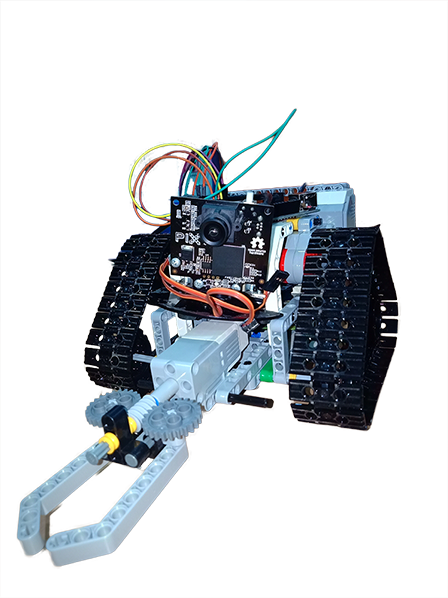

# Advance Line Follower Robot
***
Sep 2018 – Nov 2018

## Block Diagram of the Project

Project descriptionAdvanced line Follower Robot with 5 sensors and is able to take different complex paths
Runner up in Compilation held in National Institute of Technology, Warangal

## Components Required
- Arduino UNO (or Arduino Nano)
- L293D Motor Driver IC
- Geared Motors x 2
- IR Sensor Module x 2
- Jumper Wires
- Battery Connector

Working of Arduino Line Follower Robot

In this project, we have designed an Arduino based Line Follower Robot. The working of the project is pretty simple: detect the black line on the surface and move along that line. The detailed working is explained here. As mentioned in the block diagram, we need sensors to detect the line. For line detection logic, we used two IR Sensors, which consists of IR LED and Photodiode. They are placed in a reflective way i.e. side – by – side so that whenever they come in to proximity of a reflective surface, the light emitted by IR LED will be detected by Photo diode. The following image shows the working of a typical IR Sensor (IR LED – Photodiode pair) in front of a light coloured surface and a black surface. As the reflectance of the light coloured surface is high, the infrared light emitted by IR LED will be maximum reflected and will be detected by the Photodiode.

  <iframe width="560" height="315" src="https://www.youtube.com/embed/GkQ1Ul6oZdg" frameborder="0"
          allow="accelerometer; autoplay; encrypted-media; gyroscope; picture-in-picture" allowfullscreen></iframe>

# The Crawler Smart Robot
***
Oct 2018 – Dec 2018

## Overview:
 This is a Robot that seeing and recognizes objects based on color and process it in the environment
It detects and Grabs the selected colored object
using i2c communication between Arduino and Raspberry pi using Brick Pi 3 Extension and Dexter OS

## Introduction
Crawler is a Controlled Robot it can be used for several purposes like diffusing bombs, transporting heavy loads.
This is a machine which can be used by people who are indolent

## Working Principle
It finds and detects objects by color and moves to that location and grips the object. The exterior structure is
strong and can resist more physical damage.

## Technical Overview

### Input
Pixy is used to receive all the information about the objects and live video stream to Arduino and Arduino is Pre-Programmed to send the X ,Y Coordinates and length and width length and signature index color of the recognized object. And this data is sent to raspberry pi using communication protocol between raspberry pi and Arduino This is an integration between Arduino and Raspberry Pi used together due to lack of proper libraries in Raspberry Pi

### Output

Brick pi is integrated with Raspberry Pi and all the motor work through the brick pi and it’s python libraries programmed in raspberry pi

  <iframe width="560" height="315" src="https://www.youtube.com/embed/YxB-_cdjnTc" frameborder="0"
          allow="accelerometer; autoplay; encrypted-media; gyroscope; picture-in-picture" allowfullscreen></iframe>

# Bluetooth Controlled Robo Car
***
2018

Project description: Using an android app car can be controlled which instructs the bot the directions to move
Car consists of a Bluetooth Module for Arduino for communication and Arduino is the controller of the bot
500 RPM motors using a 12 V Battery and LED's for better look check out full description in my website

<iframe width="560" height="315" src="https://www.youtube.com/embed/u6nTNSZgJ80" frameborder="0"
        allow="accelerometer; autoplay; encrypted-media; gyroscope; picture-in-picture" allowfullscreen></iframe>

# DTMF Controlled Robo car
***
Sep 2018 – Nov 2018

Project description This robot is controlled using DTMF (Dual Tone Multiple Frequency). With the help of a mobile phone, you can control the motion of the robot. The heart of the robot is an Arduino Mega board.

It can be controlled from anywhere in the world just by a phone call then use the dial-pad to control the bot movement

