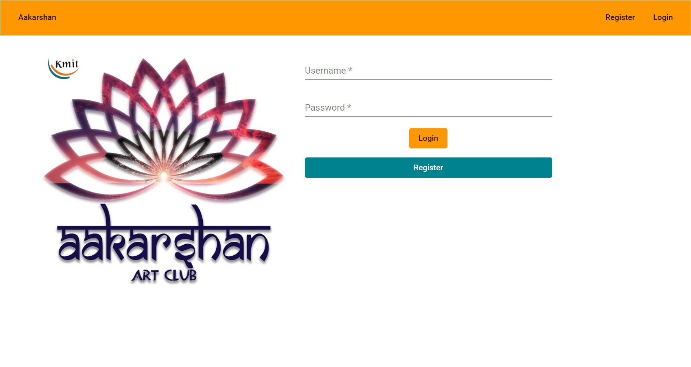
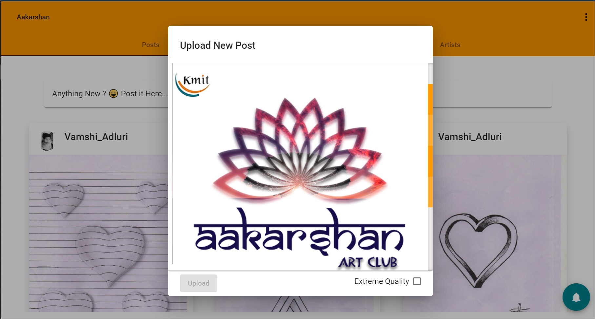
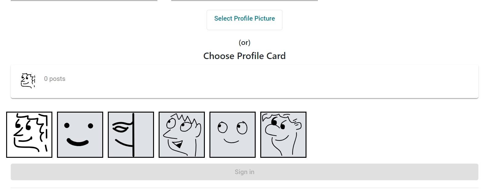
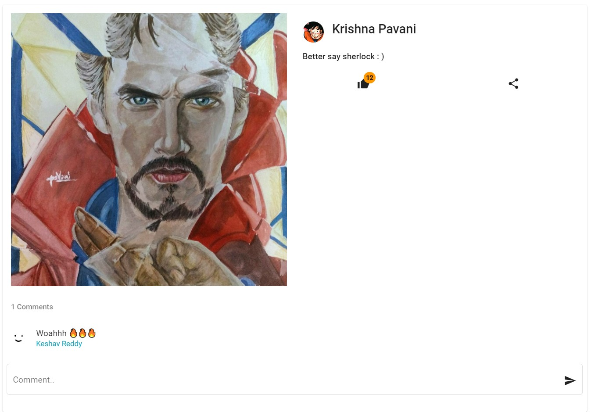
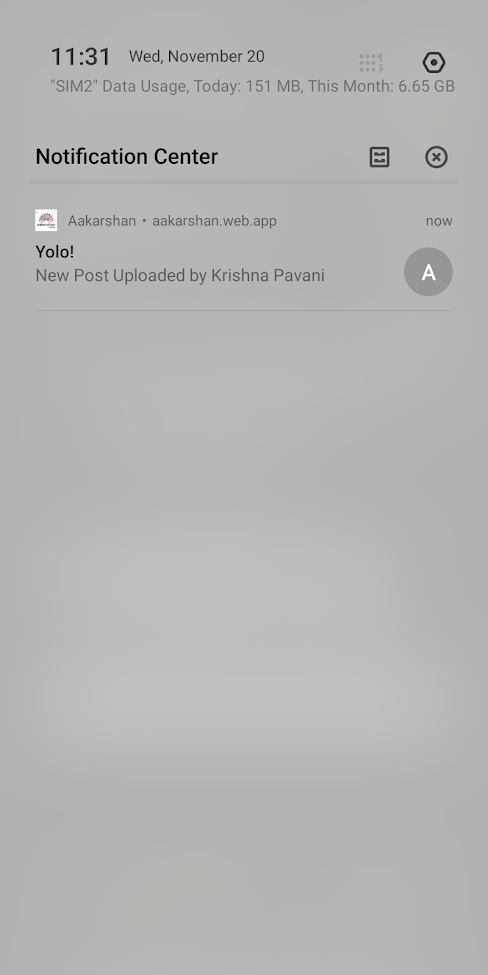
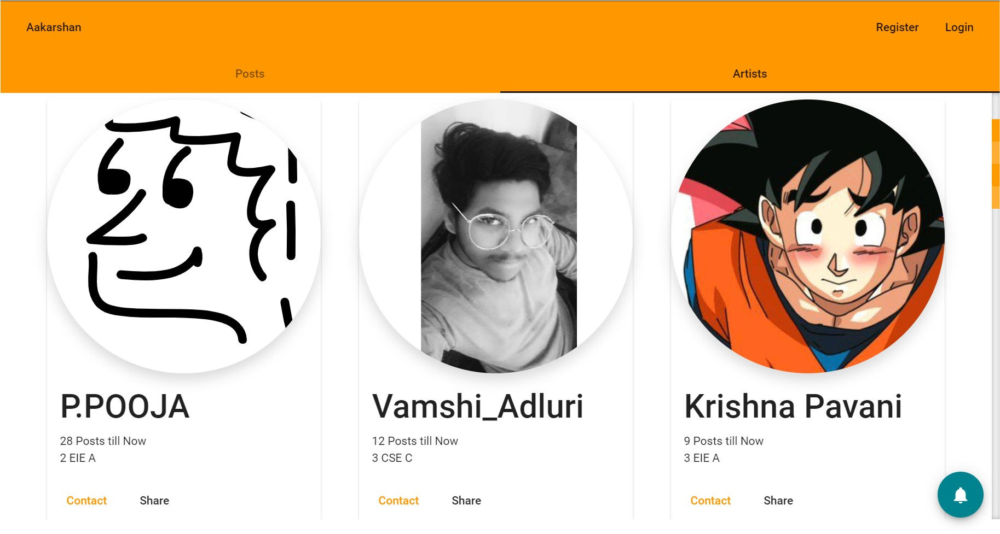
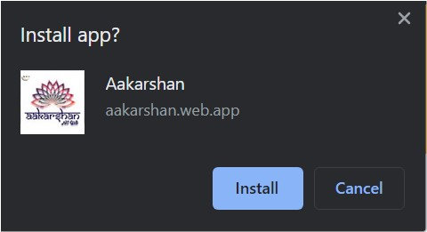
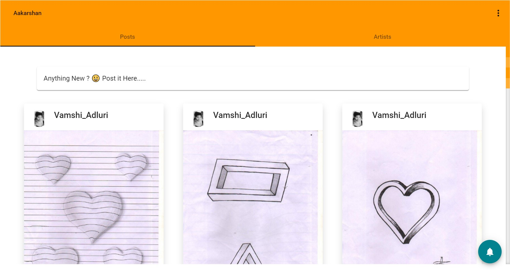
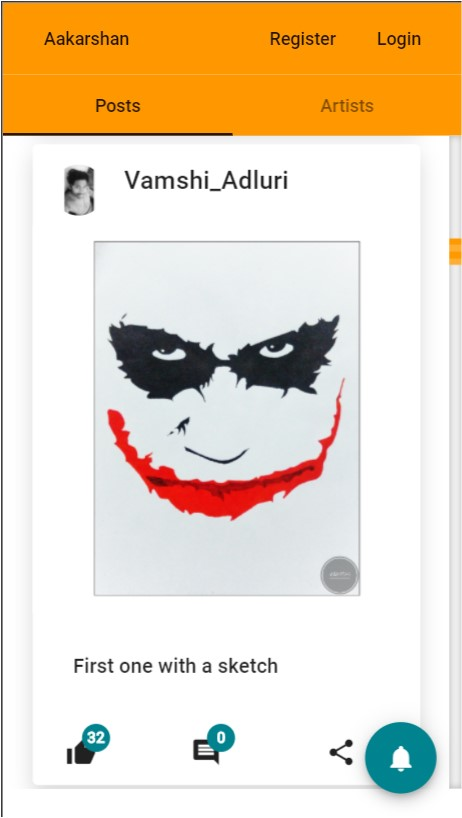
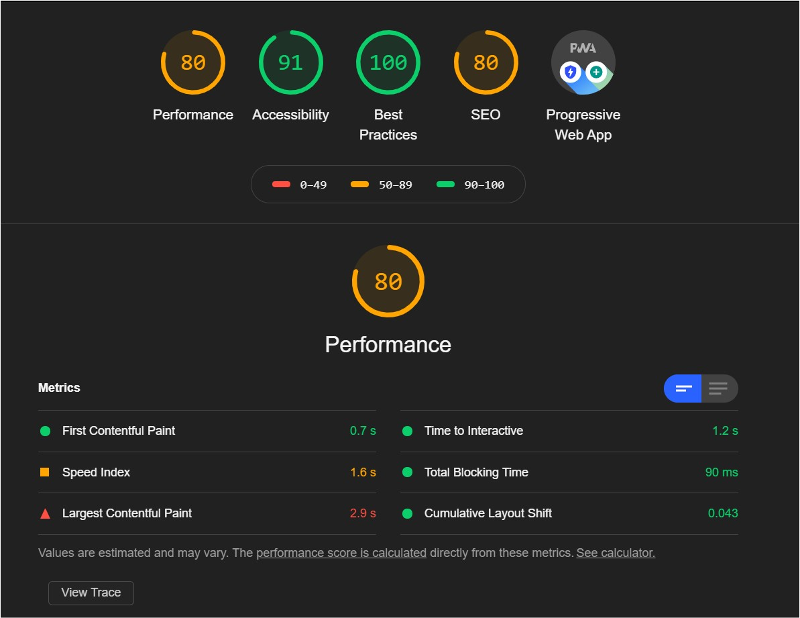

## Introduction

Aakarshan Artboard is a social media platform for connecting with friends online. It was originally built for the Aakarshan art club so members could showcase and share their artwork with each other over the internet.

## Purpose

Anyone with an email address can create an account and share images with the rest of the community.

## Features

### 1. Login / Register

### 2. Upload images

### 3. Pick a profile card while registering

### 4. Like, comment, and share

### 5. Get notified whenever there is a new post

### 6. Browse and contact other users

### 7. Install it as an app on your device (PWA)

## Other Highlights

### Google Material Design

### Mobile responsive

### Fast page loads

Dynamic post loading (infinite scrolling), caching, and offline support through the PWA keep things quick — the app loads in under 3 seconds on an average mobile connection.

