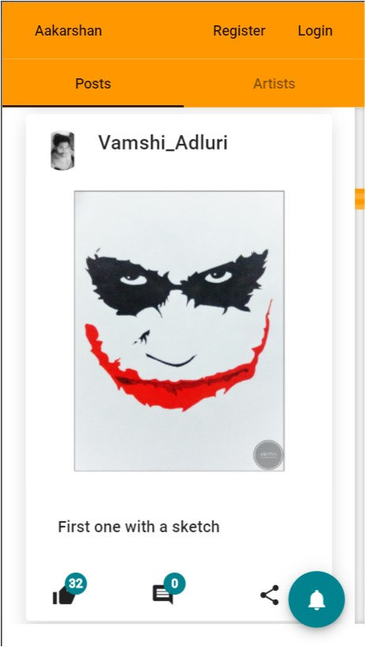

# Aakarshan Artboard
***

## Introduction
It's a social media platform it lets you connect with your friends online, Originally designed to showcase art work
with friends over internet

## Purpose
It let anyone with a mail id create account and share media images to everyone on website

## Features of Aakarshan

### 1. Login / Register

2. Upload Images

3. Ability to choose Profile cards when registering

4. Ability to Like, Comment and Share

5. Notify Users whenever there is a new post

6. View and Contact all other users

7. Ability to install as an app on your Device (PWA)

## Other Features

1. Google Material Design (Home Page)

2. Mobile Responsive

3. Faster Page Loading (Dynamic Post Loading/ Infinity Scrolling ) Caching and Offline Support (PWA)

  Loads in less than 3s on average mobile  network speed

