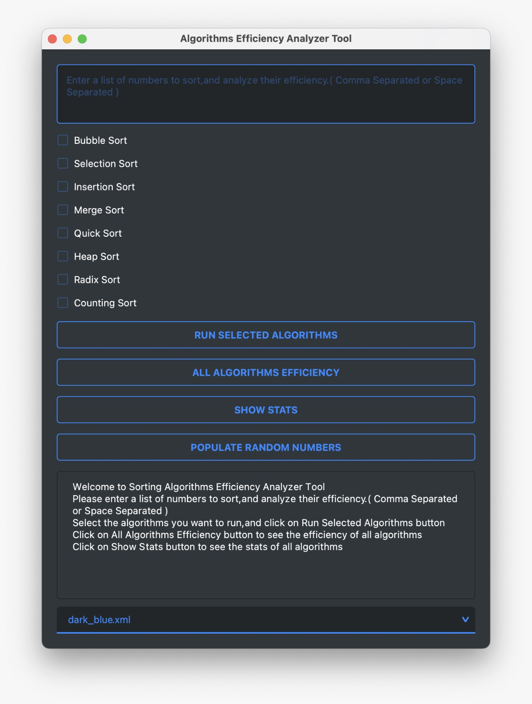
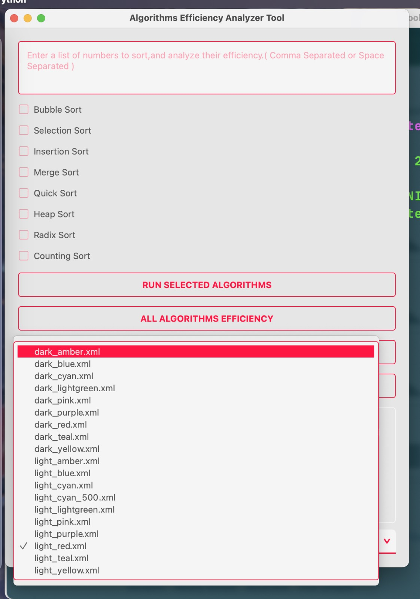
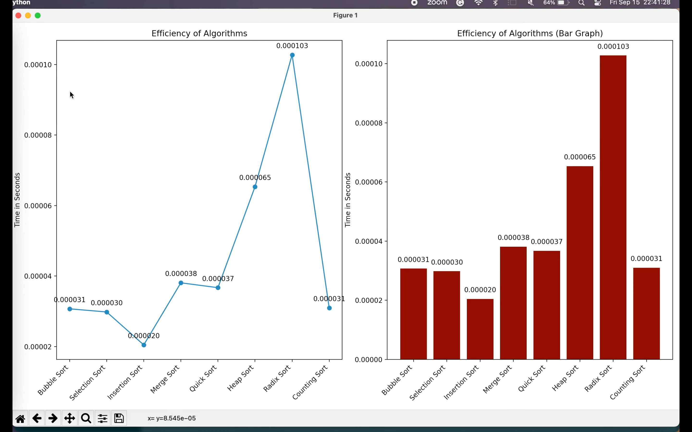

# Python GUI App to Analyze Sorting Algorithms

Simple Python GUI using PyQt5 and Qt-Material to analyze sorting algorithms.


## Screenshots



<br/>



<br/>



## Demo Video

<iframe width="560" height="315" src="https://www.youtube-nocookie.com/embed/8yOZqOd-Utw?si=1lYNCXSIagH-FSZv"
        title="YouTube video player" frameBorder="0"
        allow="accelerometer; autoplay; clipboard-write; encrypted-media; gyroscope; picture-in-picture; web-share"
        allowFullScreen></iframe>

## Instructions to run the Application ( MacOS )

1. Clone the repository using this URL

```bash
git clone https://github.com/keshavlingala/AlgoAnalyzerTool
cd AlgoAnalyzerTool
chmod +x setup app # This will give execute permission to setup and app files
./setup # This create a virtual environment and install all the dependencies
./app # This will run the application
```


