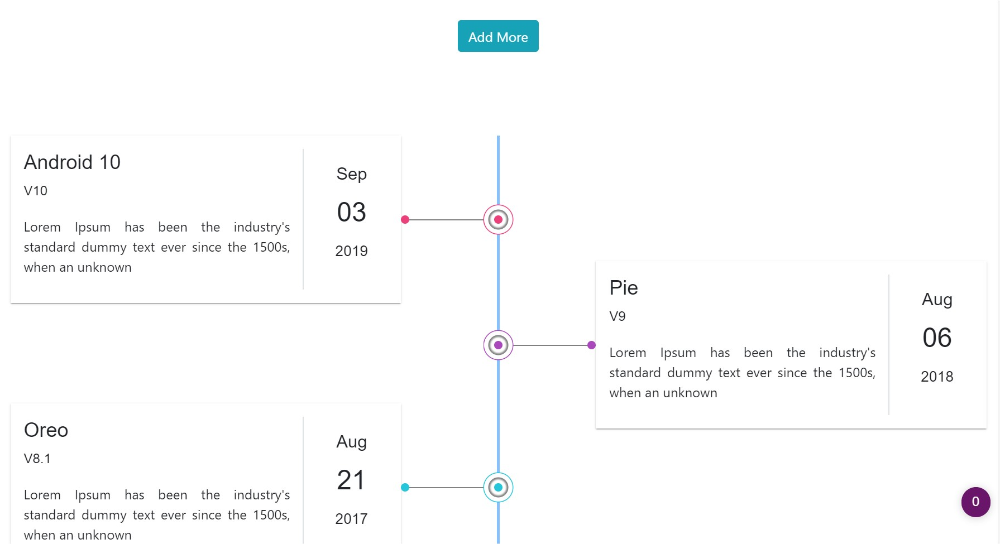

## Overview

A lightweight, CSS-based Angular library, published to npm, for rendering dynamic data as a clean, responsive timeline. Each item's colors are individually customizable so the component blends into any design.

> This library is no longer maintained.

## Installation

Install from npm:

```bash
> npm i angular2-timeline
```

Add the timeline module to your app:

```typescript
import {TimelineModule} from "angular2-timeline";

@NgModule({
    ...
  imports: [
    TimelineModule,
    ...
  ],
```

## Exposed Components

- `TimelineComponent`
- `TimelineItemComponent`

## How to use

```html
<timeline>
  <timeline-item>
 <!-- your content here -->
  </timeline-item>
</timeline>
```

A complete example with statically and dynamically added items:

```typescript
import {Component} from '@angular/core';

@Component({
  selector: 'app-root',
  template: `
    <button (click)="more.push(0)">Add More</button>
    <timeline>
      <timeline-item>
        <div style="background-color: azure;padding: 10px;box-shadow: 3px 3px 15px 3px #6565656b;">
          <h1>Title</h1>
          <h4>Subtitle</h4>
          <p>Lorem Ipsum is simply dummy text of the printing and typesetting industry. Lorem Ipsum has been the
            industry's
            standard dummy text ever since the 1500s.</p>
        </div>
      </timeline-item>
      <timeline-item>
        <div style="background-color: azure;padding: 10px;box-shadow: 3px 3px 15px 3px #6565656b;">
          <h1>Title</h1>
          <h4>Subtitle</h4>
          <p>Lorem Ipsum is simply dummy text of the printing and typesetting industry. Lorem Ipsum has been the
            industry's
            standard dummy text ever since the 1500s.</p>
        </div>
      </timeline-item>
      <timeline-item *ngFor="let i of more">
        <div style="background-color: azure;padding: 10px;box-shadow: 3px 3px 15px 3px #6565656b;">
          <h1>Title</h1>
          <h4>Subtitle</h4>
        </div>
      </timeline-item>
    </timeline>
  `,
})
export class AppComponent {
  more = [];
}
```

Set a dot color per item with a HEX code:

```html
<timeline>
    <timeline-item color="#42b5b6">
        <!--Your Content Goes Here-->
    </timeline-item>
</timeline>
```

# Features

- Mobile responsive
- Customizable dot color for each timeline item

***
