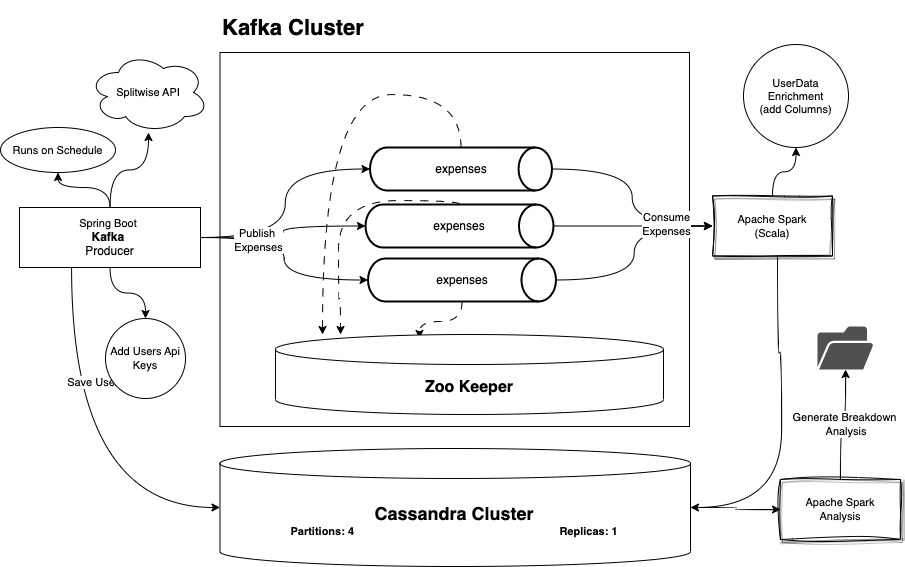
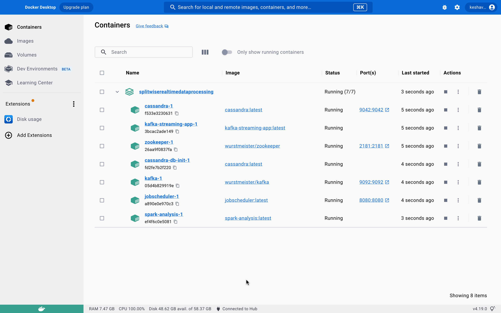
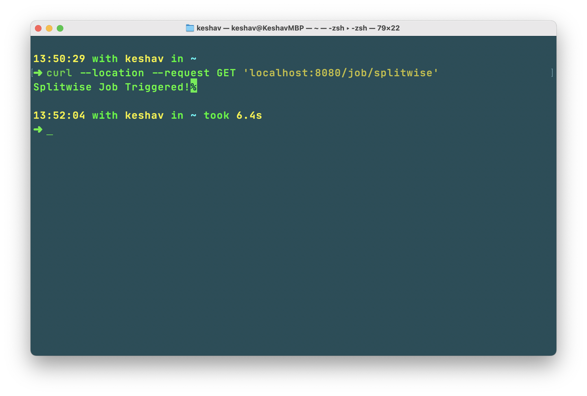
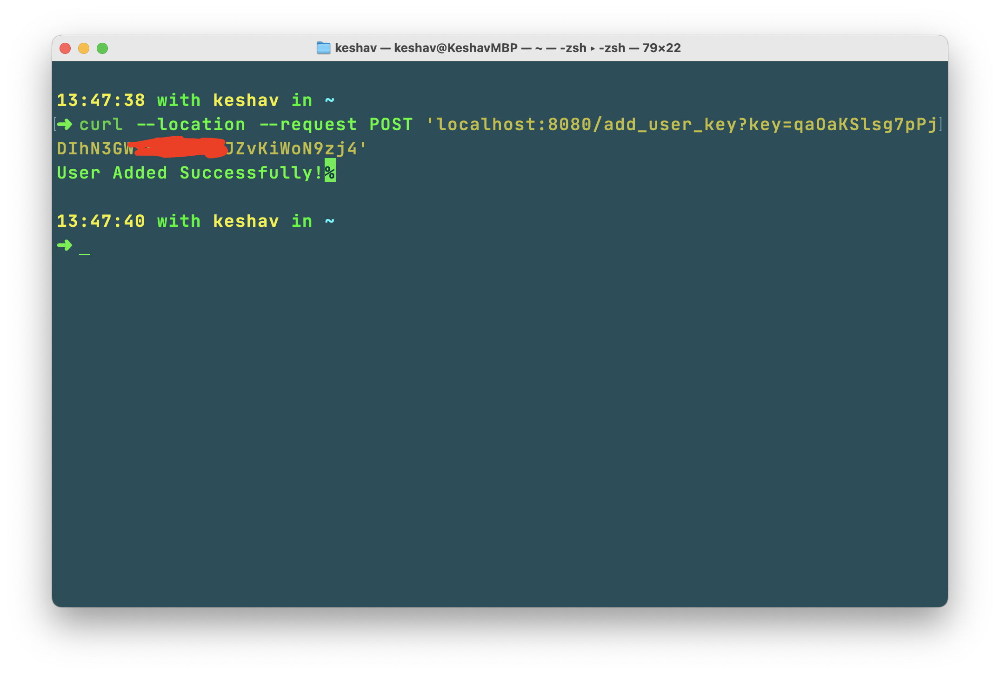

## Introduction

[Splitwise](https://www.splitwise.com/) is a free tool friends and roommates use to track shared bills and expenses. This project pulls that financial data and processes it with a Big Data stack in two modes: a real-time streaming pipeline and a batch analytics job. It is built with Kafka, Spark, Spring Boot, Cassandra, and Docker Compose, and is meant as an end-to-end demonstration of wiring these tools together into a working pipeline.

## Architecture



## Technologies Used

- Kafka
- Spark
- Spring Boot
- Cassandra
- Docker
- Docker Compose
- Gradle
- SBT
- Scala
- Kotlin
- CQL

## How to run the project

### Prerequisites

- Docker

### Steps

Clone the project, change into its directory, and build the images:

```shell
docker build -t jobscheduler ./scheduler
docker build -t spark-analysis ./sparkanalysis
docker build -t kafka-streaming-app ./kafka-streaming-app
```

Start everything with Docker Compose:

```shell
docker-compose up -d
```

Docker Desktop should look like this:



Give Cassandra and Kafka about 60 seconds to start. The `cassandra-init` service is expected to stop after ~65 seconds (depending on machine speed) once it has initialized the database — if it stops before the database is ready, run it again and wait another 60 seconds. This is only needed the first time.

Once Cassandra is up and initialized, start the `jobscheduler` service, then register a Splitwise user:

```shell
curl --location --request POST 'localhost:8080/add_user_key?key=<splitwise-api-key>' \
--data ''
```

> A Splitwise API key can be generated [here](https://secure.splitwise.com/apps/new).

Start the `kafka-streaming-app` service and trigger the scheduler:

```shell
curl --location --request GET 'localhost:8080/job/splitwise'
```



This triggers the scheduler to fetch data from Splitwise and push it to Kafka. The `kafka-streaming-app` service consumes from Kafka, processes the data, and writes it to Cassandra.



Finally, start the `sparkanalysis` service to generate reports into the [output](./output) folder. It stops automatically once the reports are written. The generated CSVs can be opened directly in Excel or fed into a visualization tool such as Tableau or Power BI.
