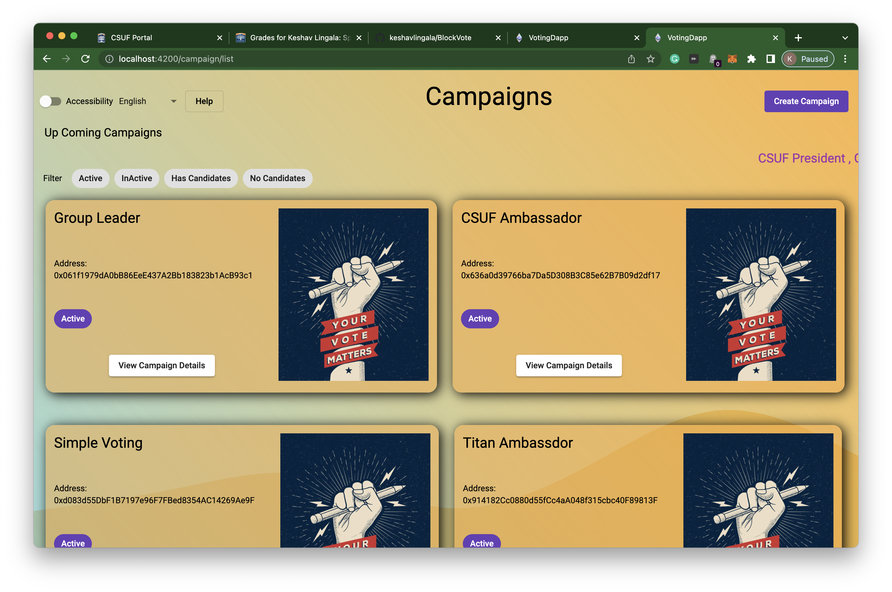
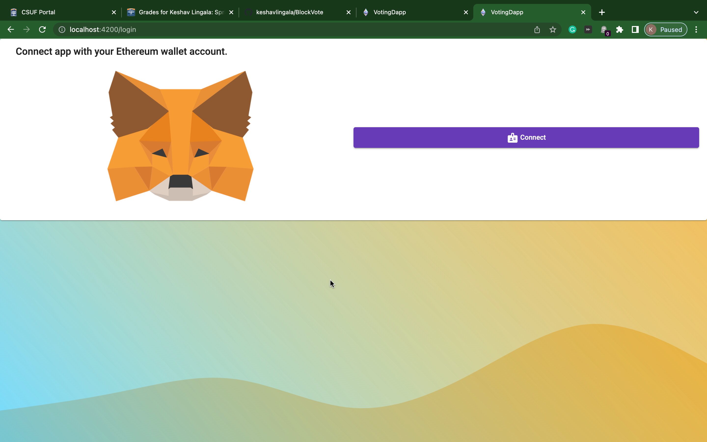
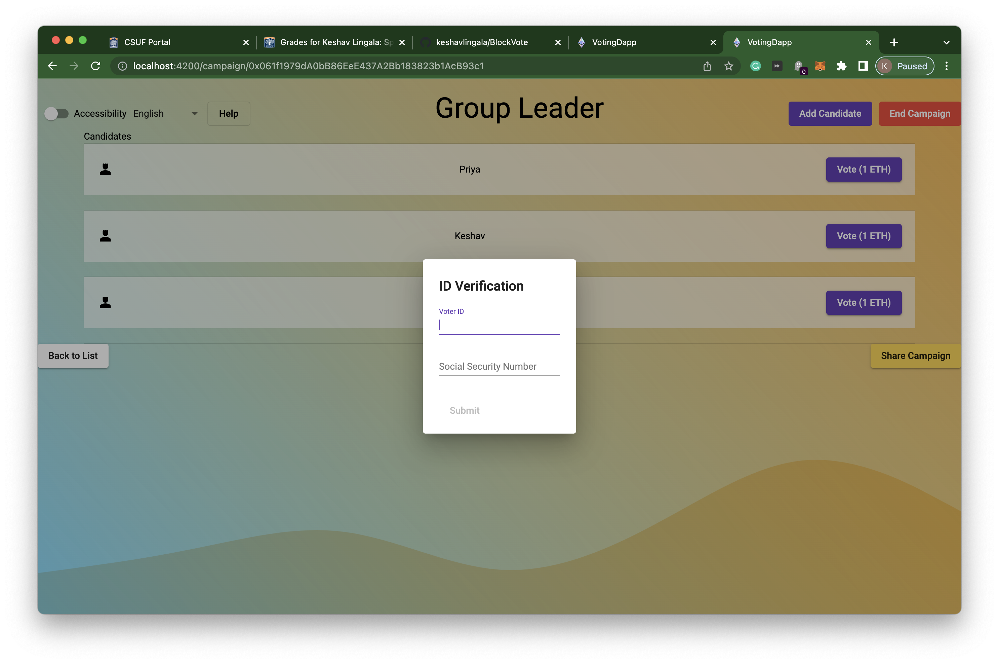
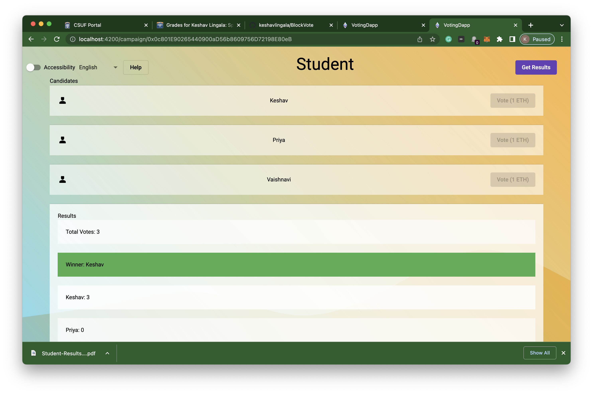
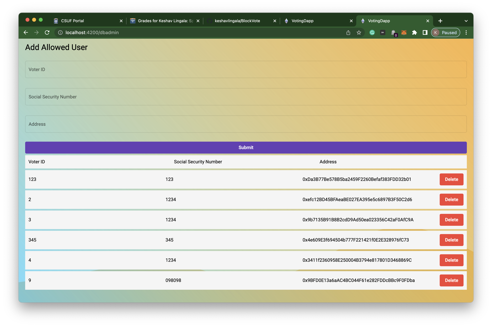
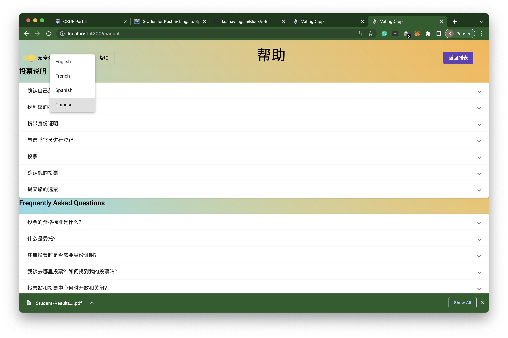

# BlockVote

Secure and Transparent Elections: Implementing a Blockchain-Based Voting System

## Introduction

## Project Description

The application lets any user create campaigns, whoever creates the Campaign will be the Campaign's owner, and only he can
modify the Campaign. Each Campaign will have candidates. The Campaign owner can only add candidates.

In order to use the application, the user must install Metamask as a Blockchain wallet and connect to the respective network.
Users with voting rights can vote.

Moreover, the Campaign owner can make the Campaign Inactive. Everyone can see the votes and the Winner and Download the Results in PDF format. Each Campaign and candidate in the Campaign will have a unique blockchain address so It can be transparent, and all the vote transactions can be seen in transaction history and Etherscan.
Users can always go to the help screen to understand the rules and see FAQs for better usability.

The application is also accessible for visually impaired users using a voiceover when hovered over the screen.
The application also supports multiple languages with a single click of a button.

## Technical Details

- Used Truffle to deploy smart contracts to Ganache and Sepolia Ethereum Network
- Used Angular 11 and NX Workspace for front-end development
- ng-web3 library to connect to Metamask and make blockchain transactions
- Used Google's Material Design Standard Components
- Used Multiple Solidity contracts and inheritance features to develop  robust smart contracts
- Used Dexie for Minimalist IndexedDB to store eligible voters
- Used JsPDF Library to generate PDF files

# Instructions to run the project

- Clone the repository
- Run `npm install` in the root directory
- Run `npm run truffle:develop` to start the local blockchain
- Run `npm run truffle:migrate` to deploy the smart contracts to the local blockchain
- Modify the `truffle-config.js` file to point to the local blockchain
- Copy the contract addresses from the terminal and paste them in the file `environment..campaignFactory.address`
- Run `npm run start` to start the frontend application
- Navigate to `http://localhost:4200/` to view the application

## Project Features

- Create Campaign
- Adding Candidates to Campaign
- Voting for Candidates
- Smart Contracts for Campaign operations and voting operations
- Ability to make a Campaign InActive after Voting is done, so that no more votes can be cast
- Security, cannot access any campaigns without logging in
- ID verification and ability to add eligible voters ( Voter ID and Social Security)
- Ability to Download Voting Results as PDF file
- UI Improvements, Card Designs, Colors, Buttons, Animation, Icons, Images etc
- Multiple Language Support
- Improve accessibility for visually impaired users
- Upcoming Elections Headers
- Help Screen with Instructions and FAQs for Voters
- Share Campaign on Any Social Media Platform with a single click
- Deployed to Sepolia Testnet and Ganache

## Project Screenshots

### Home Page

### Login and Metamask Connection

### Casting User Vote using Metamask

### Campaign Details

### Local DB for storing eligible voters

### Help Screen

