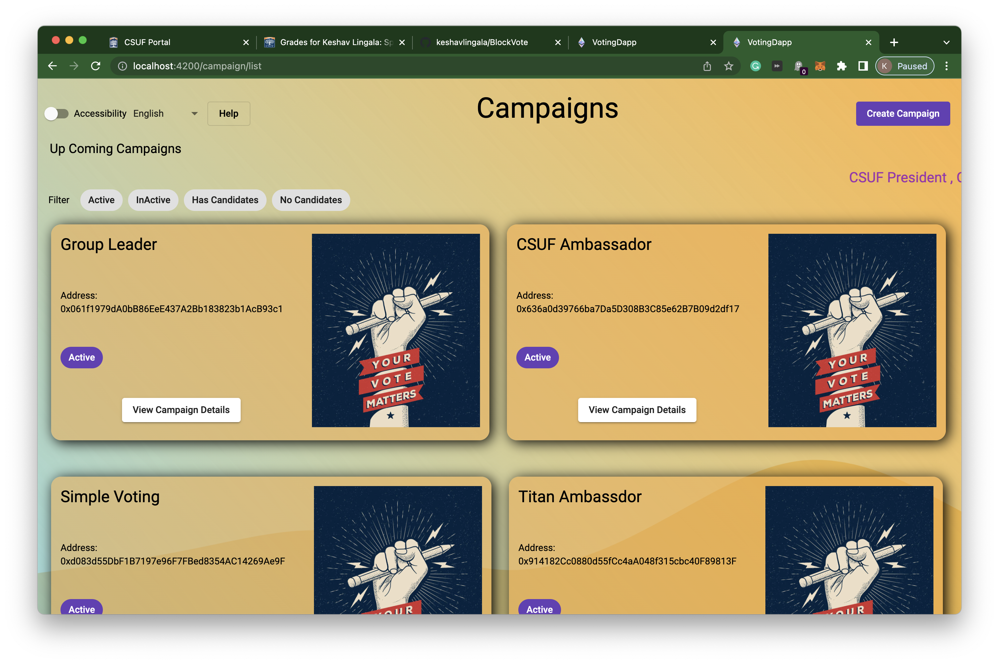
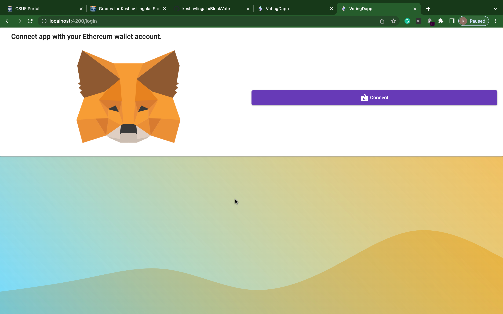
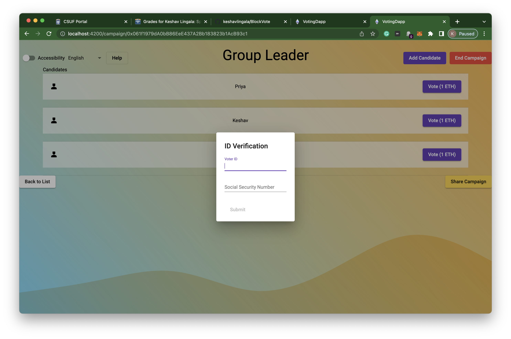
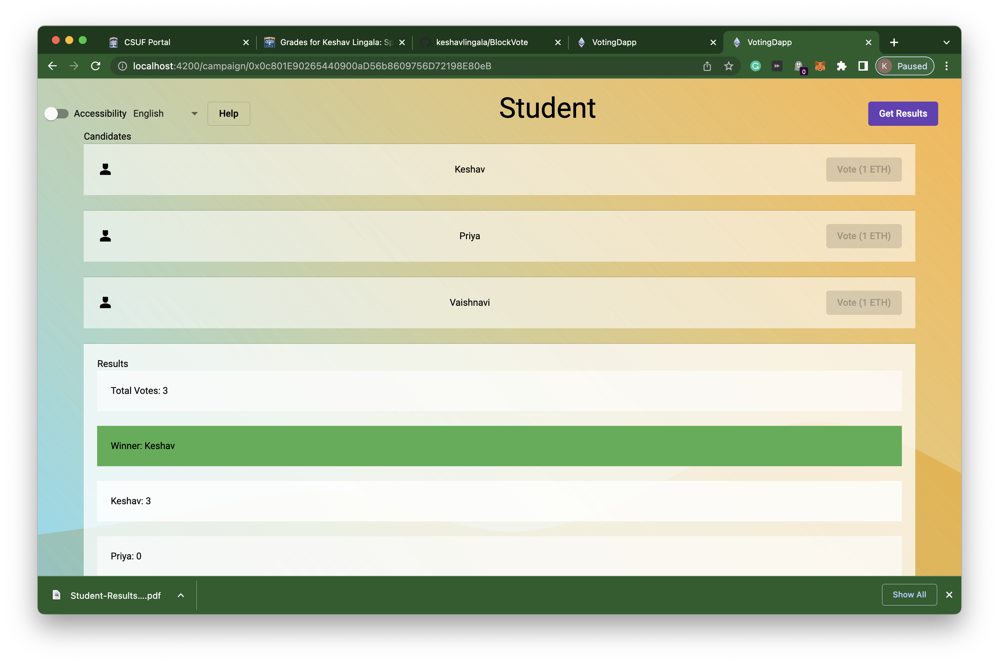
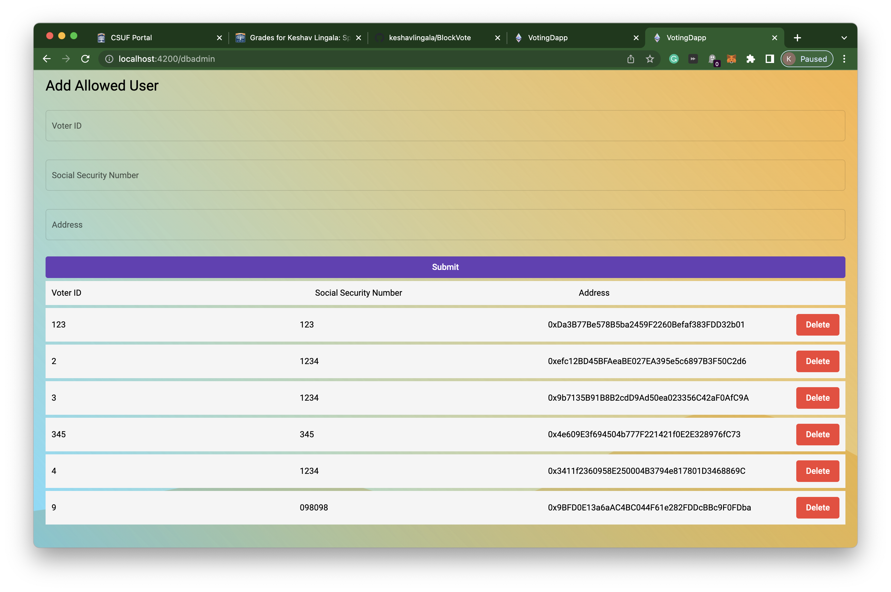
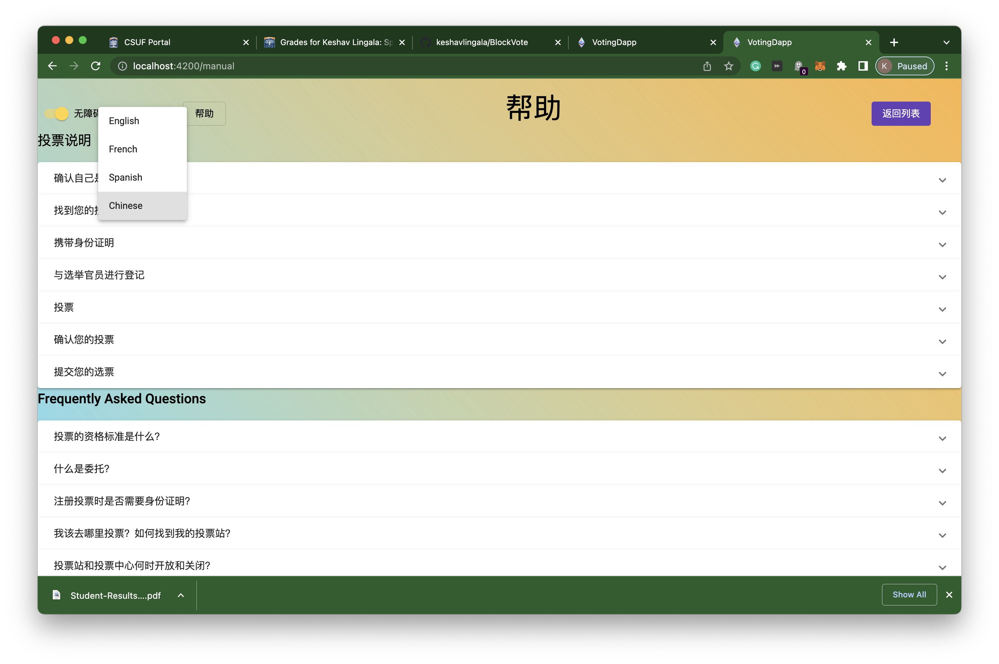

Secure and transparent elections, implemented as a blockchain-based voting system.

## Project Description

Any user can create a voting campaign. The user who creates a campaign becomes its owner and is the only one who can modify it or add candidates. To participate, voters install Metamask as their blockchain wallet and connect to the appropriate network; users with voting rights can then cast their vote.

The campaign owner can mark a campaign inactive once voting is complete, after which no further votes can be cast. Every campaign and candidate has a unique blockchain address, so results are fully transparent — anyone can view the votes and the winner, download the results as a PDF, and verify every transaction in the in-app history or on Etherscan. A help screen with rules and FAQs is always available for guidance.

The application is also accessible to visually impaired users through voiceover on hover, and supports multiple languages with a single click.

## Technical Details

- Truffle to compile and deploy smart contracts to Ganache and the Sepolia Ethereum network
- Angular 11 with an Nx workspace for the front end
- `ng-web3` to connect to Metamask and submit blockchain transactions
- Google Material Design components
- Multiple Solidity contracts using inheritance for robust, modular smart contracts
- Dexie (a minimalist IndexedDB wrapper) to store the eligible-voter list
- jsPDF to generate the downloadable results

# Instructions to run the project

- Clone the repository
- Run `npm install` in the root directory
- Run `npm run truffle:develop` to start the local blockchain
- Run `npm run truffle:migrate` to deploy the smart contracts to the local blockchain
- Modify `truffle-config.js` to point to the local blockchain
- Copy the contract addresses from the terminal into `environment.campaignFactory.address`
- Run `npm run start` to start the frontend application
- Open `http://localhost:4200/` to view the application

## Project Features

- Create campaigns and add candidates
- Cast votes for candidates through Metamask
- Smart contracts for all campaign and voting operations
- Mark a campaign inactive once voting is done, locking out further votes
- Authentication required — no campaign is accessible without logging in
- ID verification and an eligible-voter list (Voter ID and Social Security)
- Download voting results as a PDF
- Polished UI: card designs, colors, buttons, animations, icons, and imagery
- Multi-language support
- Improved accessibility for visually impaired users
- Upcoming-elections header
- Help screen with instructions and FAQs for voters
- One-click campaign sharing to any social platform
- Deployed to the Sepolia testnet and Ganache

## Project Screenshots

### Home Page

 

### Login and Metamask Connection

 

### Casting a Vote with Metamask

 

### Campaign Details

 

### Local DB for Eligible Voters

 

### Help Screen

 
