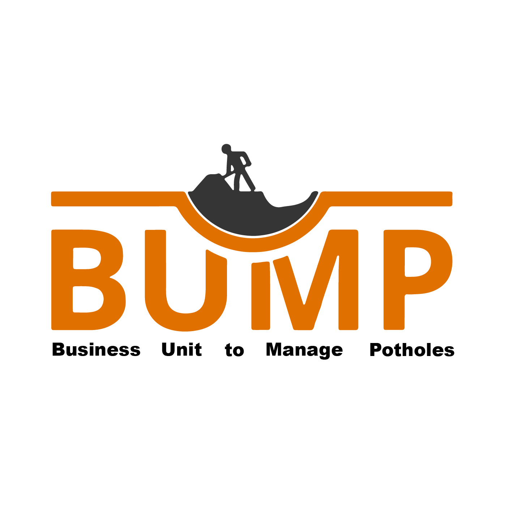
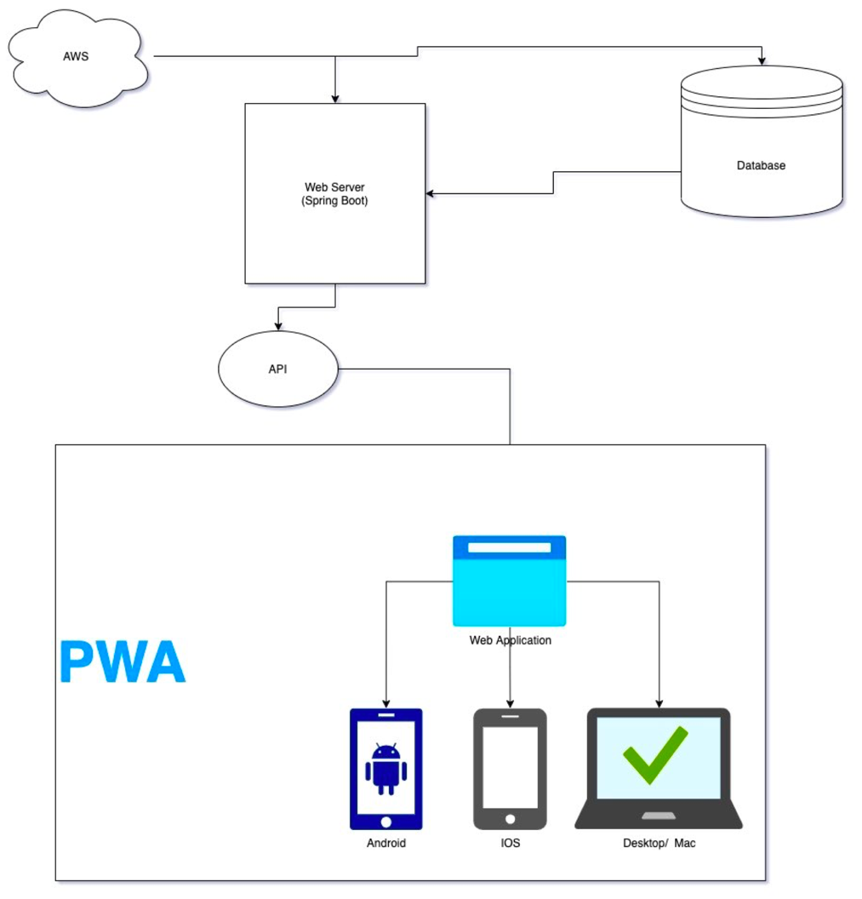
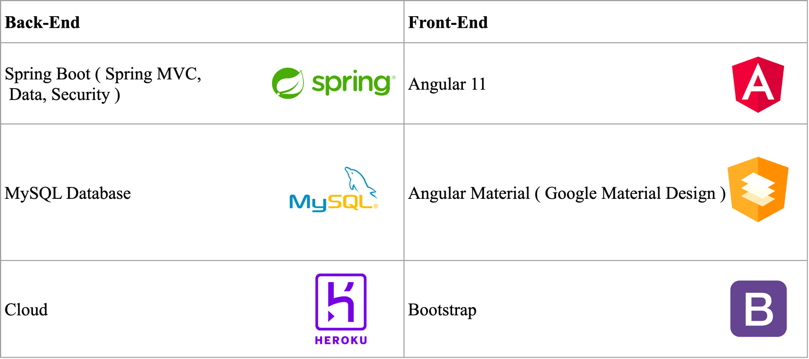
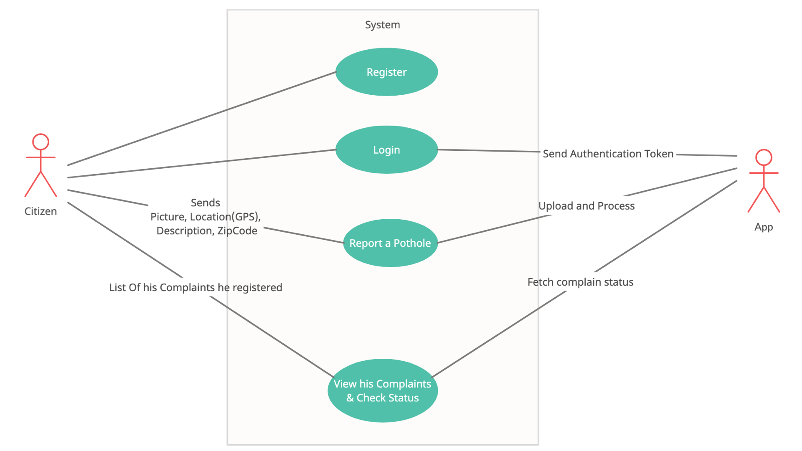
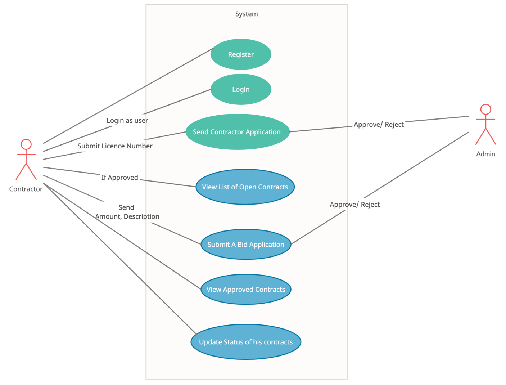
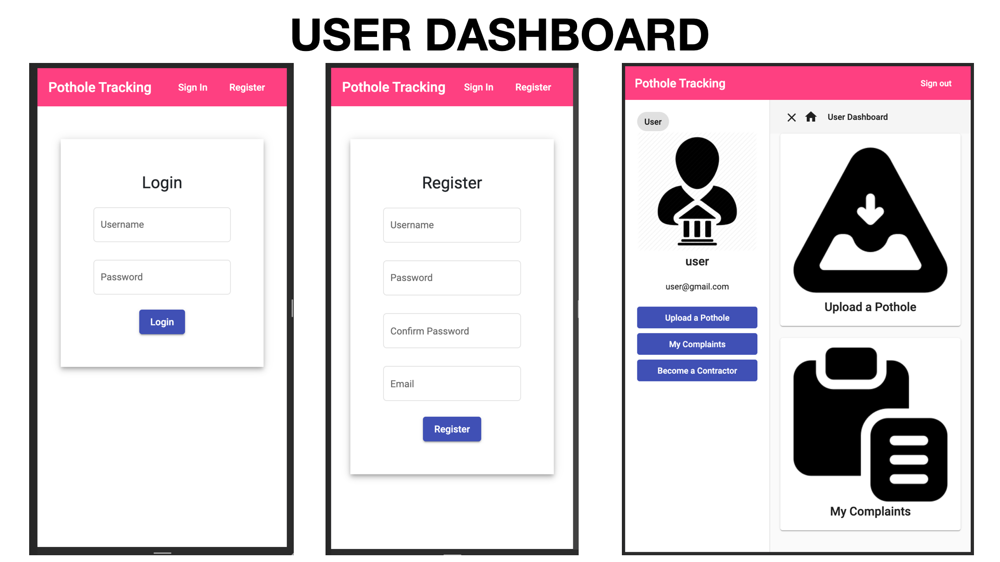
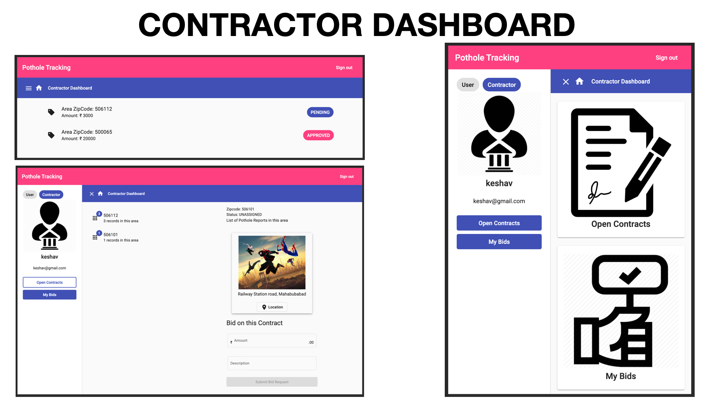
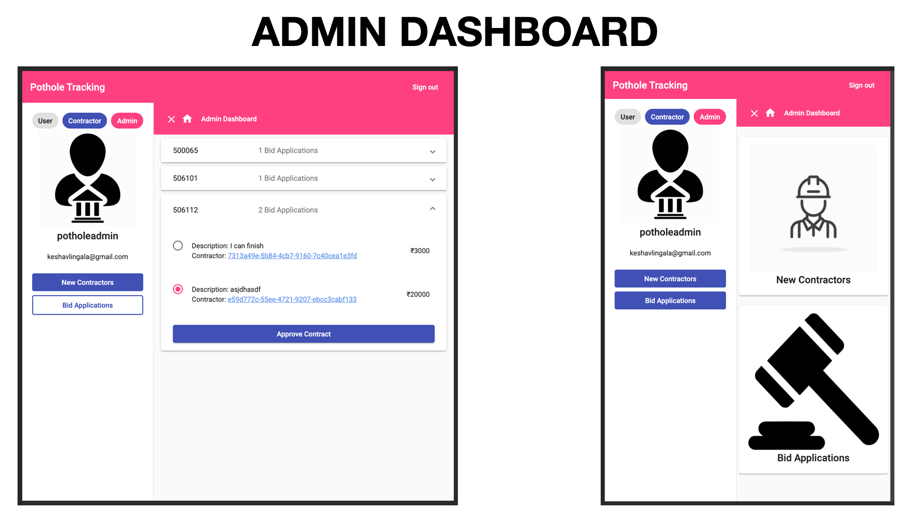

# Business Unit to Manage Potholes
---

## Introduction
 ---

Problem Statement took from SIH ( Smart India Hackathon )

|                            |                                                                                                                                                                                                                                                                                                                                                                                                                                                                                                                                                                                                         |
|----------------------------|---------------------------------------------------------------------------------------------------------------------------------------------------------------------------------------------------------------------------------------------------------------------------------------------------------------------------------------------------------------------------------------------------------------------------------------------------------------------------------------------------------------------------------------------------------------------------------------------------------|
| **Description**            | Goa has faced the rage of rains this year and potholes are the biggest problem which government is tackling. Now problem lies in the fact that concerned departments are not able to co-ordinate to resolve the issue. ISSUES (a) Fundamentally there is disconnection between civil agencies, people and elected representatives. (b) The aim is to build a mobile based dynamic reporting system which will facilitate into flow of information among all concerned stakeholders. (c) The aim is to provide better Governance by more involvement of public. |
| **Organization**           | Govt of Goa                                                                                                                                                                                                                                                                                                                                                                                                                                                                                                                                                                                             |
| **Category**               | Software                                                                                                                                                                                                                                                                                                                                                                                                                                                                                                                                                                                                |
| **Domain Bucket	Software** | Mobile App development                                                                                                                                                                                                                                                                                                                                                                                                                                                                                                                                                                                  |

## Project Design
---

> This is just a miniaturized software solution for all the paper work done by government which is very complex

Angular PWA Application talks to Spring Boot Web Server.
Web Server is connected and communicates to Amazon S3 Bucket and MySQL Server

### Functionalities

Users can upload details of pothole, and the location at which the pothole picture is clicked is tracked by using GPS. There is also a feature where the citizens can register their details along with their license number and get approved by the government  as contractors for filling in the potholes. Contracts can bid for a particular pothole, the government can select the best bid and award the pothole repair contract. The status of repairing of pothole is updated to both government and the citizens.

* Pothole complaints can be directly registered by citizens
* People can provide their contract and stand a chance to repair the pothole
* Citizens receive updates regarding the complaints registered
* Prioritize potholes in order to reduce inconvenience to public
* Government authorities have complete access and control over the application

### Technical Implementation
* Platform Independent
* Details of pothole are saved in the absence of internet
* Efficient and reliable
* Material Design
* Mobile Responsive

## Technology Stack

## Use Cases
---

### User Use Case

### Contractor Use Case

## Screenshots
---

