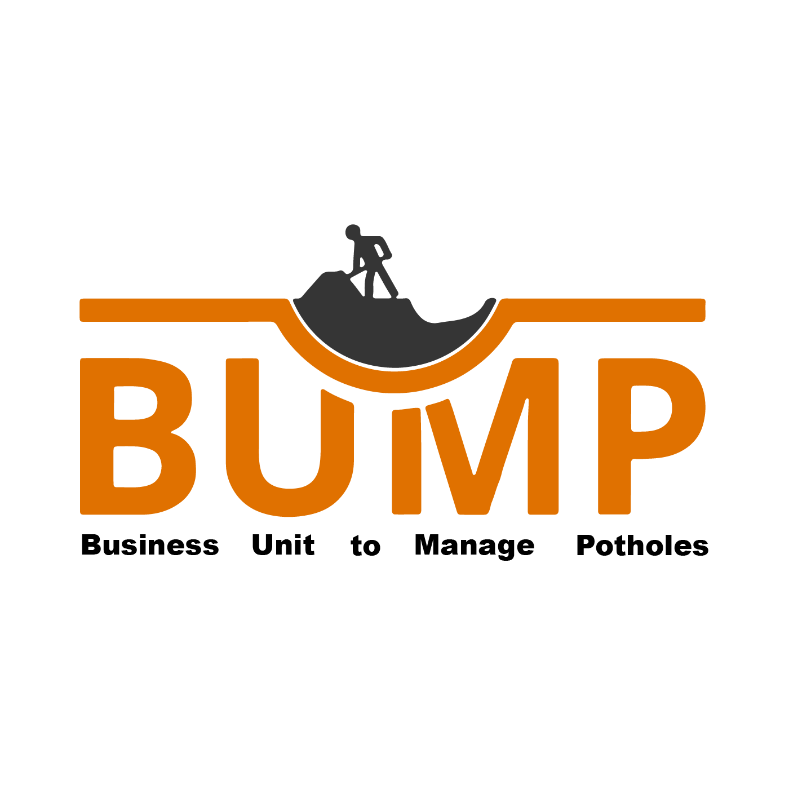
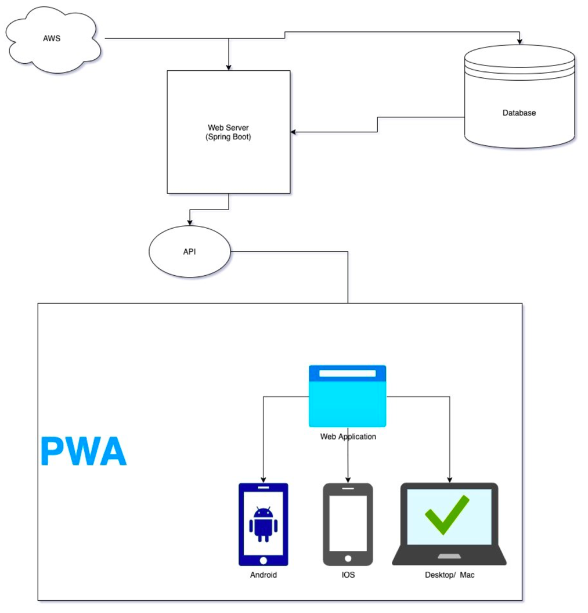
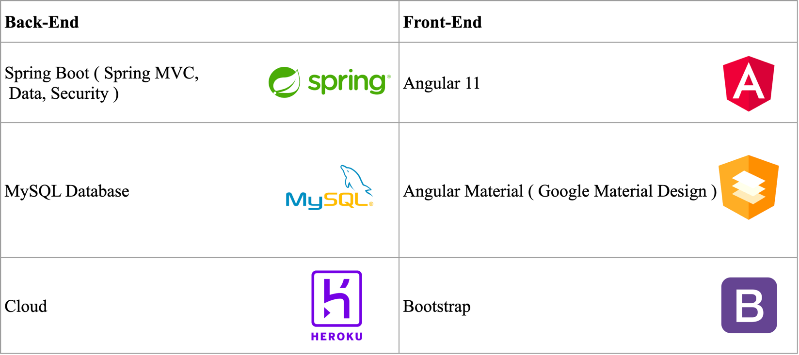
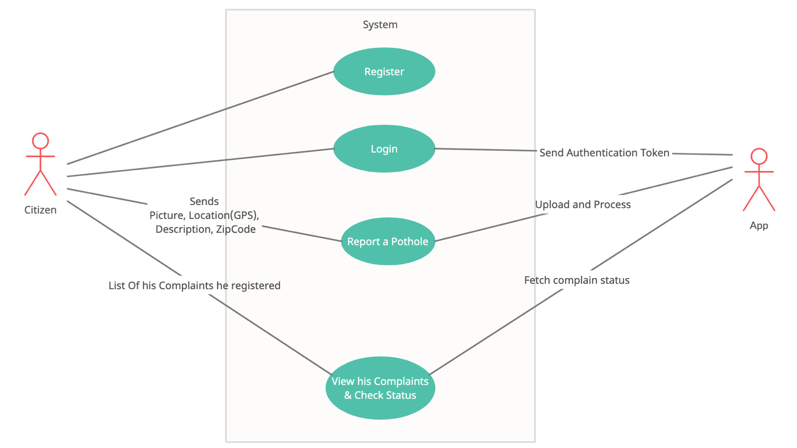
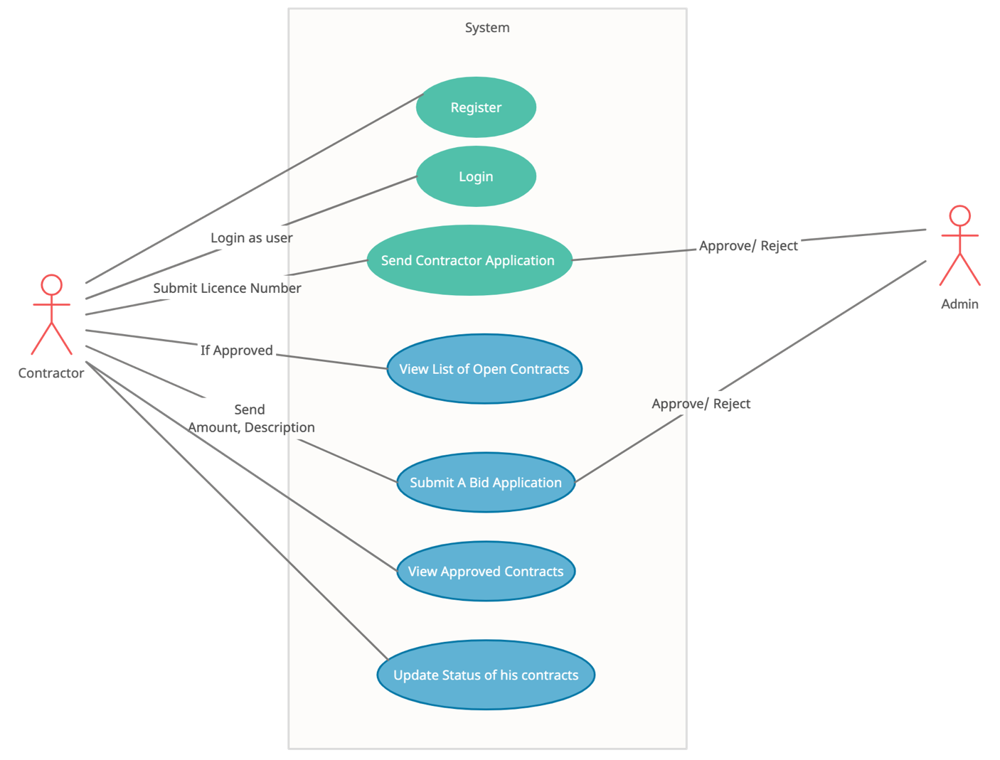
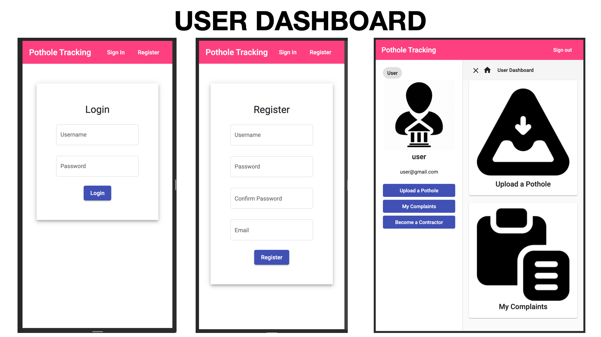
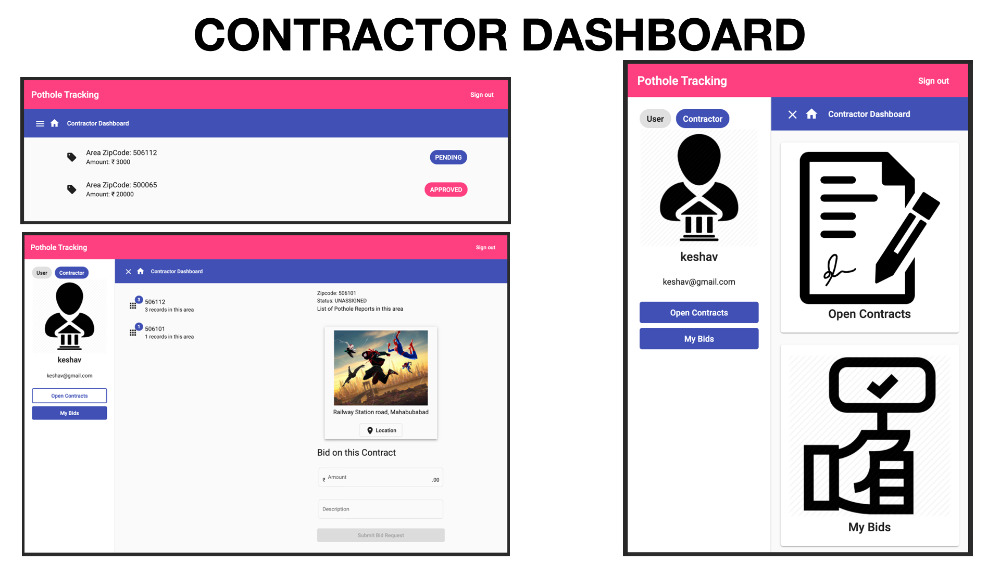
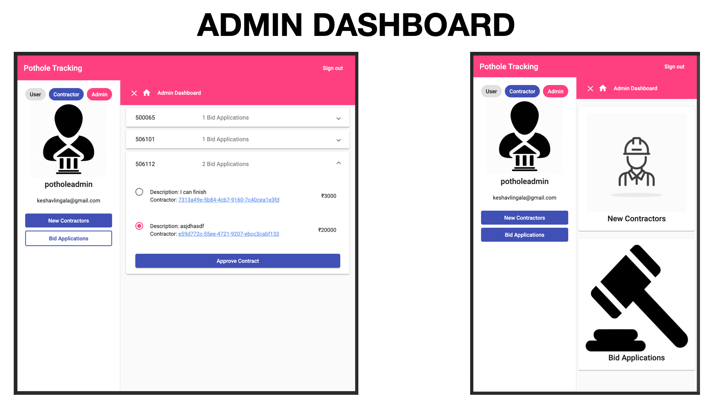

## Introduction

Bump was built around a problem statement from the Smart India Hackathon (SIH):

> **Problem:** Goa faced heavy rains, and potholes became the government's biggest maintenance challenge. The core issue is coordination — there is a fundamental disconnect between civil agencies, the public, and elected representatives. The goal is a mobile-based dynamic reporting system that keeps information flowing between all stakeholders and improves governance through greater public involvement.

- **Organization:** Govt. of Goa
- **Category:** Software
- **Domain:** Mobile app development

## Project Design

> This is a miniaturized software solution for the otherwise very complex paperwork the government handles manually.

An Angular PWA talks to a Spring Boot web server, which in turn communicates with an Amazon S3 bucket and a MySQL database.

### Functionalities

Citizens upload pothole details, with the location captured automatically via GPS at the time the photo is taken. Citizens can also register with their license number and, once approved by the government, act as contractors. Contractors bid on a given pothole, the government selects the best bid and awards the repair contract, and the repair status is then kept up to date for both the government and the reporting citizens.

- Citizens can register pothole complaints directly
- Citizens can offer a contract and bid for the chance to repair a pothole
- Citizens receive updates on the complaints they registered
- Potholes are prioritized to minimize public inconvenience
- Government authorities have full access and control over the system

### Technical Implementation

- Platform independent
- Pothole details are saved even without an internet connection
- Efficient and reliable
- Material Design
- Mobile responsive

## Technology Stack

## Use Cases

### User Use Case

### Contractor Use Case

## Screenshots

