# ChainReaction with Minimax

> Live demo: https://chainreactionai.web.app/

## ABSTRACT

The chain reaction is a multiplayer game where each player will be assigned a color. It is a two - dimensional array
where each player gets a turn to choose a place on the board. After a player selects a cell on the board the counter on
the cell increases, maximum of 3 in each counter else the counter splits to the adjacent rows or columns.
The objective of the Chain Reaction is to take control of the board by eliminating your opponents' orbs.
Players take turns placing their orbs in a cell. Once a cell has reached critical mass the orbs explode into the
surrounding cells adding an extra orb and claiming the cell for the player. A player may only place their orbs in a
blank cell or a cell that contains orbs of their own color. As soon as a player loses all their orbs they are out of the
game.
We created ChainReaction from the beginning and used MiniMax Algorithm in Typescript to build a web application with
Angular 15 Framework.


## Introduction

This project is a web application that has been developed in the Angular framework. It uses the Minimax Algorithm to
implement the game of Chain Reaction. Chain Reaction is a two-player game where each player takes turns placing their
pieces on the board in an attempt to take over the board. The goal of the game is to be the last player with pieces on
the board.
The web application is implemented using the Angular framework and is written in TypeScript. The Minimax Algorithm is
used to determine the best move for each player. The game also utilizes HTML5 and CSS3 for the user interface. The
application is hosted on Firebase and can be accessed from any web browser.
The application has a simple user interface that allows the user to easily set up the game, choose the board size, and
choose the each player. The user can also choose to play against the computer ,against another human player, or
Computer-Computer with Human Interaction.
The application also features a scoreboard that displays the current scores of each player. This scoreboard is updated
as each game progresses.
Overall, this project has implemented the game of Chain Reaction using the Minimax Algorithm in the Angular framework.
The application is hosted on Firebase and can be accessed <a href="https://chainreactionai.web.app">here</a>.


## Chain Reaction Game

Chain Reaction is a deterministic, combinatorial game of perfect information for two to eight players. It was developed
by Buddy-Matt Entertainment for Android and can be downloaded from the Play
Store [here](https://play.google.com/store/apps/details?id=com.BuddyMattEnt.ChainReaction&amp;hl=en&pli=1). A sample
game playing on YouTube can be viewed [here](https://www.youtube.com/watch?v=L15TaZbLUo0).

A combinatorial game is a two-player game with no randomization, such as flipping a coin or rolling a dice. All the
players have perfect information, meaning they know all the information about the state of the game, nothing is hidden.
What makes this game exciting is how unpredictable it can be, even when playing with human friends. It may seem like one
player has the advantage, but then suddenly the other takes over.

The game is played on an mxn board, typically 9x6. For each cell on the board, there is a critical mass which is equal
to the number of orthogonally adjacent cells. All cells begin empty and each turn the Red and Green players take turns
placing their corresponding colored atoms. When the number of atoms in a cell reaches its critical mass, the cell
explodes, sending an atom to each of the orthogonally adjacent cells. If a red cell explodes and there are green cells
around, the green cells are converted to red. This chain reaction of explosions will continue until all cells are stable


### Rules of the Game

For each cell, the critical mass is determined by the number of orthogonally adjacent cells - 4 for regular cells, 3 for
cells on the edge, and 2 for cells in the corners.
At the start, all cells are empty. Blue and Black players take turns to place their corresponding colored "atoms" in an
empty cell or a cell with one or more of their atoms already placed. When two or more atoms are placed in the same cell,
they stack up.
When a cell reaches its critical mass, it explodes and adds an atom to each of its orthogonally adjacent cells while
losing as many atoms as its critical mass. This can cause an adjacent cell to reach its critical mass and so on,
creating a chain reaction of explosions until all cells are stable.
If a blue cell explodes and there are black cells around, they are converted to blue and the other rules of explosions
still apply. The same applies to other color.


### Heuristic Strategy

The Scores of each player is calculated as number of orbs the current player has in the board.
Heuristic at any state of the game is decided as score of the current player – score of opponent player. If the game is
a terminal state a heuristic value of +Infinity if player won. -Infinity if Player loses.
Below is the utility function to determine the heuristic value of the game state

```typescript
  //memorize
function utility(node: Node): number {
    let key = JSON.stringify(node);
    if (memorize.has(key)) {
        return memorize.get(key);
    }
    if (node.isTerminal()) {
        return node.state.currentPlayer.color == this.maxColor ? Infinity : -Infinity;
    }
    const own = node.state.gameData.flat(1).filter(v => v.value > 0 && v.color == this.maxColor).reduce((v, c) => v + c.value, 0)
    const opponent = node.state.gameData.flat(1).filter(v => v.value > 0 && v.color != this.maxColor).reduce((v, c) => v + c.value, 0)
    const value = own - opponent;
    memorize.set(key, value);
    return value;
}
```


## Angular Framework

Angular is an open-source web application framework developed and maintained by Google. It is a TypeScript-based
platform that allows developers to build dynamic and powerful web applications. Angular is written in TypeScript and
uses components, directives, and services to create complex applications. It is also used to create single page
applications (SPAs).
Angular is one of the most popular frameworks for building modern web applications. It has been used in many popular
websites and applications, such as YouTube, PayPal, Upwork, Freelancer, and Udemy. Angular is known for its scalability,
speed, and performance. It is also a great choice for developing large and complex applications.
Angular is built on the MVC (Model-View-Controller) architecture, which divides an application into three parts: the
model, the view, and the controller. The model stores the data, the view displays the data, and the controller connects
the model and the view. Angular also uses a two-way data binding system, which allows changes made to the data in the
model to be reflected instantly in the view.

Angular is an efficient framework for building modern web applications and has been used in many popular websites and
applications. It is a great choice


### Typescript

TypeScript is an open-source programming language developed and maintained by Microsoft. It is a strict, strongly typed
superset of JavaScript that compiles to plain JavaScript. TypeScript is designed for the development of large
applications and transcompiles to JavaScript.

TypeScript adds optional static typing to the language and supports tools for large-scale JavaScript applications for
any browser, for any host, on any OS. It helps developers to write code that is more maintainable and easier to
understand.

TypeScript supports classes, modules, and interfaces, which helps developers to build robust components. TypeScript also
supports static type-checking at compile time, which helps to catch common errors early in the development cycle.

TypeScript is a great choice for any application that needs to be written in JavaScript. It helps to reduce bugs and
improve the quality of the code.


## Minimax Algorithm

The minimax algorithm is a decision-making algorithm used in artificial intelligence and game theory. It is used to
determine the best move in a two-player game that has a finite number of possible moves. It works by looking at all
possible moves for each player and then determines which move would be the most beneficial for each player. The
algorithm works by having each player assume that the other player is making the best possible move and then choosing
the move that would be the best response to that move. The algorithm is beneficial in that it can be used to determine
the optimal move in a situation without the need for the player to manually explore all possible moves.

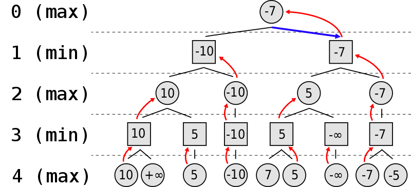


## Project implementation

The implementation of the game involves designing the game board, developing the rules of the game, and implementing a
graphical user interface (GUI). The game board will consist of a grid of cells. Each cell will represent a space on the
board where a player can place their pieces. The rules will define how the pieces can be placed and how a chain can be
formed. The GUI will allow the players to interact with the game board and make their moves.
The development of the game will involve the use of a Typescript language. The code will need to be designed in such a
way that it can be easily modified and extended. Additionally, the code should be well organized and documented to allow
for easy maintenance and debugging.
Finally, the game should also be tested thoroughly to ensure that it is working correctly. This will involve playing the
game several times and ensuring that


### Class Diagram

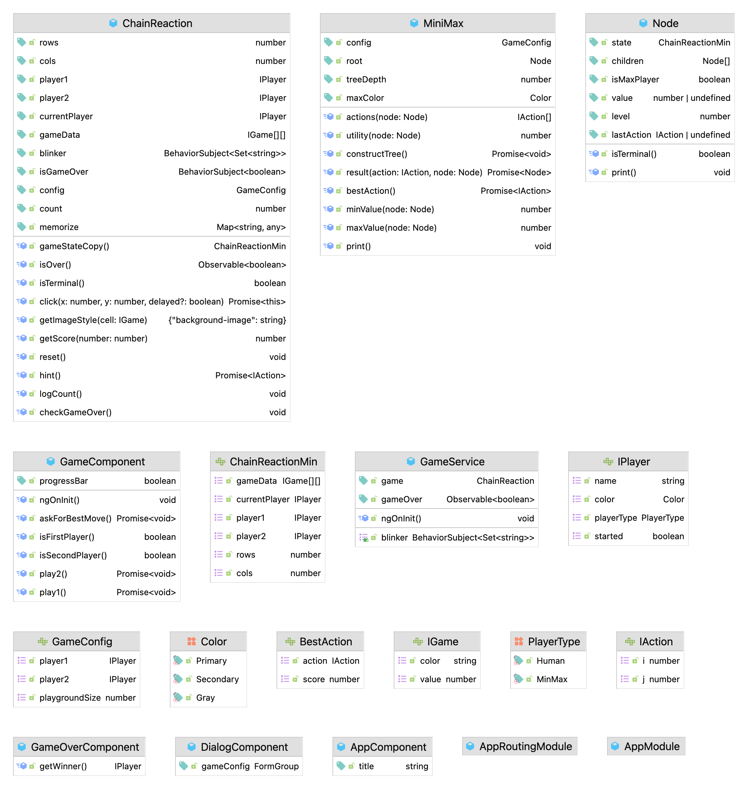


### Classes and Dependencies

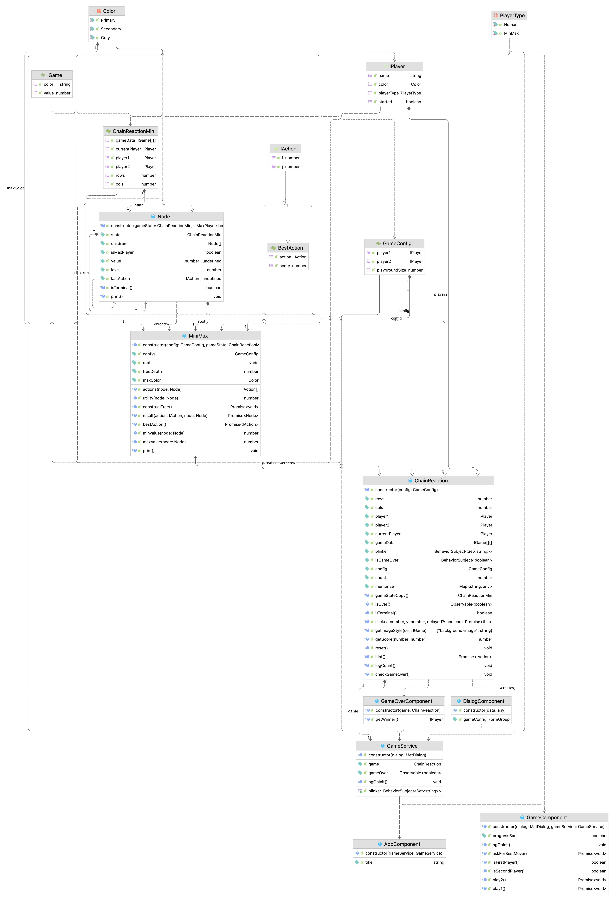


### Game working screenshots

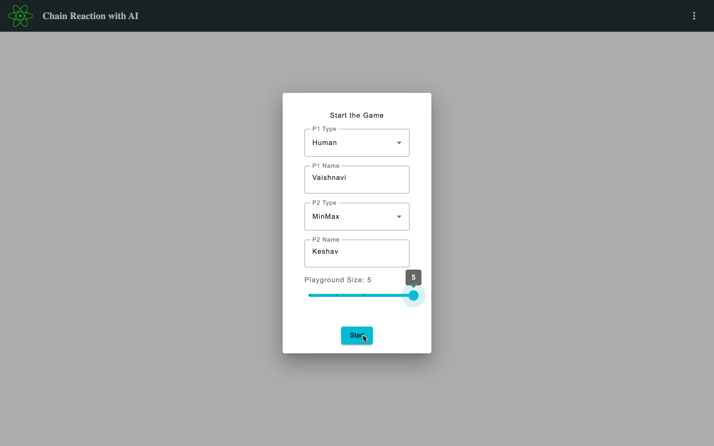


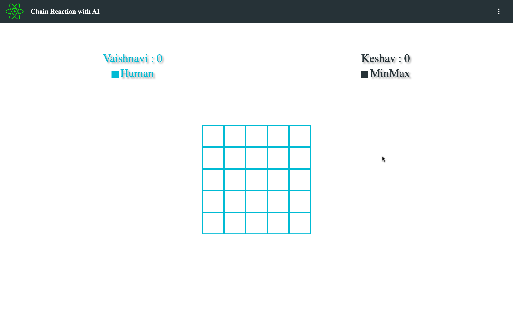


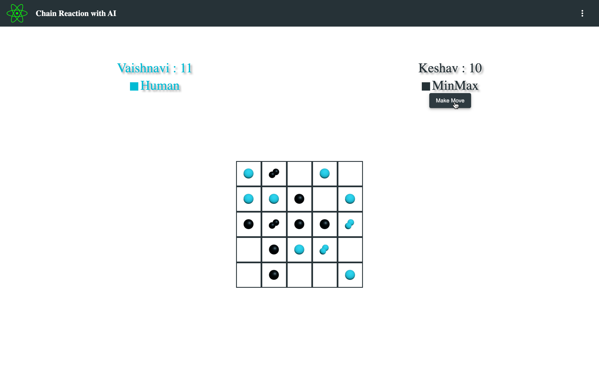


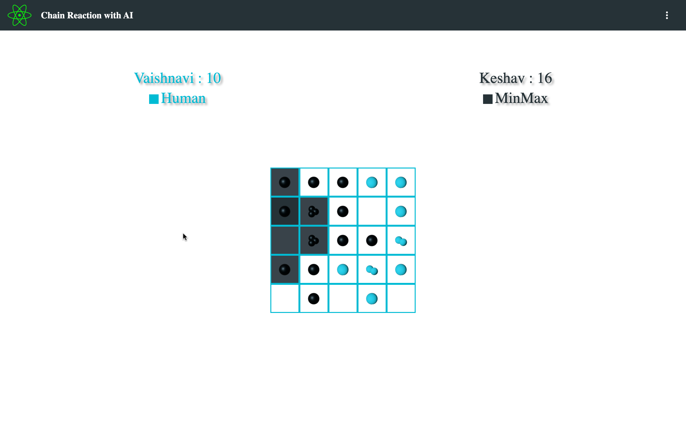


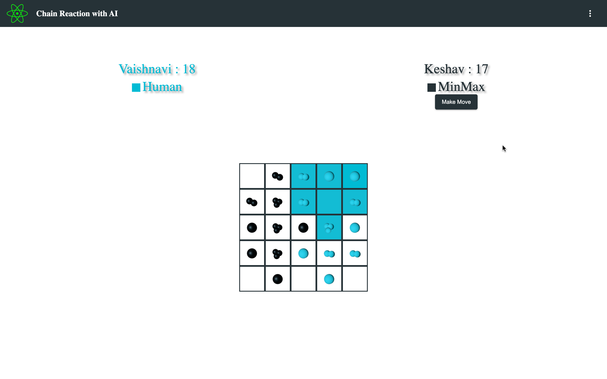


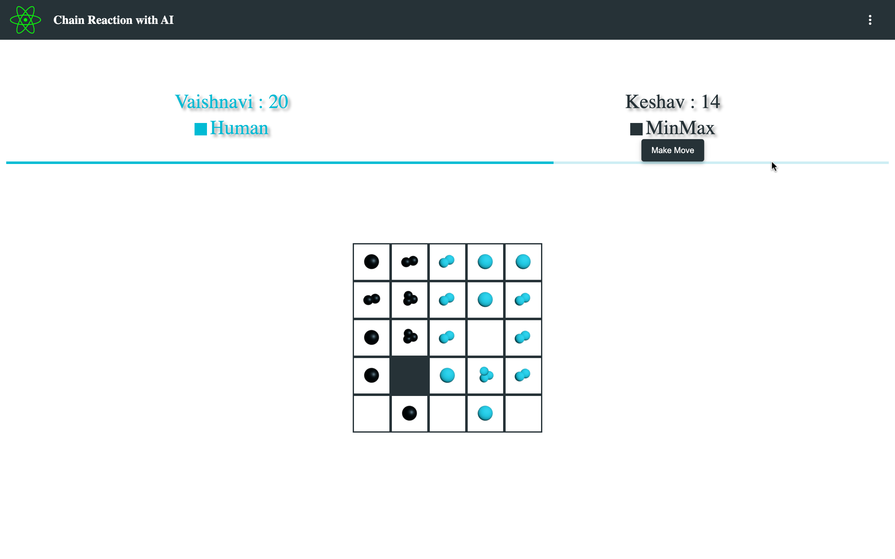


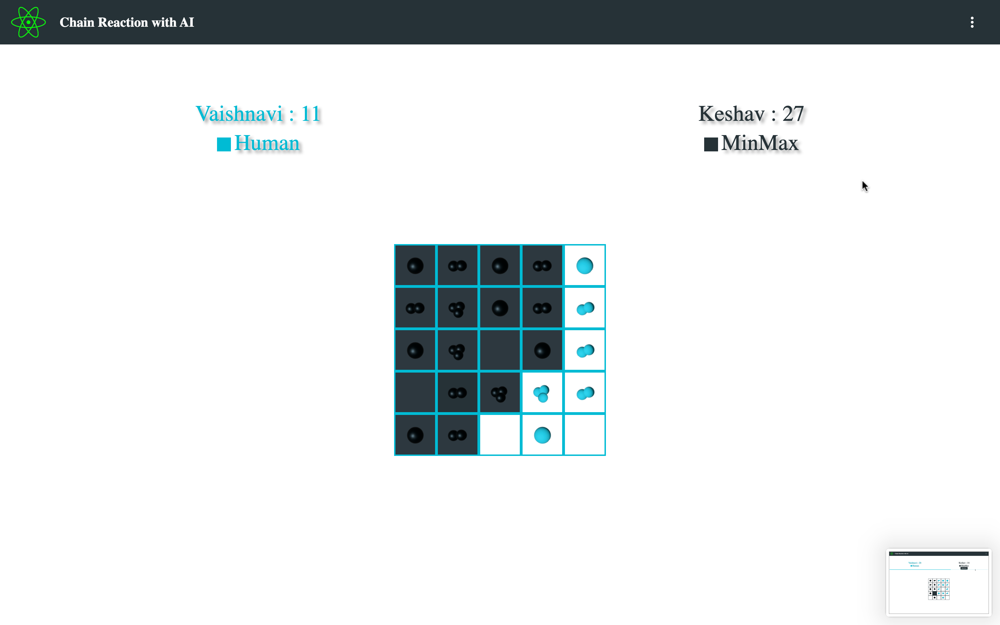


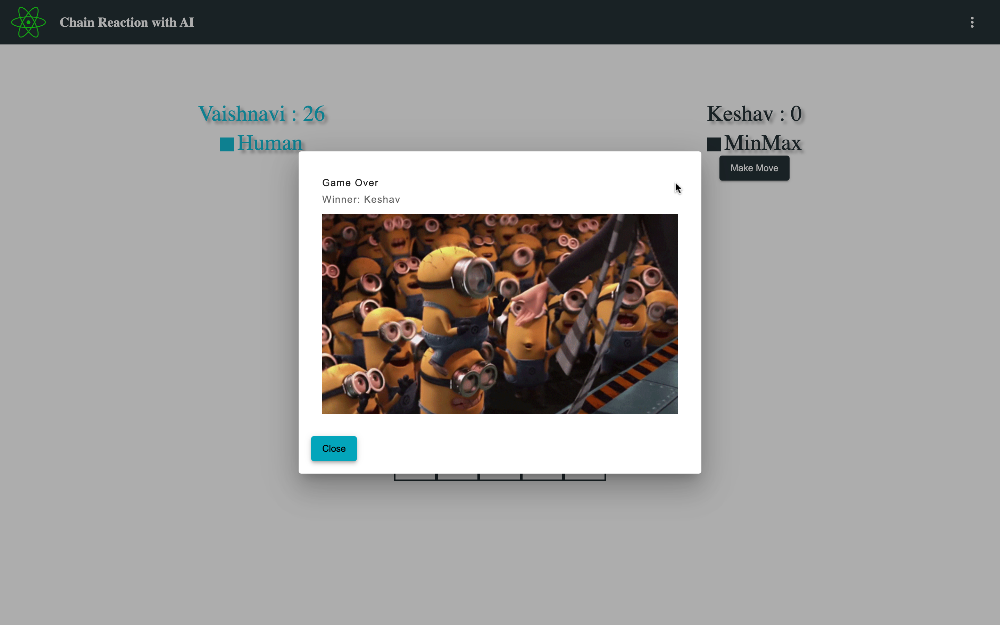


### Optimization

As it is implemented using complex modified Depth-First Search (DFS) and modified Breadth-First Search (BFS) algorithms
applied on every user move. For min-max decision making, a tree will be built for every possible move and the best move
will be chosen. The AI will also be able to adapt and learn from the user moves by adjusting its decision-making process
accordingly.
For each node built the algorithm has to preform multiple DFS as part of user move and the complete application
undergoes into another recursive application making it very complex and time consuming. For example a board with 5x5
size and a user has 25 possible moves in worst case for each action in 25 cells in the board the game undergoes multiple
DFS and comes to another state returned and added as a child node to the root likewise there will be 24 other actions
with each having possibly multiple DFS and all this is a single layer of minimax algorithm. For the AI to get the
optimal solution the game has to go build a tree with depth 3 i.e the number of nodes created for a single decision
making will be around

- Ideal number of available cells for a user at any arbitrary position will be 25
- For a depth of 3 the time complexity for each decision will be n^3
- Each action would take an indeterminate number of DFS based on the game state. For simplicity assuming each move would
take n^4.
- Calculating the final O(n) would be O(n^6) which is dangerously expensive.
To optimize this we used memorization in every possible function that is independent of the state as we observed the
pattern of repeating calculations based on the same game state which would optimize the decision making speed.

Below is the code snippet for the memorization implementation


```typescript
const memorize = new Map<string, any>();

//memorize node and actions
function actions(node: Node): IAction[] {
    let key = JSON.stringify(node);
    if (memorize.has(key)) {
        return memorize.get(key);
    }
    // Computation
}

async function result(action: IAction, node: Node): Promise<Node> {
    let key = JSON.stringify(node) + JSON.stringify(action);
    if (memorize.has(key)
    )
        return memorize.get(key);
// Computation
}

// memorize
function maxValue(node: Node): number {
    const key = JSON.stringify(node);
    if (memorize.has(key)) {
        return memorize.get(key);
    }
    // Computation
}

//memorize
function minValue(node: Node): number {
  let key = JSON.stringify(node);
  if (memorize.has(key)) {
    return memorize.get(key);
  }
  // Computation
}
```


## Conclusion

In conclusion, the Chain Reaction Game with Minimax Algorithm Web Project was a successful endeavor. It was able to
successfully combine the traditional board game of Chain Reaction with the modern artificial intelligence technique of
Minimax Algorithm. The project was able to provide a challenging and engaging experience for the user. Additionally, the
project was able to provide an intuitive and easy to use interface, making it accessible to all users, regardless of
their technical knowledge. All in all, the project was a success, and it provided a great learning experience for the
developers involved.
