> Live demo: https://chainreactionai.web.app/

## Abstract

Chain Reaction is a turn-based board game built from scratch as an Angular 15 web application, with an AI opponent driven by the Minimax algorithm written in TypeScript. Players take turns placing orbs on a grid; when a cell reaches critical mass it explodes into its neighbors, converting their orbs and often triggering cascading chain reactions. The objective is to eliminate every opponent orb from the board. The app supports human vs. human, human vs. computer, and computer vs. computer with human interaction, and tracks a live scoreboard throughout the game. It is hosted on Firebase and playable in any browser.

## The Game

Chain Reaction is a deterministic, perfect-information combinatorial game for two to eight players — no dice, no hidden state, yet remarkably unpredictable in practice. The board is an *m × n* grid (typically 9 × 6). Each cell has a critical mass equal to its number of orthogonally adjacent cells: 4 for interior cells, 3 along the edges, and 2 in the corners.

Players take turns placing an orb in an empty cell or one that already holds their own orbs. When a cell's orb count reaches its critical mass, it explodes: it loses orbs equal to its critical mass and sends one orb to each orthogonally adjacent cell. Any opponent orbs in those cells are converted to the exploding player's color, which can set off further explosions — a chain reaction that continues until every cell is stable. A player is out once they lose all of their orbs.

## Heuristic Strategy

A player's score is the total number of orbs they hold on the board. The heuristic for any non-terminal state is `currentPlayerScore − opponentScore`. Terminal states return `+Infinity` if the maximizing player has won and `−Infinity` if they have lost.

```typescript
  //memorize
function utility(node: Node): number {
    let key = JSON.stringify(node);
    if (memorize.has(key)) {
        return memorize.get(key);
    }
    if (node.isTerminal()) {
        return node.state.currentPlayer.color == this.maxColor ? Infinity : -Infinity;
    }
    const own = node.state.gameData.flat(1).filter(v => v.value > 0 && v.color == this.maxColor).reduce((v, c) => v + c.value, 0)
    const opponent = node.state.gameData.flat(1).filter(v => v.value > 0 && v.color != this.maxColor).reduce((v, c) => v + c.value, 0)
    const value = own - opponent;
    memorize.set(key, value);
    return value;
}
```

## The Minimax AI

The AI uses Minimax: at each turn it builds a game tree of possible moves, assumes the opponent always plays optimally, and chooses the move that maximizes its own outcome against that best response. Because Chain Reaction has perfect information and no randomness, Minimax is a natural fit for finding a strong move.

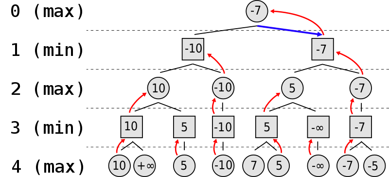

## Project Implementation

The game models the board as a grid of cells, encodes the explosion and chain-reaction rules, and renders an interactive Angular UI for setup (board size, player configuration) and play. The code is written in TypeScript and organized so the rules engine, AI, and UI stay decoupled and easy to extend.

### Class Diagram

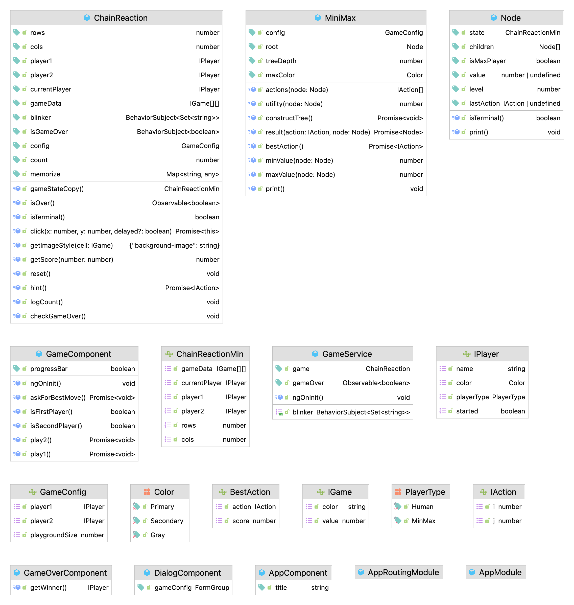

### Classes and Dependencies

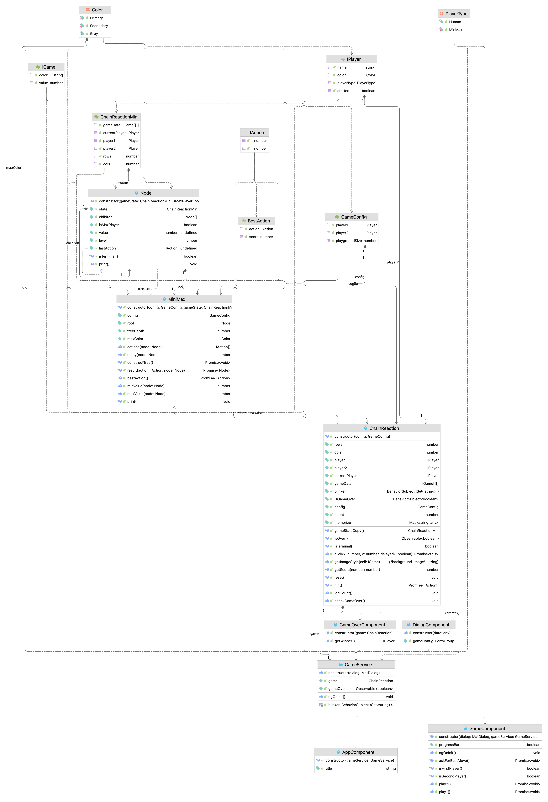

### Gameplay Screenshots

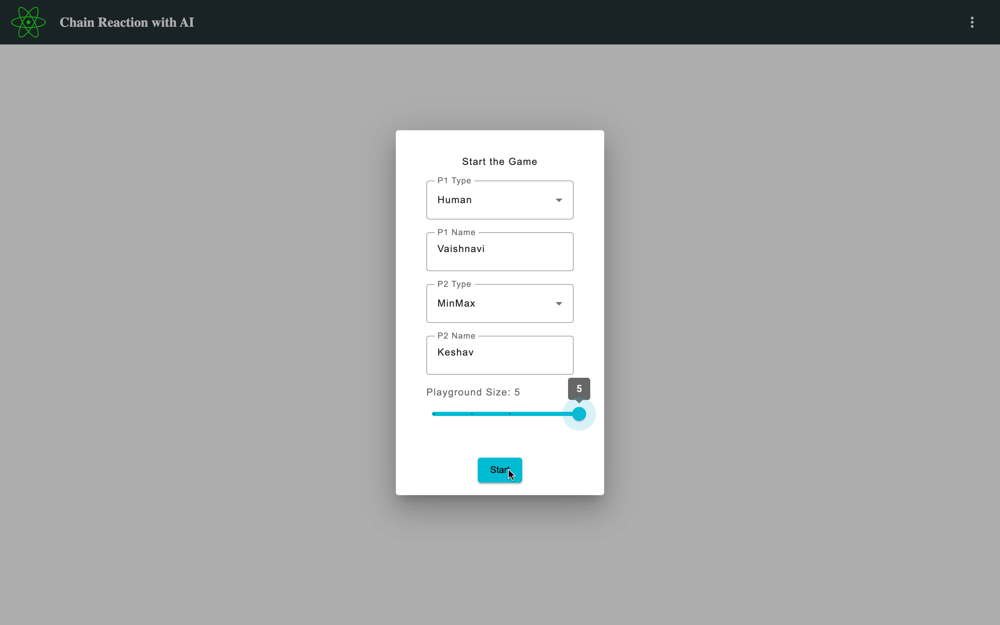


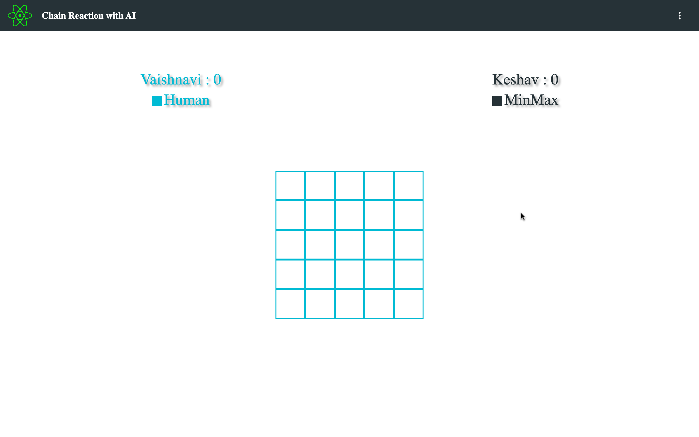


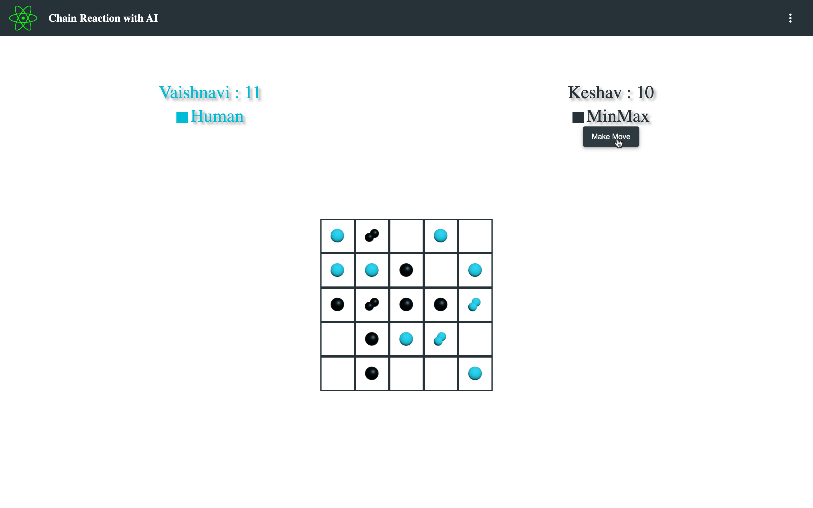


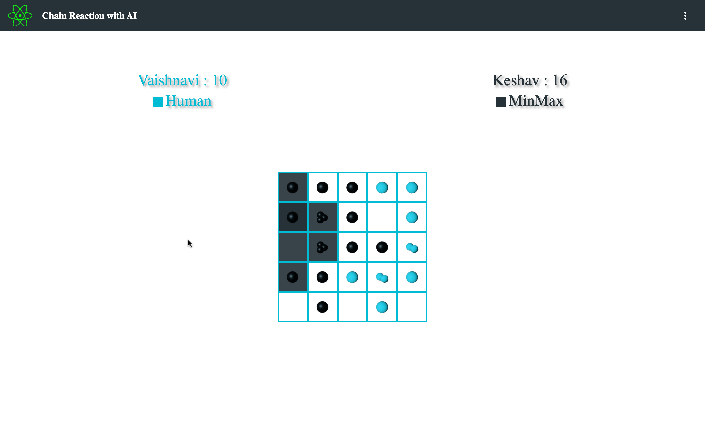


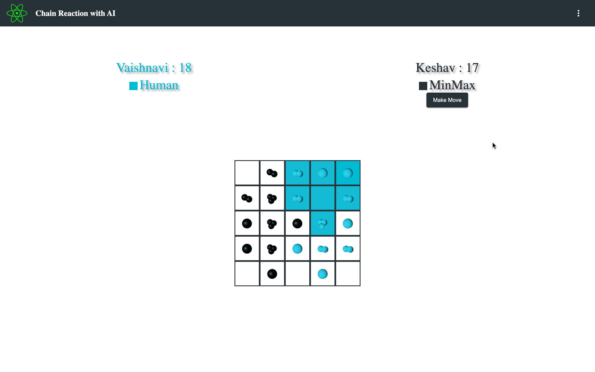


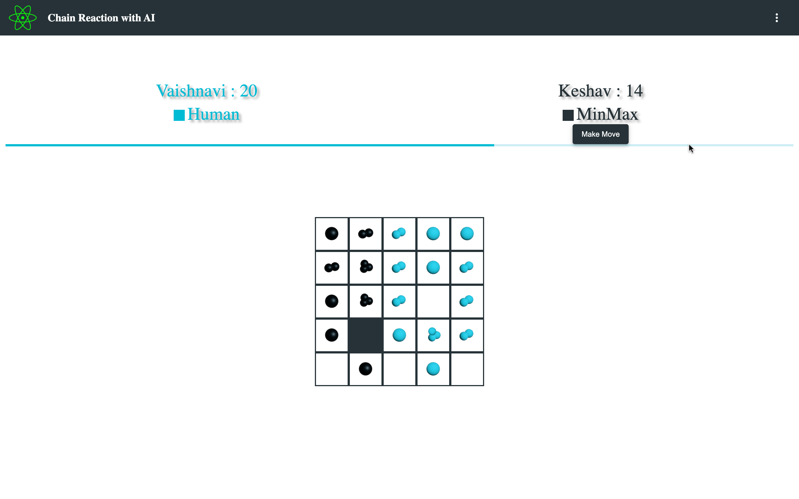


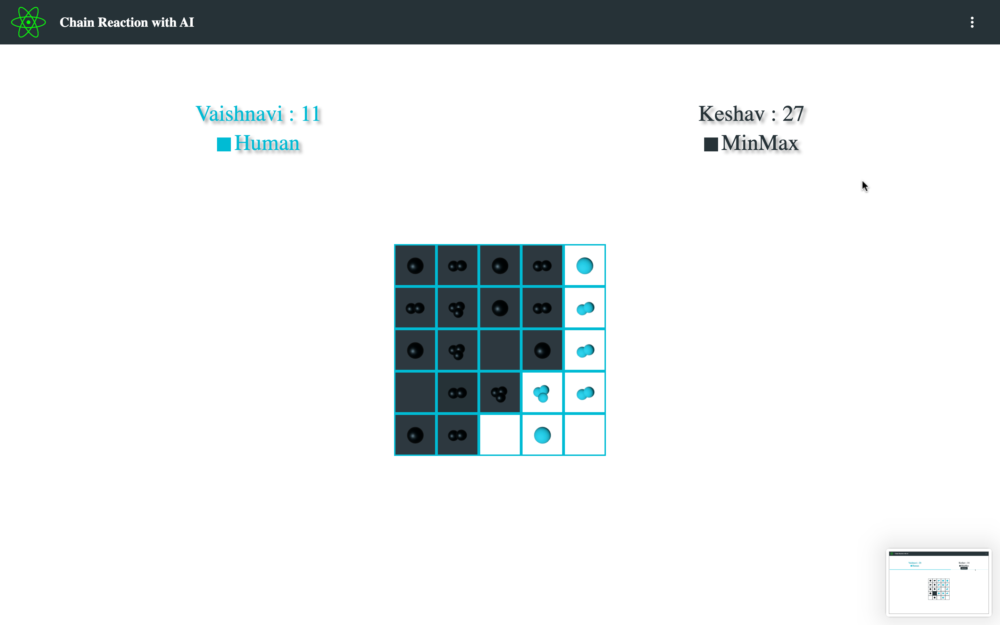


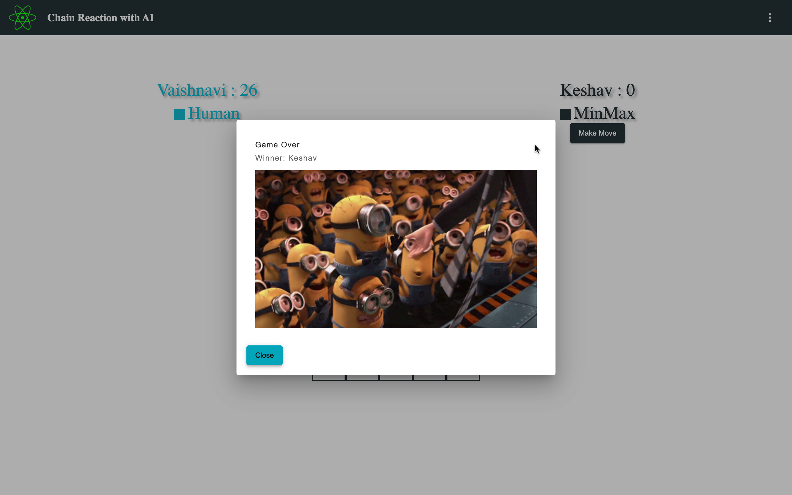

### Optimization

The naive search is extremely expensive. Each move expands into a modified DFS/BFS over the board to compute the resulting state, and that expansion happens for every candidate move at every layer of the Minimax tree. On a 5 × 5 board a player can have ~25 possible moves; at a search depth of 3 that is roughly `n³` move combinations, and if each state evaluation costs about `n⁴`, the worst case approaches `O(n⁶)` — dangerously slow.

The key observation was that the same board states recur constantly across the search. Adding memoization to every state-independent function — `actions`, `result`, `maxValue`, `minValue`, and `utility` — caches these repeated computations and brings the decision time down dramatically.

```typescript
const memorize = new Map<string, any>();

//memorize node and actions
function actions(node: Node): IAction[] {
    let key = JSON.stringify(node);
    if (memorize.has(key)) {
        return memorize.get(key);
    }
    // Computation
}

async function result(action: IAction, node: Node): Promise<Node> {
    let key = JSON.stringify(node) + JSON.stringify(action);
    if (memorize.has(key)
    )
        return memorize.get(key);
// Computation
}

// memorize
function maxValue(node: Node): number {
    const key = JSON.stringify(node);
    if (memorize.has(key)) {
        return memorize.get(key);
    }
    // Computation
}

//memorize
function minValue(node: Node): number {
  let key = JSON.stringify(node);
  if (memorize.has(key)) {
    return memorize.get(key);
  }
  // Computation
}
```

## Conclusion

Chain Reaction brings a classic strategy game to the web and pairs it with a Minimax AI that plays a genuinely challenging game. The most interesting engineering problem was performance: a direct search is exponentially expensive, and memoizing recurring game states was what made a depth-3 AI responsive enough to play in real time. The result is a polished, browser-based game and a practical case study in applying game-theory algorithms under real performance constraints.
