# Smart Conference IOT Room Admin Dashboard
---

## Description

This is a sample admin dashboard for smart conference IOT room. This dashboard is build using Angular 11, Angular Material, Angular Flex Layout

Fast, Dynamic, High Performance Admin Dashboard
> Loads in less than 2 seconds

## Features

- Angular 10 ( High Performance Front-end Framework )
- UI Updates Automatically ( No need to refresh the page )
- Lazy Loading ( Component loads only when it is required and just before user about to see it )
- Google's Standard Material Design
- Adjustable Layout
- Multiple Charts from different providers (chart.js, google charts, chartist, d3-charts)
- Draggable Cards and resizable cards for analytics dashboard
- Custom Designs for all the components
- Dynamic Data Tables with sorting, filtering, pagination, resizing, exporting features
- Delete, Edit, Add, View features for data tables

## Screenshots

Multiple Charts in Dashboard

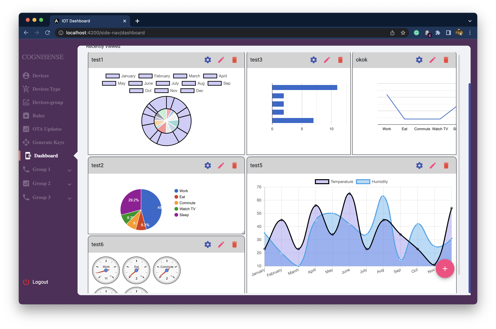

Adjustable and Resizable Layout

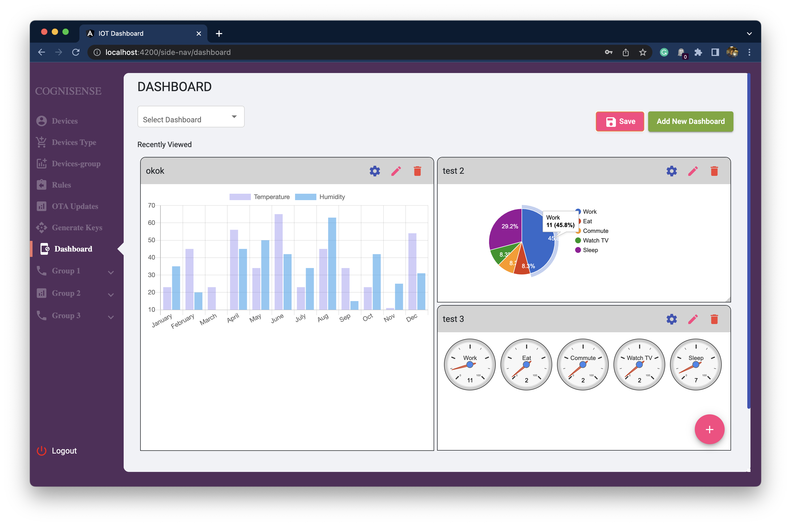

Delete, Edit, Add new Widgets in Dashboard

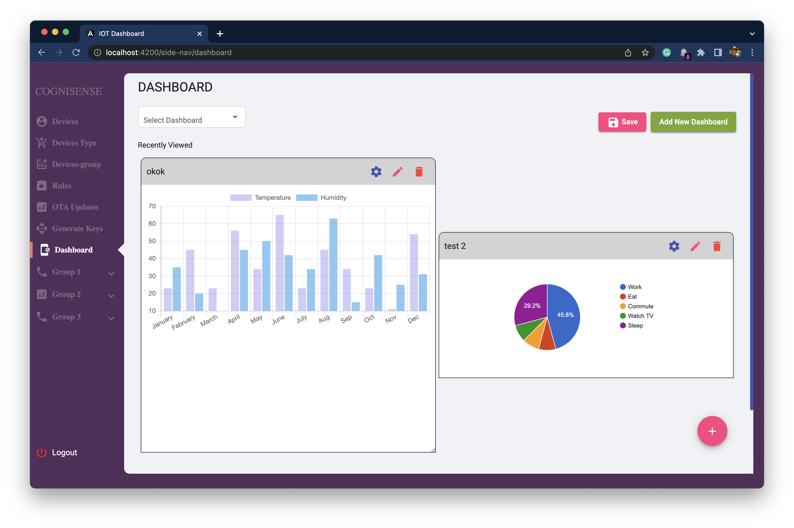

Bar Chart with Real time Updates

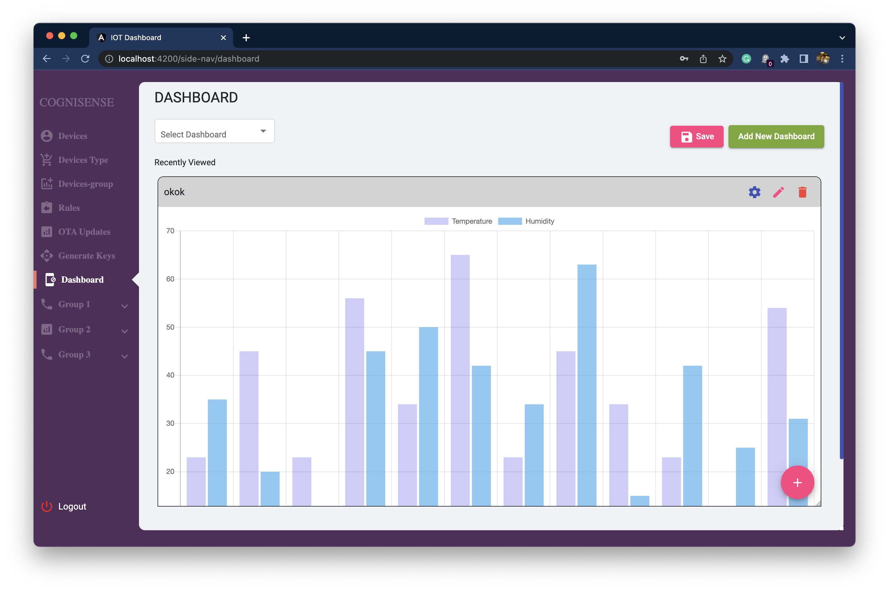

Selecting the chart type , and configuring the chart data dynamically

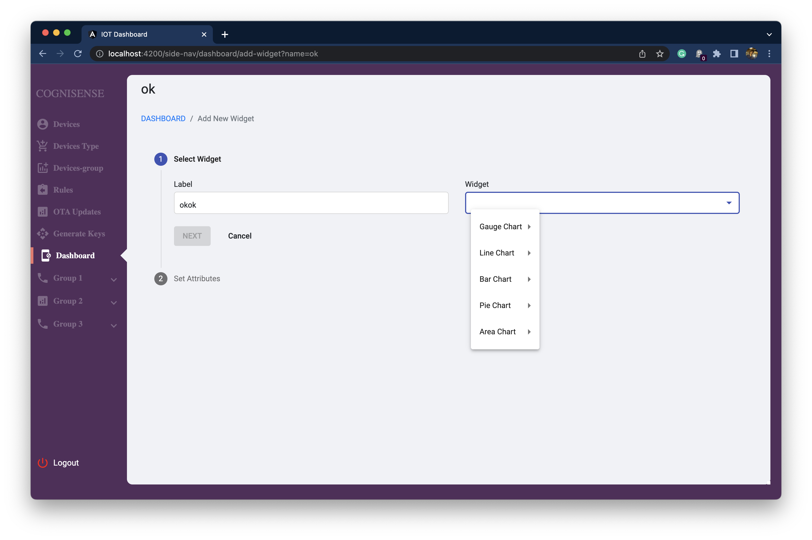

Generating Keys for IOT Devices ( Single Click to Copy)

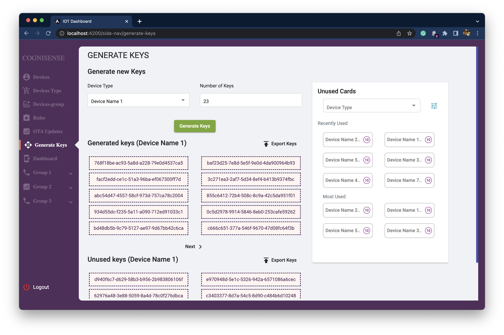

Custom UI Design for OTA Updates

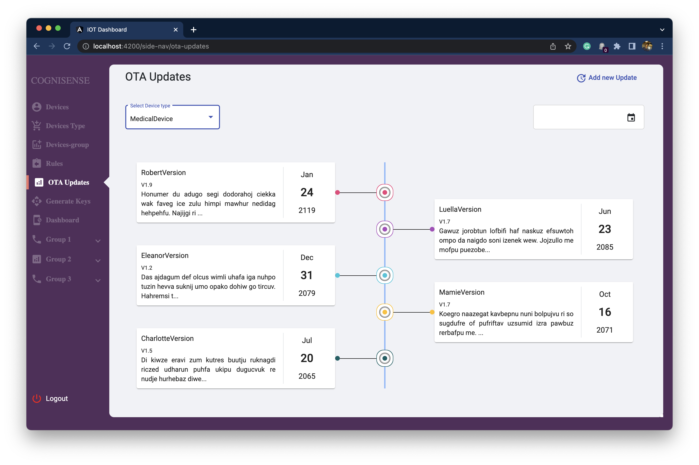

Reusing the components in different modules ( Lazy Loading )

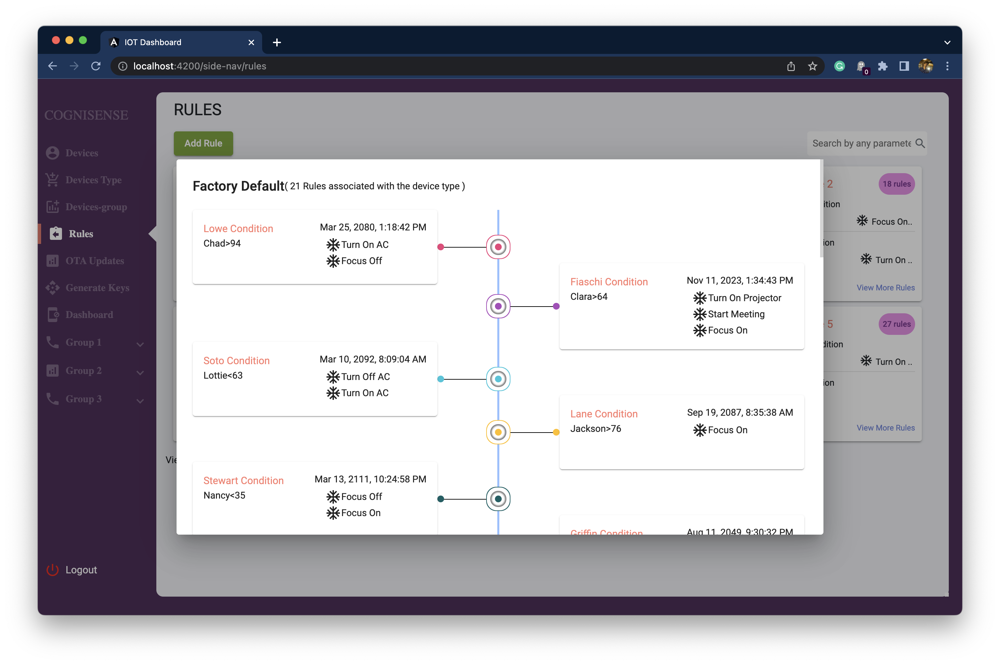

Defining IOT Device Rules UI

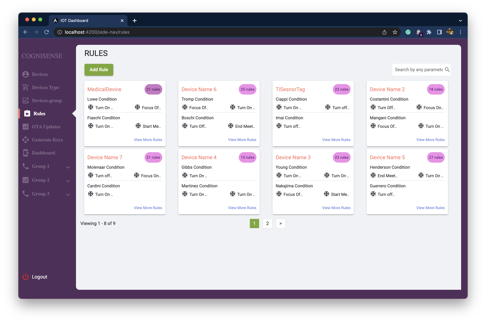

Edit and Delete Buttons in Data Table with selection of multiple rows

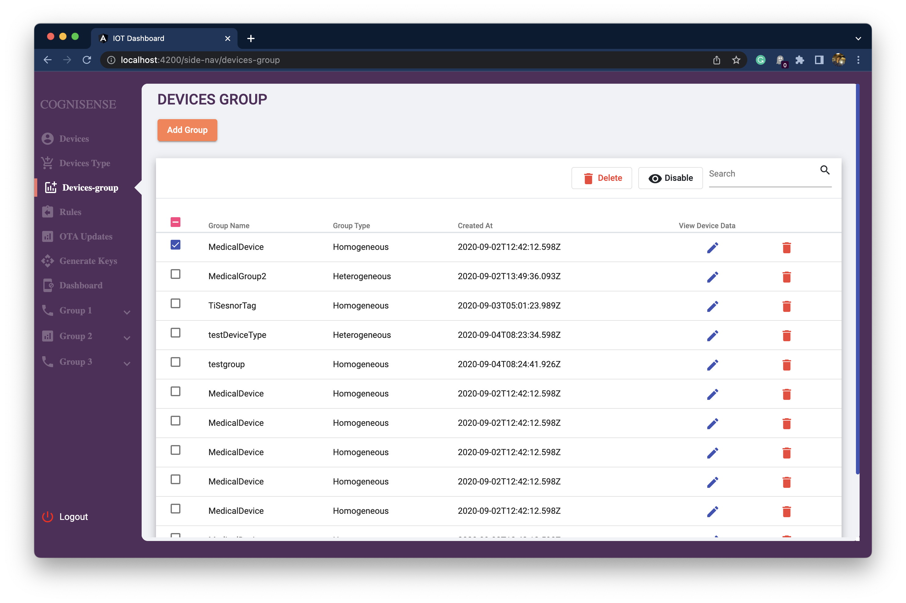

Configurable Data Table with Sorting, Filtering, Pagination, Resizing, Edit and Delete Buttons

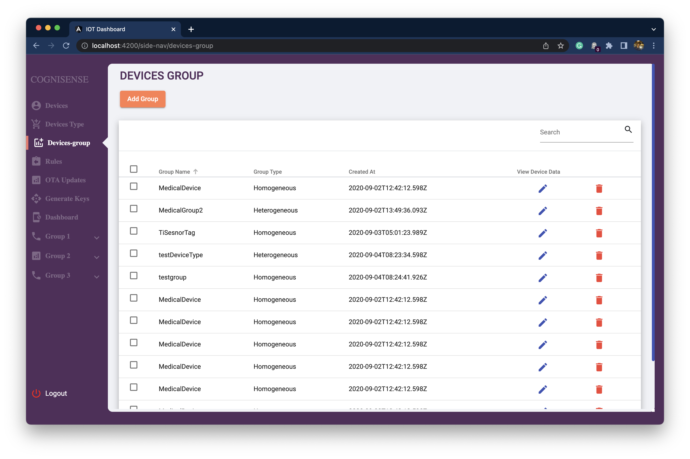

UI with multiple pages and cards and clickable cards with built in charts

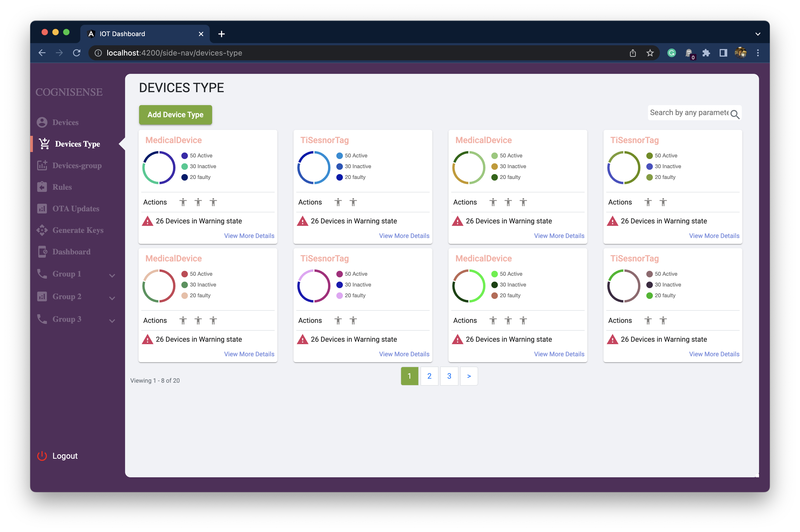

Data Tables with button to view in detail

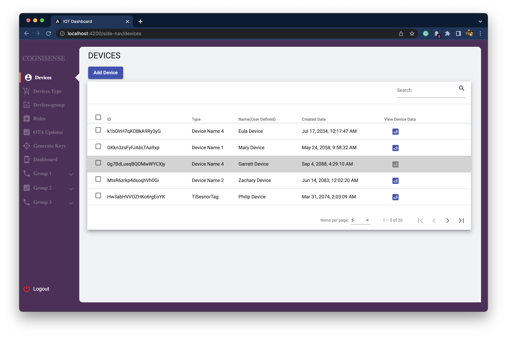

