## Description

A sample admin dashboard for a smart-conference IoT room, built with Angular 11, Angular Material, and Angular Flex Layout. It is designed to be fast, dynamic, and high performance.

> Loads in under 2 seconds.

## Features

- Built on Angular 11 for a high-performance front end
- UI updates automatically — no page refresh needed
- Lazy loading: components load only just before the user needs them
- Google Material Design throughout
- Adjustable, resizable layout
- Charts from multiple providers (Chart.js, Google Charts, Chartist, D3)
- Draggable and resizable analytics cards
- Custom designs for every component
- Dynamic data tables with sorting, filtering, pagination, resizing, and export
- Add, view, edit, and delete actions for table data

## Screenshots

Multiple charts on the dashboard:

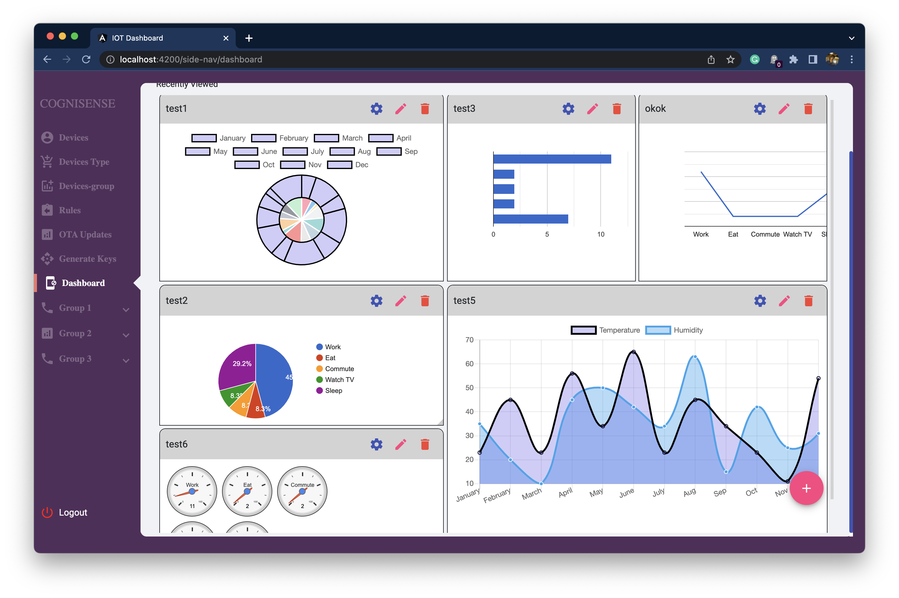

Adjustable and resizable layout:

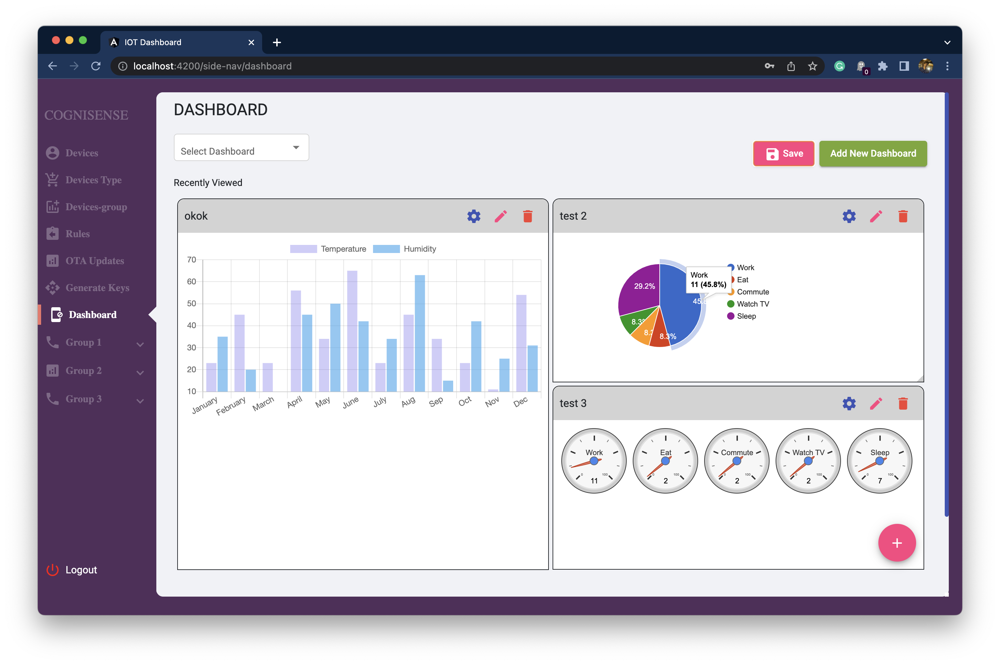

Add, edit, and delete dashboard widgets:

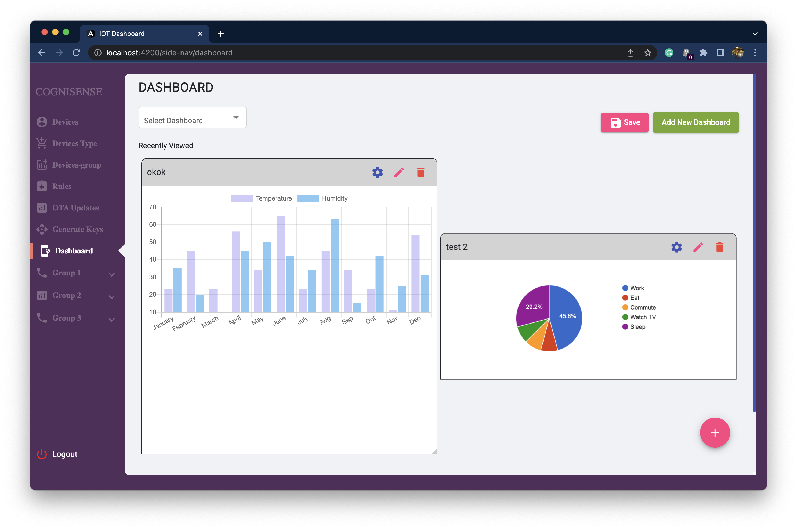

Bar chart with real-time updates:

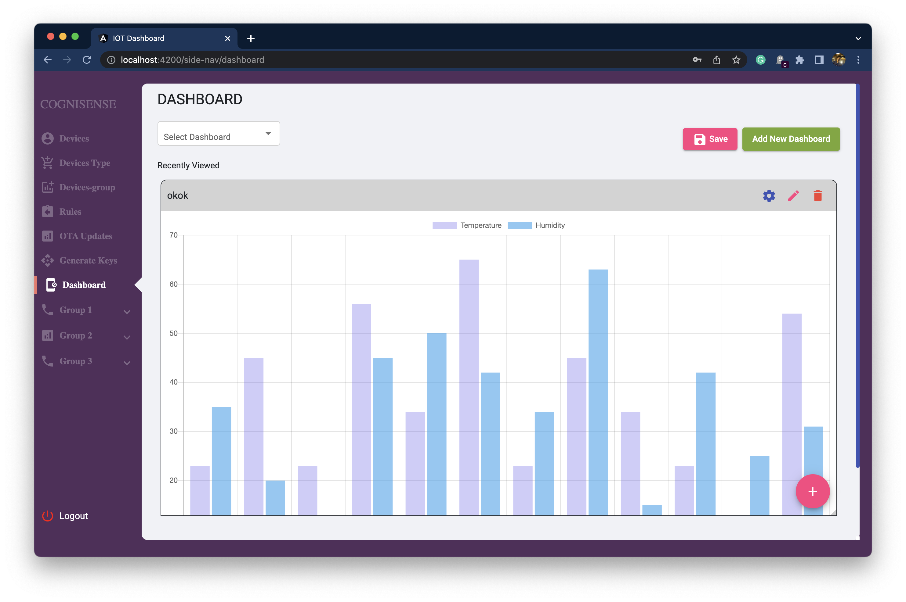

Selecting a chart type and configuring its data dynamically:

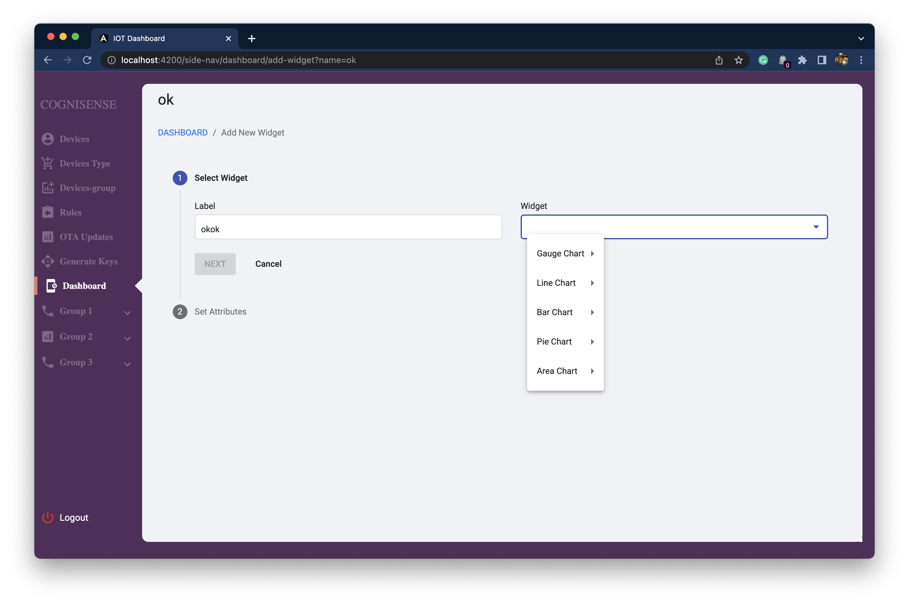

Generating keys for IoT devices (single click to copy):

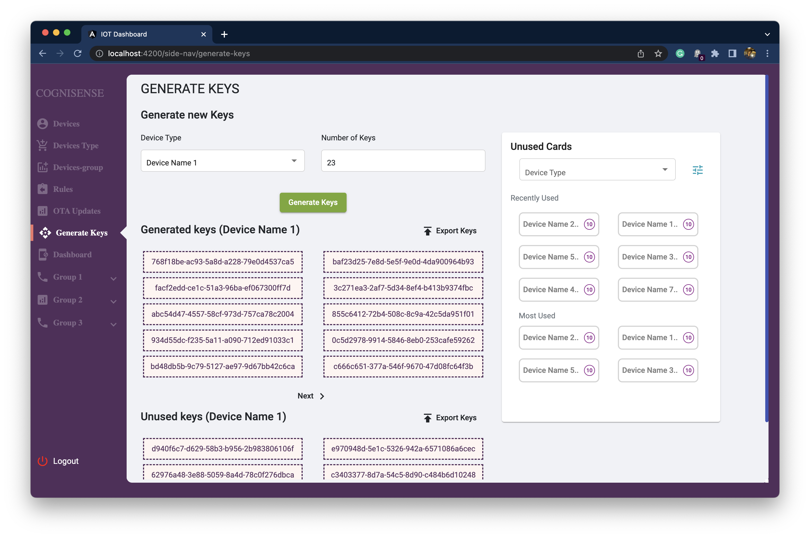

Custom UI for OTA updates:

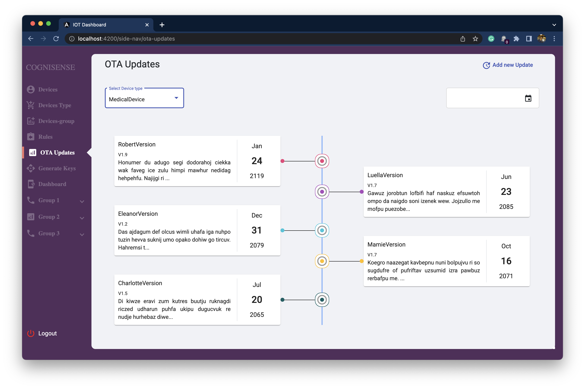

Reusing components across modules via lazy loading:

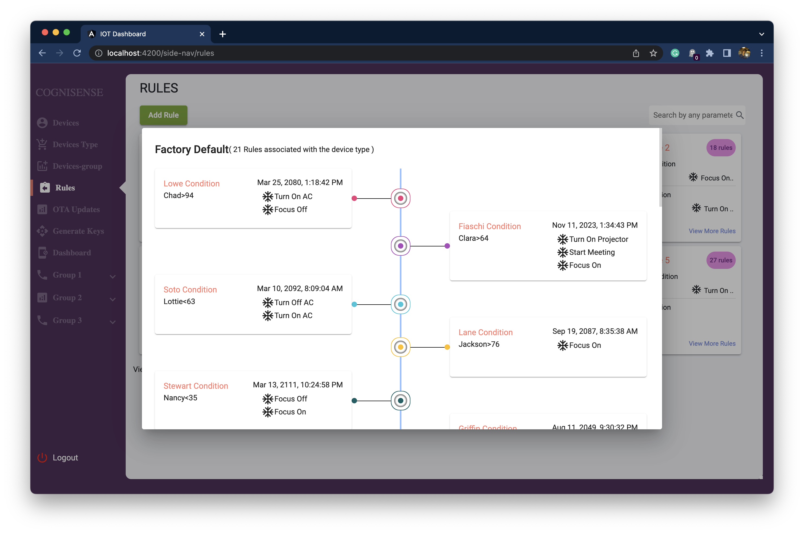

Defining IoT device rules:

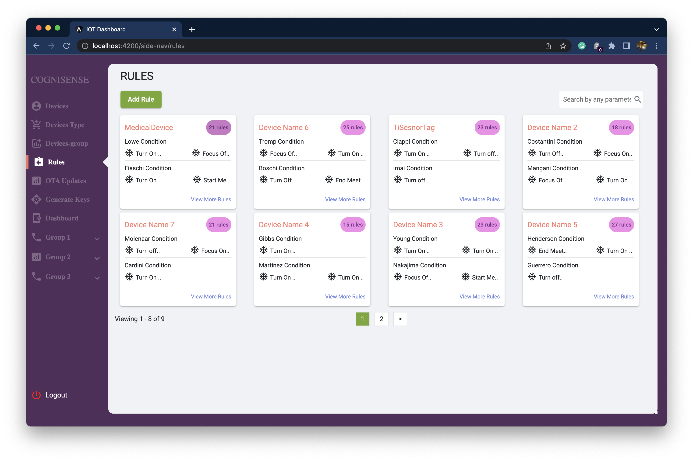

Edit and delete in a data table with multi-row selection:

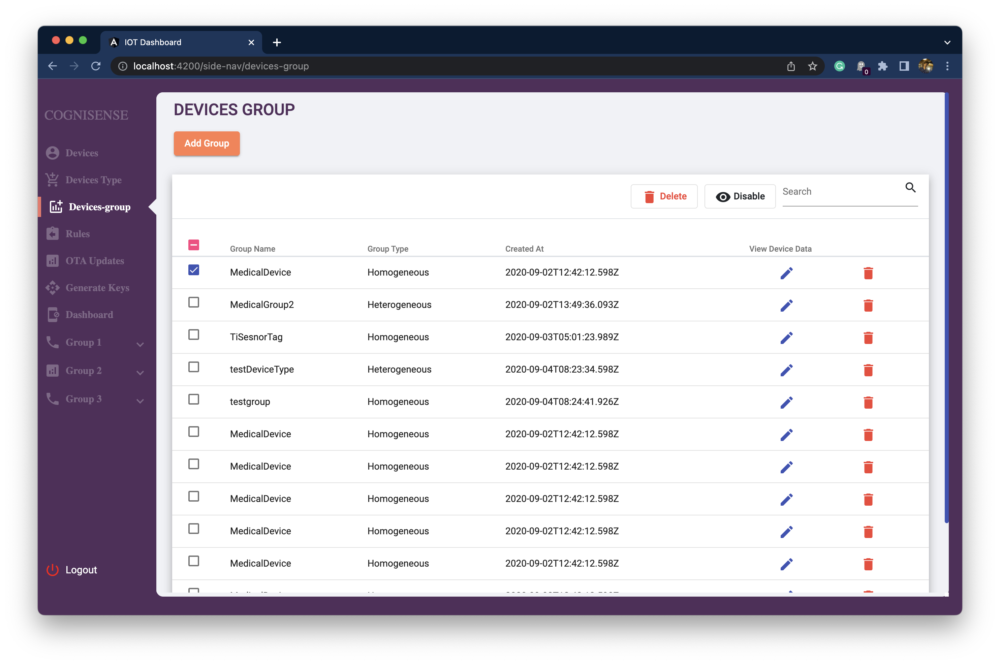

Configurable data table with sorting, filtering, pagination, resizing, and row actions:

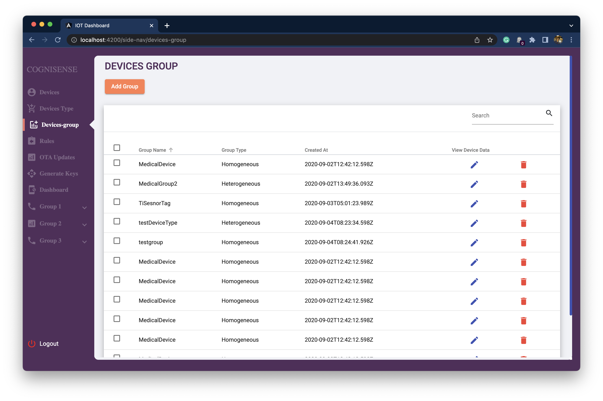

Multiple pages with clickable cards and built-in charts:

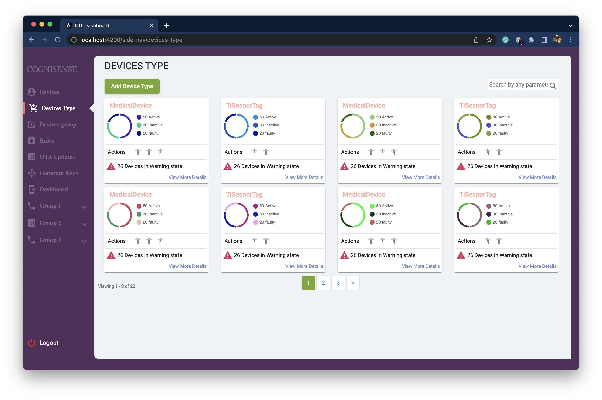

Data tables with a detail view:

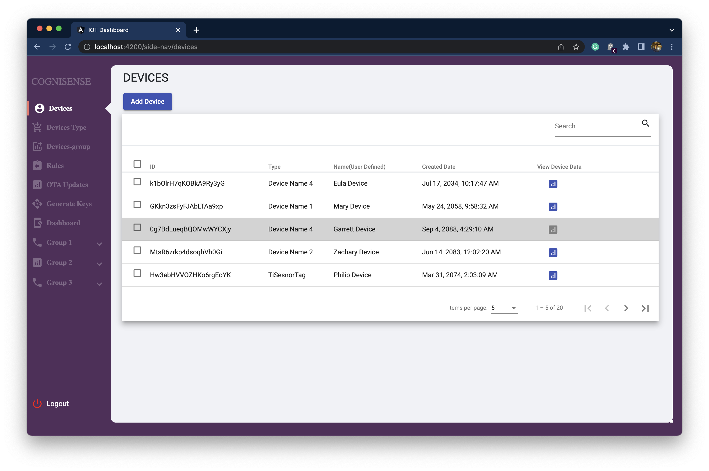
