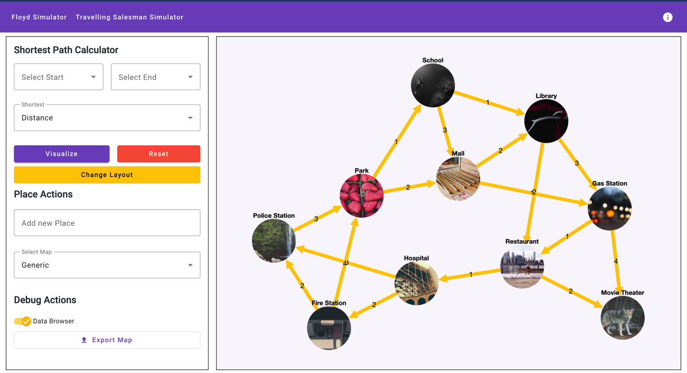
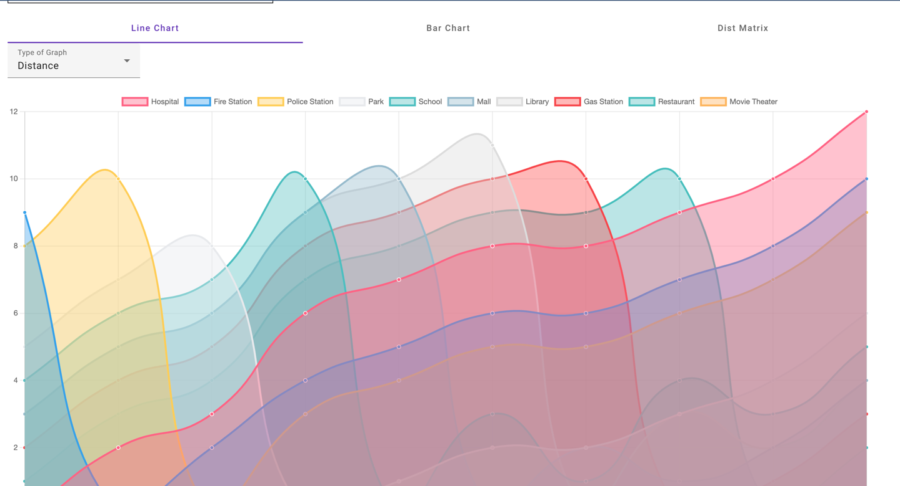
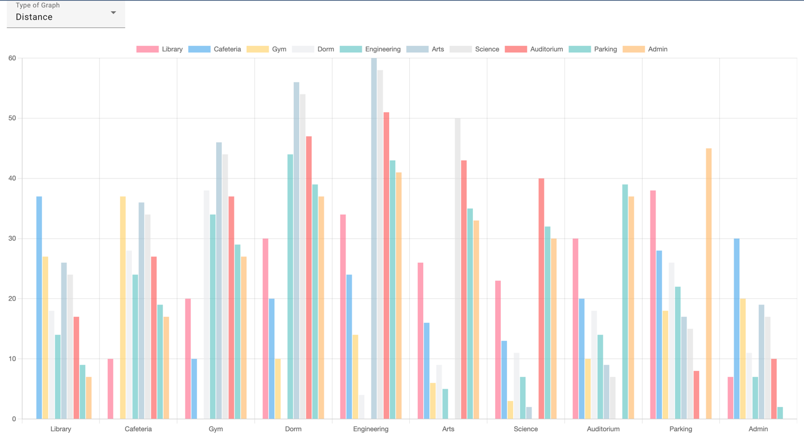
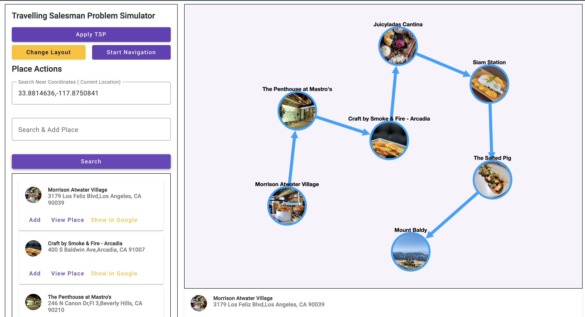
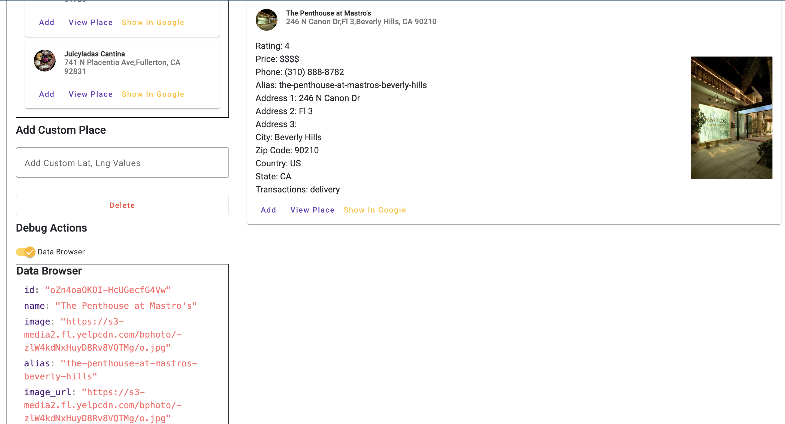
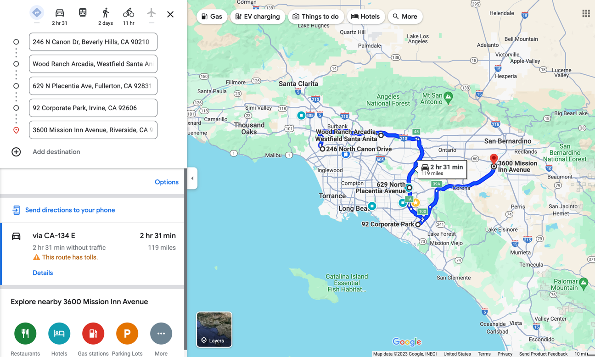

# Graph Algorithm Learning: Introducing My Interactive Educational Platform

```toc
# This code block gets replaced with the TOC
```

## Introduction
I took on an ambitious project: developing a real-world application to facilitate interactive learning of complex graph algorithms. This endeavor was not just about fulfilling academic requirements; it was a pursuit to blend theory with practical application and create a learning tool that goes beyond traditional methods.

## The Inspiration
The project was inspired by a desire to see theoretical concepts come to life. Collaborating with a team that brought diverse skills and backgrounds, I found myself in a unique position to lead and innovate, despite some team members not being familiar with all the technologies involved. It was an opportunity to showcase my leadership and technical skills in a real-world setting.

## Challenges and Triumphs
Throughout this project, I navigated challenges such as handling large data sets, optimizing application performance, and integrating external services. One of the most significant accomplishments was designing a user-friendly interface for an inherently complex application. Each challenge was a learning opportunity, pushing me to apply my knowledge and skills in novel ways.

## Core Features of the Application

Interactive graph visualization and manipulation with Cytoscape.js.
Implementation of the Floyd-Warshall algorithm for shortest path finding.
Solving and visualizing the Travelling Salesman Problem (TSP).
Capability to dynamically modify graphs (adding/removing nodes and edges).
Integration with external APIs for practical data application.
Support for importing and exporting graph data in JSON format.
Development of an intuitive interface for complex algorithm interactions.

## Screenshots

### Floyd Warshall Screens



<br/>



<br/>


<br/>


### Travelling Salesman Problem Screens




<br/>


<br/>





## Video Demo

### Floyd Warshall Application

<iframe width="560" height="315" src="https://www.youtube.com/embed/xnEv2_aoAqU?si=g3hTxW2J0JSp-Qx_"
        title="YouTube video player" frameBorder="0"
        allow="accelerometer; autoplay; clipboard-write; encrypted-media; gyroscope; picture-in-picture; web-share"
        allowFullScreen></iframe>

### Travelling Salesman Problem Application

<iframe width="560" height="315" src="https://www.youtube.com/embed/TQGZJXiWaKc?si=3cCgVkADCIIp4j-i"
        title="YouTube video player" frameBorder="0"
        allow="accelerometer; autoplay; clipboard-write; encrypted-media; gyroscope; picture-in-picture; web-share"
        allowFullScreen></iframe>

