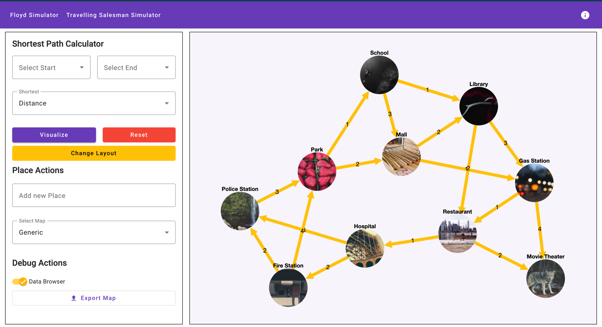
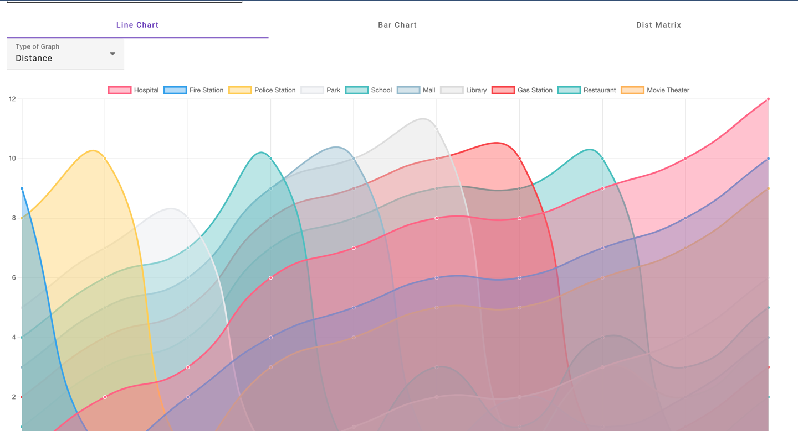
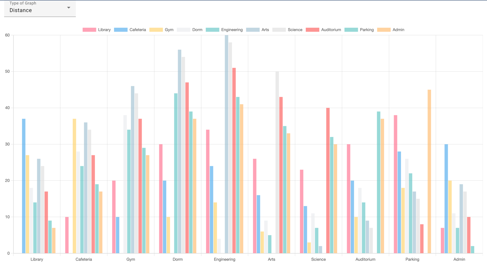
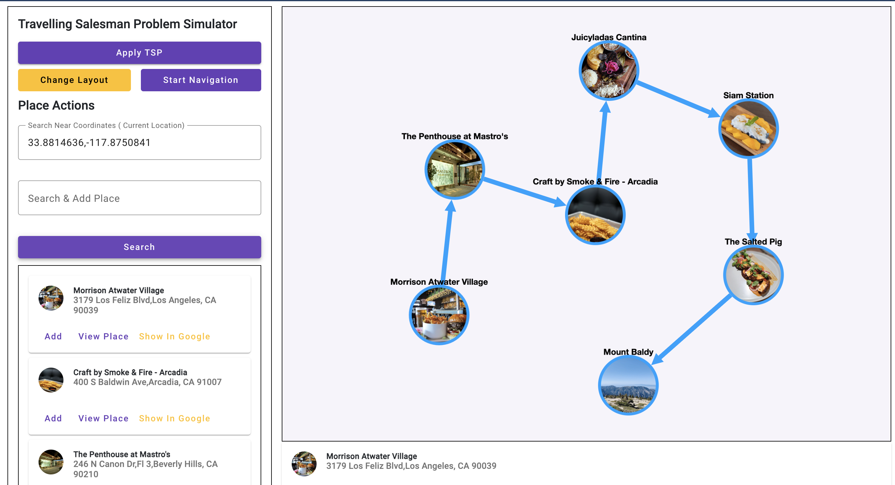
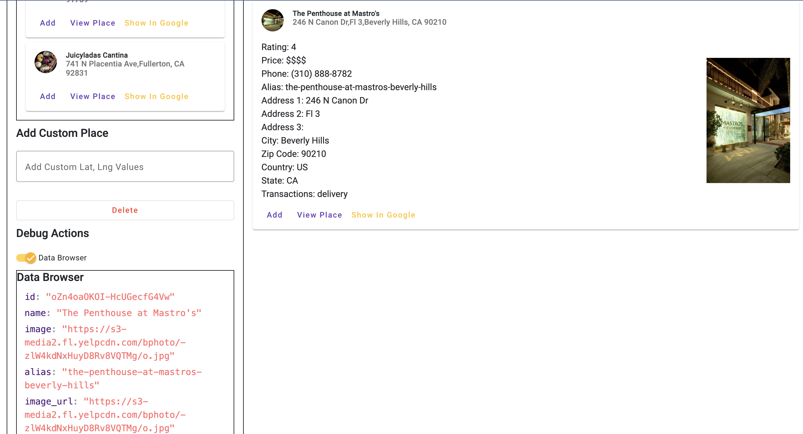
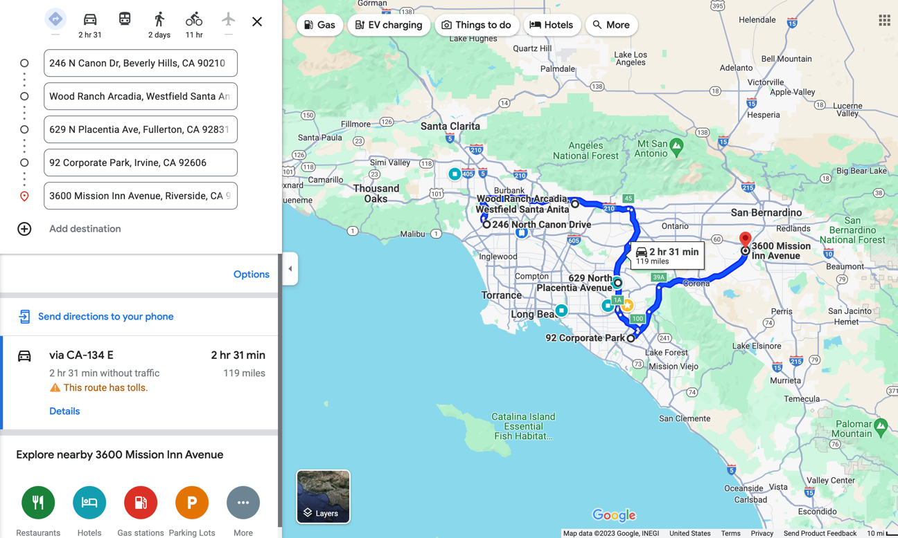

## Introduction

An interactive learning tool for complex graph algorithms. The goal went beyond an academic requirement: I wanted to blend theory with practice and build something that teaches graph algorithms more effectively than static diagrams ever could.

## The Inspiration

The project came from wanting to see theoretical concepts come to life. I led a team with diverse skills and backgrounds — not everyone was familiar with all the technologies involved — which made it a strong opportunity to combine technical leadership with hands-on development.

## Challenges and Triumphs

The main challenges were handling large datasets, optimizing application performance, and integrating external services. The most satisfying win was designing a genuinely intuitive interface for an inherently complex application — each obstacle pushed me to apply familiar concepts in new ways.

## Core Features

- Interactive graph visualization and manipulation with Cytoscape.js
- Floyd-Warshall algorithm for shortest-path finding
- Solving and visualizing the Travelling Salesman Problem (TSP)
- Dynamic graph editing (adding and removing nodes and edges)
- Integration with external APIs for real data
- Importing and exporting graph data as JSON
- An intuitive interface for interacting with complex algorithms

## Screenshots

### Floyd-Warshall Screens

 

 

 

### Travelling Salesman Problem Screens

 

 

## Video Demo

### Floyd-Warshall Application

<iframe width="560" height="315" src="https://www.youtube.com/embed/xnEv2_aoAqU?si=g3hTxW2J0JSp-Qx_"
        title="YouTube video player" frameBorder="0"
        allow="accelerometer; autoplay; clipboard-write; encrypted-media; gyroscope; picture-in-picture; web-share"
        allowFullScreen></iframe>

### Travelling Salesman Problem Application

<iframe width="560" height="315" src="https://www.youtube.com/embed/TQGZJXiWaKc?si=3cCgVkADCIIp4j-i"
        title="YouTube video player" frameBorder="0"
        allow="accelerometer; autoplay; clipboard-write; encrypted-media; gyroscope; picture-in-picture; web-share"
        allowFullScreen></iframe>
