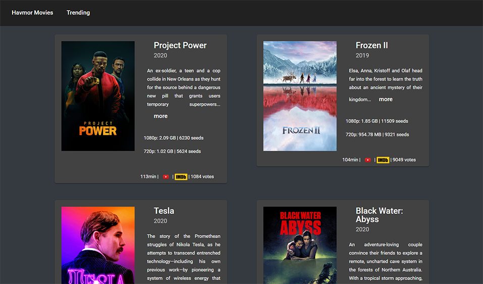
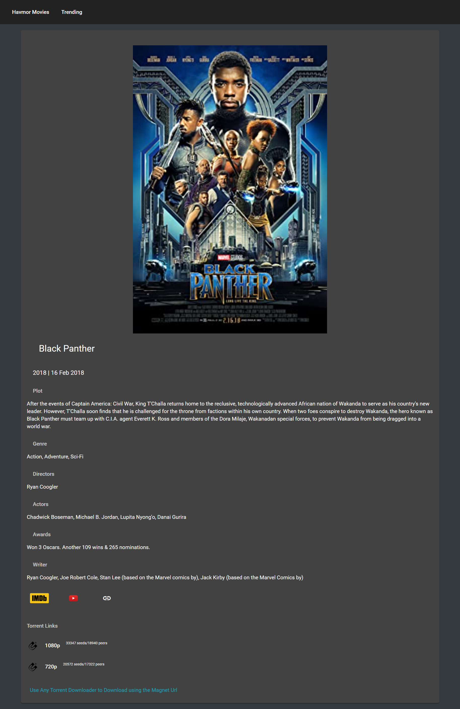

## Overview

> App is down and will no longer work as the API is no longer available

In this app you can quickly find latest YIFY movie torrents inspired from Popcorn Times

All the Movies will get updated to the app as soon as the API database is updated
This is an inspiration from popcorn times🍿 I used several APIs🧠 for movie info

# Movie Description
Get to know more about that movie before downloading it in just a click

Download your favorite movies directly without any advertisements from here

