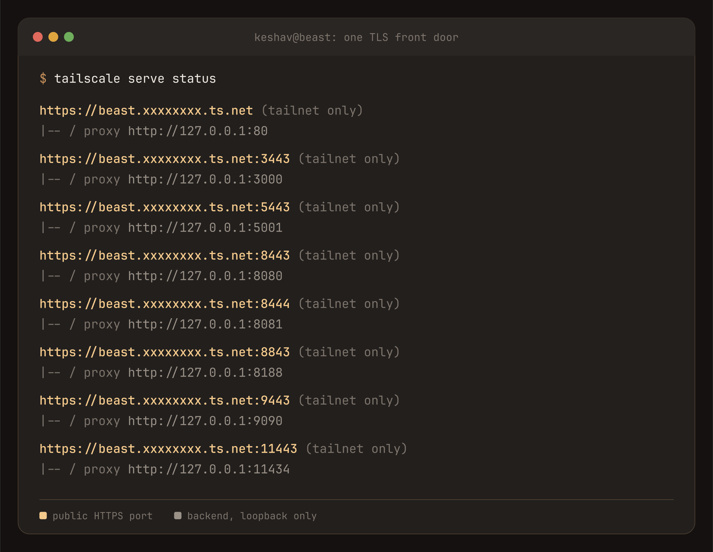
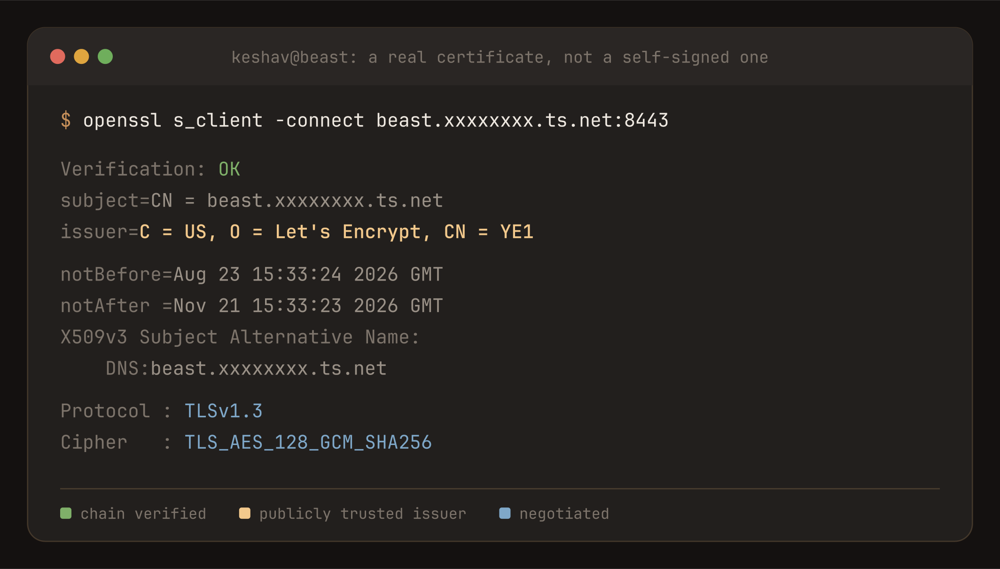
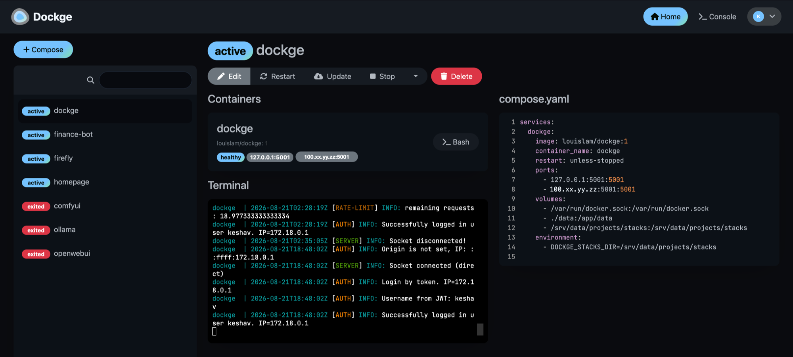
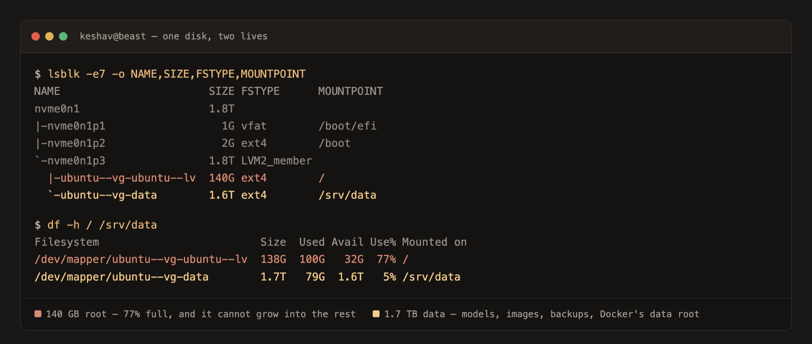
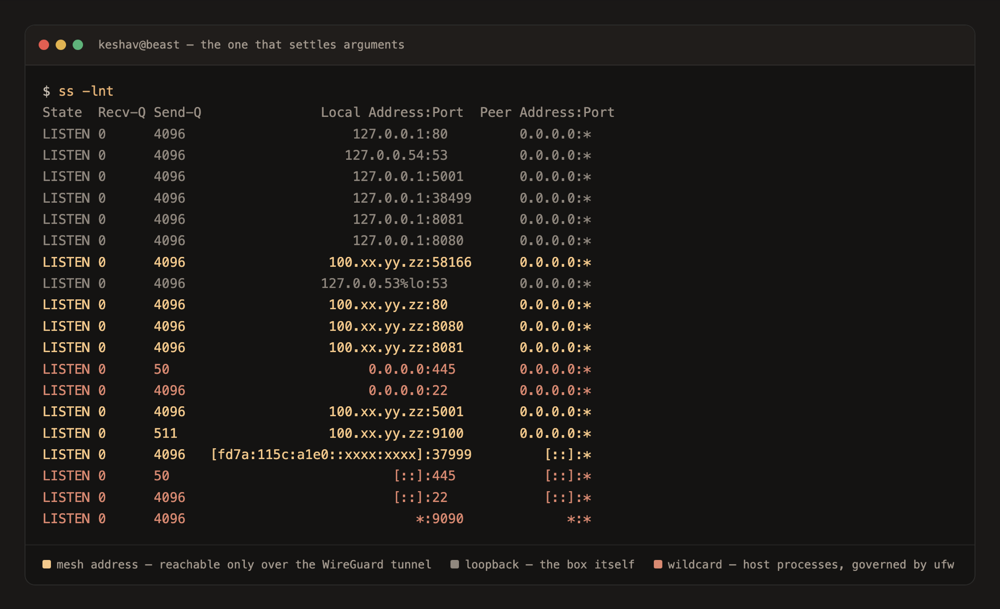

import Diagram from "../../../components/Diagram.astro";

**beast** is a machine I built, put in a corner of my apartment, and have never plugged a monitor into. It runs local AI, image and video generation, my entire personal finance system and my file storage, as seven Docker Compose stacks.

Every one of them is an HTTPS URL I can open from my phone, on cellular, anywhere in the world. None of them is exposed to the internet.

<Diagram variant="grid" title="What I use it for">

- **Local AI.** Models served on my own GPU with a chat UI in front of them. Nothing I type goes to a vendor.
- **Image and video generation.** A full ComfyUI install with a working image-to-video pipeline on 16 GB of VRAM.
- **My money.** A self-hosted Firefly III ledger plus [the automation around it](/finance-bot/), which imports and categorises my spending overnight.
- **File storage.** 1.7 TB mounted in Finder on my Mac like any other drive.
- **Admin from anywhere.** Full system dashboard and container management, from the couch or from a plane.
- **Agent sessions.** Long-running coding sessions I can start on my laptop and pick up on my phone.

</Diagram>

## The Box

<Diagram variant="grid" title="The hardware">

- **CPU.** Ryzen 9 9900X, 12 cores / 24 threads, boost to 5.66 GHz, full AVX-512.
- **GPU.** RTX 5070 Ti, GB203 Blackwell, 16 GB VRAM.
- **Memory.** 59 GB usable, 8 GB swap.
- **Storage.** 2 TB Gen5 NVMe on LVM: 138 GB root, 1.7 TB data.
- **Network.** WiFi 7 uplink; the 5 GbE port sits unplugged.
- **OS.** Ubuntu 26.04 LTS, headless since the day it was built.

</Diagram>

It runs `multi-user.target` and has no display manager, because a headless box should never start one. I administer all of it from a Mac mini and an iPhone.

## One URL Per Service, All Over HTTPS

The thing that made this machine pleasant to actually use, rather than just impressive to own, was giving every service a real HTTPS address.

A single reverse proxy holds the machine's address on my private mesh and terminates TLS on a genuine, publicly trusted certificate that renews itself. Every container behind it publishes to loopback and nothing else.



| Service | URL | What it is |
|---|---|---|
| homepage | `:443` | A landing page of every link below |
| Open WebUI | `:3443` | Chat UI for the local models |
| Dockge | `:5443` | Compose stack management |
| Firefly III | `:8443` | The finance ledger |
| Importer | `:8444` | Bank transaction importer |
| ComfyUI | `:8843` | Image and video generation |
| Cockpit | `:9443` | Full system admin |
| Ollama | `:11443` | The model API itself |

No certificate warnings, no private CA to install on every device, no `--insecure` anywhere. It sounds like a detail, and it turned out to be the difference between a machine I poke at over SSH and one I actually use.



## Everything, From My Phone

This is the part I didn't expect to matter as much as it does.

<Diagram title="Phone to home server">

- **Any enrolled device.** Phone, laptop, on cellular or a café network.
- **The private mesh.** Resolves the machine by name and routes to it. No port forwarding, no dynamic DNS, no VPN toggle to remember.
- **The front door.** TLS on a genuine certificate, so apps and browsers both just connect.
- **The service.** Bound to loopback, publishing nothing, reachable only through the two hops above.

</Diagram>

Because the certificate is real, **native apps work**, not just browser tabs. I run Abacus, an open-source iOS client for Firefly III, pointed straight at my own ledger: balances, net worth, charts and recent transactions as a proper app on my home screen. Mobile apps are far stricter than browsers here. A browser lets you click past a self-signed certificate; an iOS app's networking stack simply refuses, usually with an error that tells you nothing.

The finance system also talks to me through Telegram, so a question about my spending is a chat message rather than a login.

For the machine itself, mesh SSH means any phone SSH client reaches it with no key to manage. Anything longer than a minute runs inside `tmux`, so a dropped cellular connection doesn't kill it, and `tmux new-session -A` makes "reconnect" and "start fresh" the same command. I can start something on the laptop and pick it up on the phone.

## What Runs On It

Seven Compose stacks, tracked in git and managed from a web UI.

<Diagram variant="grid" title="Seven stacks">

- **Ollama.** Local model serving on the GPU. It evicts the model from VRAM after five idle minutes so the card is free for everything else.
- **Open WebUI.** The chat front end for it.
- **ComfyUI.** Image and video generation. The entire install lives on a bind mount, so the container stays disposable.
- **Firefly III + Postgres.** The finance ledger. The database publishes no ports at all.
- **finance-bot.** The automation around the ledger, with [a write-up of its own](/finance-bot/).
- **Cockpit + Dockge.** System admin and stack management.
- **homepage.** A static landing page, so the bare hostname is a dashboard.

</Diagram>



Provisioning is a set of idempotent shell scripts that each verify their own prerequisites, so re-running any of them is safe. The Docker script refuses to start if the data volume isn't mounted or the driver isn't working, which means a half-finished install fails loudly at the right step instead of producing something subtly broken three steps later.

## Storage That Can't Wedge The OS

The Ubuntu installer leaves most of the volume group unallocated. A setup script carves that free space into a separate 1.7 TB data volume rather than growing root, so a runaway download or a 14 GB model file can never fill the OS disk. Docker's images live there too, and those alone total over 80 GB.



The whole data volume is one Samba share tuned for Finder, which quietly removes a shell from several workflows: drop a model file in from my Mac and the running service picks it up immediately, and the finance system's nightly backups land somewhere I can drag off the machine.

## Private By Construction

Nothing is port-forwarded. There's no dynamic DNS and no exposed SSH. Every dashboard, the shell and the file share are reachable only over a WireGuard mesh where each device is individually authenticated. Even on my own home network, the firewall denies the dashboards.

The non-obvious part, and the thing most home-lab writeups get wrong, is that **Docker publishes ports below the host firewall.** Docker writes published ports into an iptables chain that is evaluated *before* `ufw`'s rules, so a container published as `"8080:8080"` is reachable from every machine on the LAN and `ufw deny 8080` does nothing about it. The firewall reports the rule. The port is open.

The first version of this machine handled that by binding every container explicitly, to loopback and to the mesh address, never the wildcard:

```yaml
ports:
  # v1: Docker bypasses ufw, so bind explicitly, never 0.0.0.0
  - "127.0.0.1:8080:8080"
  - "100.xx.yy.zz:8080:8080"
```



That worked, and the TLS rewrite made it simpler still. Now the proxy is the only process holding the mesh address and every container is loopback-only, so the number of things listening on a reachable address dropped from "every container" to one:

```yaml
ports:
  # v2: loopback only. The mesh address belongs to the TLS proxy, not Docker.
  - "127.0.0.1:8080:8080"
```

Host processes like `sshd` and Samba are a different category and really are governed by `ufw`. Knowing which of the two you're dealing with is the difference between a firewall rule that works and one that only looks like it does. `ss -lnt` is the command that settles it, and it's the first thing the operating guide tells you to run.

## The Unglamorous Half

Things that only showed up by breaking, kept here because each cost me an evening.

<Diagram variant="grid" title="Learned the hard way">

- **The GPU driver must be the `-open` variant.** This card is Blackwell. The legacy proprietary modules install cleanly and then fail to bind, and the instinctive fix for a driver problem is dropping the suffix, which is exactly backwards here.
- **Mount the directory, never the file.** A single-file bind mount pins to an inode. Anything that rewrites a file by renaming a temp file over it swaps that inode, and the container is then reading a file that no longer exists at that path.
- **Validate downloads where they're downloaded.** A CDN handed out URLs locked to one byte range, parallel requests raced into intermittent 403s, and the downloader wrote the error page into the output. The result was a 14 GB model file that was really HTML, surfacing hours later as a crash with no obvious cause.
- **A public port must never equal the port its container publishes.** The proxy grabs it first and Docker then fails with `port is already allocated`, which reads like a Docker problem and isn't. That's why ComfyUI answers on `:8843`.
- **Apps behind a proxy must be told they're behind one.** Otherwise cookies lose their `Secure` flag, logins bounce with no error, and generated links point at the wrong port.
- **One proxy is a single point of failure.** All eight web UIs sit behind the same process. Mesh SSH is independent of it, which is the difference between an outage and a drive home.

</Diagram>

The box ships with a written operating guide aimed at whoever runs it rather than whoever built it, plus an instruction file at its root encoding the rules, so anyone working on it inherits the constraints instead of rediscovering them.
