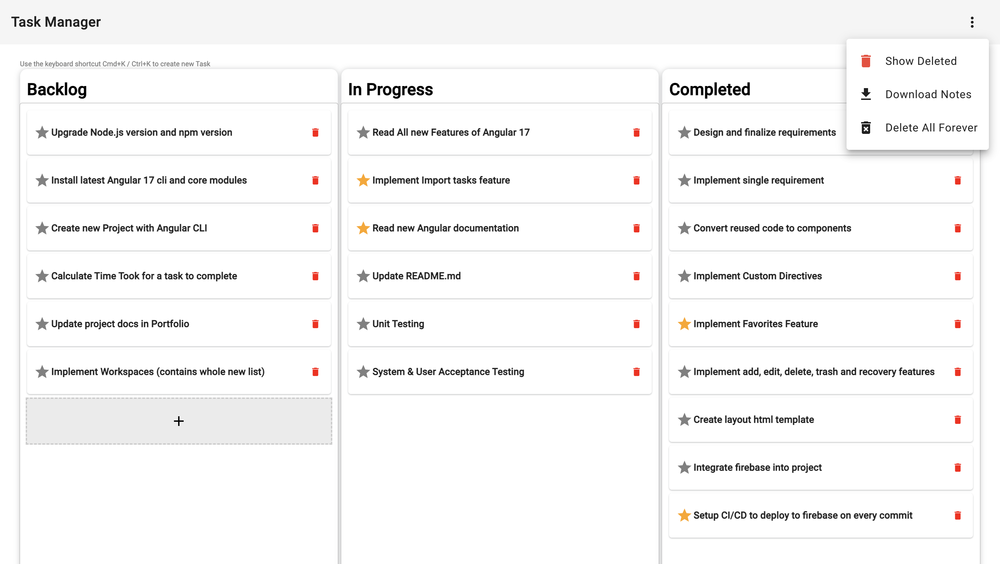
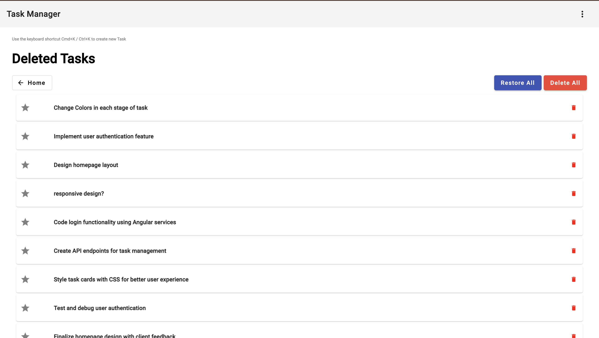
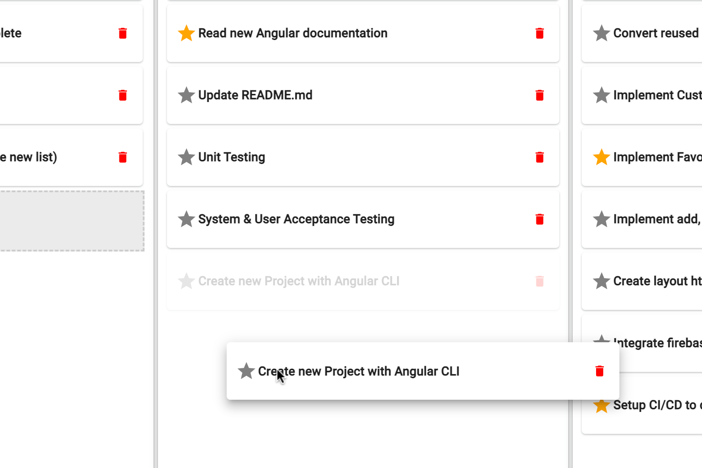

# Task Manager Application - Angular 17

### Key Features:

Utilizes Angular 17 with cutting-edge features for a modern and responsive user interface.
Implements the Angular CDK Drag and Drop library for seamless task management.
Database-free architecture ensures user data privacy, with tasks stored locally in the browser.
Intuitive user experience with easy task creation, updates, and deletion.

### Technologies Used:

- Angular 17 (Stand-alone Components, Custom Directives)
- Angular Material (Dialog, Snackbar, Icons, Buttons, Cards, Tooltips, CDK Drag and Drop)
- HTML5/SCSS
- TypeScript
- Local Storage
- GitHub Actions for CI/CD (Continuous Integration/Continuous Deployment)
- Firebase Hosting

> What makes this project unique? It was built purely for fun over just 2 days, showcasing the agility and versatility of Angular 17 in delivering efficient, enjoyable web applications.

> I wanted to make my own task management tool that was simple, intuitive, and visually appealing. This project allowed me to experiment with Angular 17's latest features and create a dynamic application that users can enjoy using every day.

# Screenshots

### Home Screen

Create, Update, and Delete Tasks with Ease in a Kanban-style Layout, also featuring a Trash Bin for Deleted Tasks and ability to download tasks as a JSON file.

### Trash Screen

Recover Deleted Tasks or Permanently Delete Them

### Drag and Drop Screen
Organize Tasks Across Different Stages with Drag-and-Drop Functionality

> Use the demo button below to try it now! You can also view the source code on GitHub.
