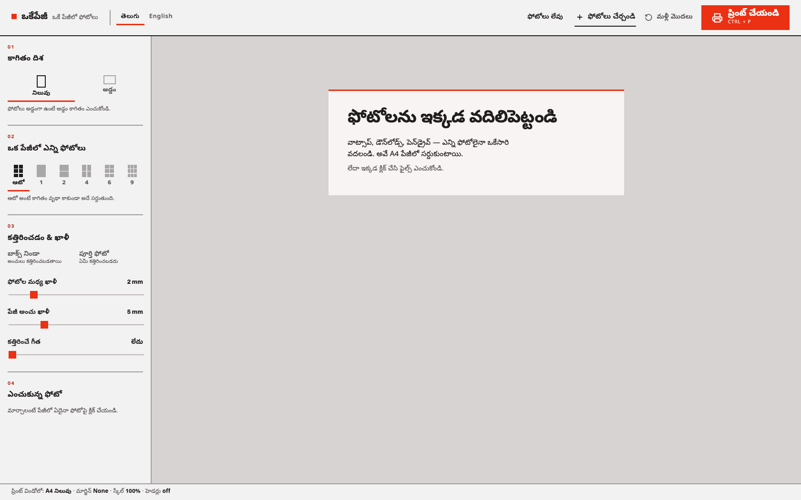
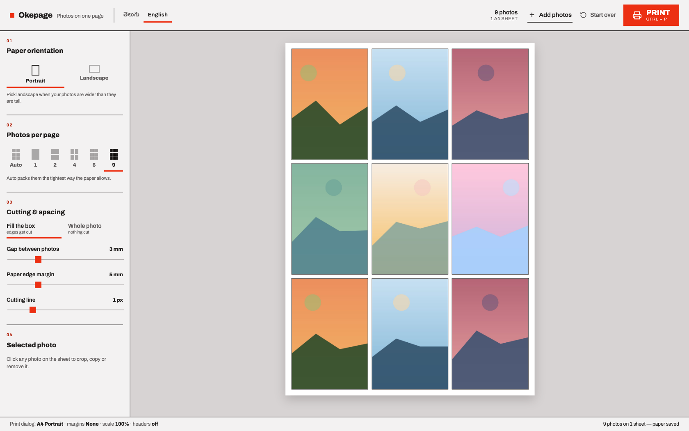
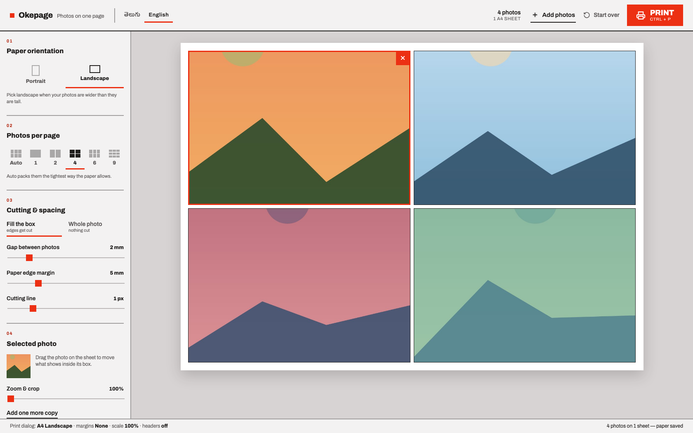

> Live: [okepage.keshav.codes](https://okepage.keshav.codes) — drop a few photos in; nothing is uploaded anywhere.

## The Problem

You have twenty photos and you want them on paper, several to a sheet, cut apart afterwards. Every route to that is annoying: a trip to the photo shop, a subscription design tool, or half an hour dragging images into a word processor that thinks in inches and margins you cannot see.

**Okepage** (ఒకేపేజీ — *"just one page"*) is for people who don't want any of that. It isn't a photo editor or a layout tool — it does the one job of getting photos onto printable sheets. Drop them in, choose how many fit on an A4 page, print. No accounts, no formatting, no upload.

## How It Works

The whole interaction is four decisions, numbered down the sidebar in the order you make them: **orientation → photos per page → cutting and spacing → the one photo you're adjusting**. Nothing else is on screen.

**Auto** is the preset I use most — it derives the grid from the photo count and the page's aspect ratio, then drops any row or column that would come out empty, so five photos don't print with a blank sixth cell.

Telugu is the default language, not a translation afterthought. The people I built this for read Telugu first, so it opens in Telugu with English one click away.

### Millimetres, not pixels

A printer thinks in millimetres, so the layout module does too — given the settings and a photo count it returns the grid, printable area, cell size, gaps and page count in mm. Those numbers go into CSS custom properties, so the same code drives the screen preview and the printed sheet.

Printing is where tools like this usually fall apart, because the preview is a scaled-down transform and the printer doesn't care about your transform. A `@media print` block strips the transform and every layout wrapper so each sheet prints at its true size, and an `@page` rule is rewritten on each render so the print dialog already has the right paper and orientation.

## Constraints I Kept

- **No backend, ever.** Photos are read as blob URLs in the browser and are gone when the tab closes. Only the layout settings persist, in `localStorage`.
- **No framework, bundler or npm packages.** Five plain scripts loaded as ordered `<script>` tags — which also means it runs straight from a `file://` URL, so a downloaded folder works with no server at all.
- **Works with no internet.** A hand-written service worker precaches every file, making it an installable PWA. Updates deliberately wait for a click instead of calling `skipWaiting()` — for a tool whose job ends in a print dialog, swapping the app out mid-print is exactly what you must not do.

Deployment is a GitHub Action that hands the repo to `wrangler`, which uploads it to Cloudflare Workers static assets. There's no build command, because there's nothing to build.

## What I Took From It

The interesting constraint wasn't technical, it was editorial: every feature that would have made this a "photo editor" was left out. No filters, no templates, no login, no cloud library. What's left loads instantly, works on a laptop with no internet, and can be explained to a parent in one sentence — in their own language.
