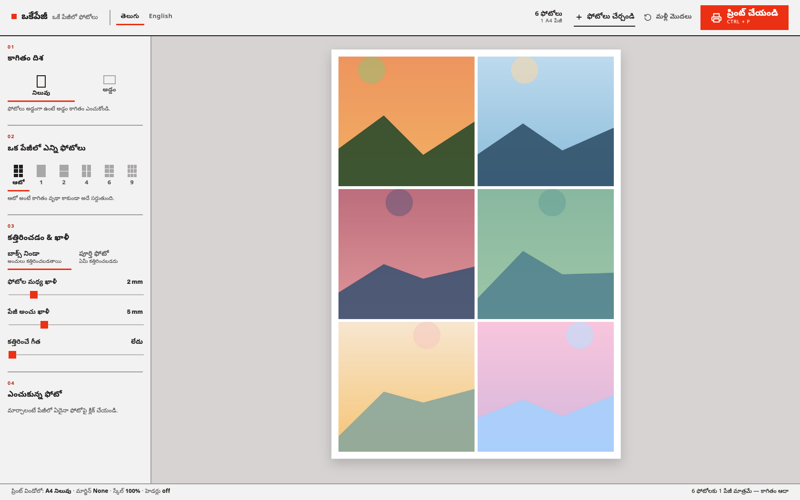

> Live: [okepage.keshav.codes](https://okepage.keshav.codes) — drop a few photos in; nothing is uploaded anywhere.

## ABSTRACT

**Okepage** (ఒకేపేజీ — *"just one page"*) solves a small, stubborn, very domestic problem: you have twenty photos and you want them on paper, several to a sheet, cut apart afterwards. Every existing route is annoying — a photo studio, a subscription design tool, or half an hour of dragging images into a word processor that thinks in inches and margins you cannot see. Okepage is a single HTML page that does exactly this one job: drop photos in, choose how many fit on an A4 sheet, print. It has no backend, no build step, no dependencies and no accounts, and the photos never leave the browser.

## The Idea

The tool is built for the way this actually happens at home: a folder of WhatsApp downloads, a pen drive from a function, a phone plugged into a laptop — and a printer that will happily waste a full sheet on each photo. The entire interaction is therefore four decisions, numbered down the sidebar in the order you make them: **paper orientation → photos per page → cutting and spacing → the one photo you are fiddling with**. Nothing else is on screen.

Telugu is the default language, not a translation afterthought. The people I built this for read Telugu first, so the app opens in Telugu and English is one click away in the top bar; exactly one language is visible at a time, and every string — including the dynamic ones like "6 photos on 1 sheet" — exists in both.

## How It Works

### Everything is millimetres until the last moment

A printer thinks in millimetres, so `layout.js` does too. A4 is 210 × 297 mm; landscape swaps them. The module is pure geometry with no DOM access — given the settings and a photo count it returns the grid, the printable area, the cell size, the gaps and the page count, in mm plus the pixel values the drag maths needs (`PX_PER_MM` is 96/25.4). The renderer writes those numbers into CSS custom properties on the sheet container, so the stylesheet never hardcodes a size and the same code path drives the screen preview and the printed sheet.

**Auto** is the preset I use most: instead of asking the user to know that six portrait photos want a 2 × 3 grid, it derives the grid from the photo count and the printable area's aspect ratio, then drops any row or column that would come out completely empty — so five photos do not print with a blank sixth cell reserved.

### Getting the print right

Printing is where tools like this usually fall apart, because the screen preview is a scaled-down transform and the printer does not care about your transform. The preview shrinks a sheet to fit the stage with a `--scale` factor, and the `@media print` block exists to undo exactly that: it strips the transform and every layout wrapper so each sheet prints at its true millimetre size, and hides anything marked as UI chrome. A `<style id="page-rule">` element is rewritten on every render with `@page { size: A4 portrait|landscape; margin: 0 }`, so the browser's print dialog already has the right paper and orientation before the user touches it. The footer permanently states the four settings that matter — A4, margins **None**, scale **100%**, headers **off** — because those are what people get wrong.

Because a broken print is invisible on screen, the print path gets verified headlessly: Chrome's `--print-to-pdf` on a seeded page, then a check that the PDF's MediaBox is 595 × 842 pt for portrait and 842 × 595 pt for landscape.

### Cropping without re-rendering

Each photo is a small record — id, blob URL, `cover` or `contain`, an object-position pair, and a zoom. Selecting one lets you drag it inside its cell to choose what survives the crop, zoom it, duplicate it, fill an entire sheet with copies of it, or remove it.

The app has no framework: state lives in a `Store`, every mutation goes through it, and the single subscriber rebuilds the visible UI. Two deliberate exceptions keep that honest approach fast — `` nodes are cached per photo id and re-parented on each render so a photo never reloads or flashes, and a crop drag writes `objectPosition` straight onto the cached image while recording it silently, instead of re-rendering on every pointer move.

## Constraints I Kept

- **No ES modules.** Scripts load as ordered `<script>` tags, each exposing one global (`I18N`, `Store`, `Layout`). Modules would break `file://` usage — and opening `index.html` straight from a downloaded folder is a legitimate way to run this.
- **No npm packages, bundlers or CSS frameworks.** Five files, ~zero install, readable in an afternoon.
- **No server, ever.** Photos are read as blob URLs in the browser and are gone when the tab closes. Only the layout settings persist, in `localStorage`.
- **One network request**, for the Google Fonts stylesheet — and the page still works offline without it.

## Deployment

The repo *is* the deployable artifact. A GitHub Action on `main` hands it to `wrangler`, which uploads the directory to **Cloudflare Workers static assets** — no build command, because there is nothing to build. An `.assetsignore` keeps the things that are not the app (README, `CLAUDE.md`, workflow files) out of the upload, and `wrangler.jsonc` binds the custom domain `okepage.keshav.codes` while leaving the apex records that point `keshav.codes` at GitHub Pages untouched.

## What I Took From It

The interesting constraint was not technical, it was editorial: every feature that would have made this a "photo editor" was left out. No filters, no templates, no login, no cloud library. What remains is a tool that loads instantly, works on a laptop with no internet, and can be explained to a parent in one sentence — in their own language.
