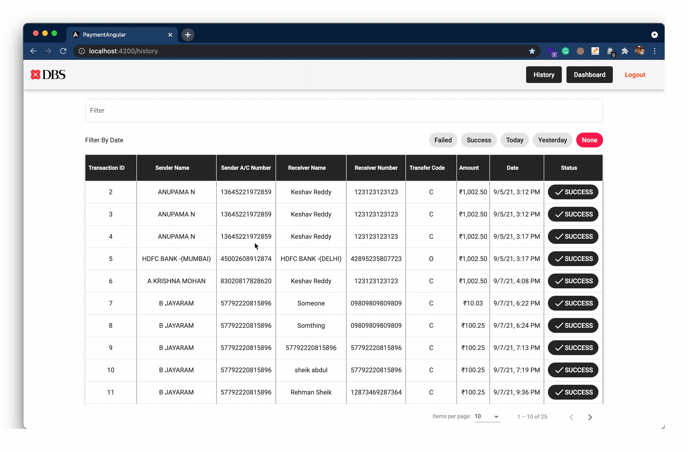

# Simple Payment Front-end

Simple payment portal front-end integrated with spring-boot
backend at  [Payment Spring Server](https://github.com/keshavlingala/payment-project)

## Employee Login (Optional)

## Home Screen - Transaction Form

## Transaction History Screen

## Analytics Dashboard

## Making a Transaction

## Dynamic History

# Simple Payment Back-end

A REST API with minimal api endpoints with CRUD operations with MySQL5 Database

Front-end for this project is integrated at @[Payment Angular](https://github.com/keshavlingala/payment-angular)

## List of Endpoints

> API Endpoints Docs Generated using OpenAPI

## Database Design

