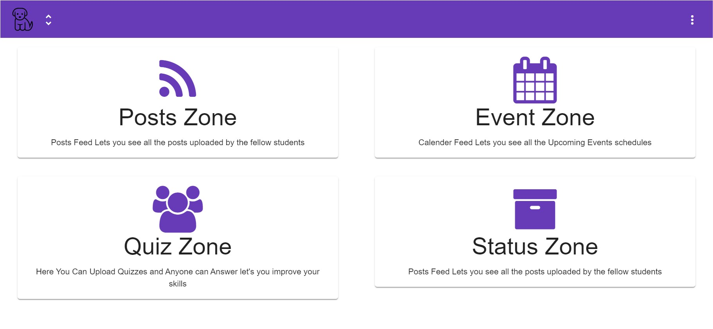
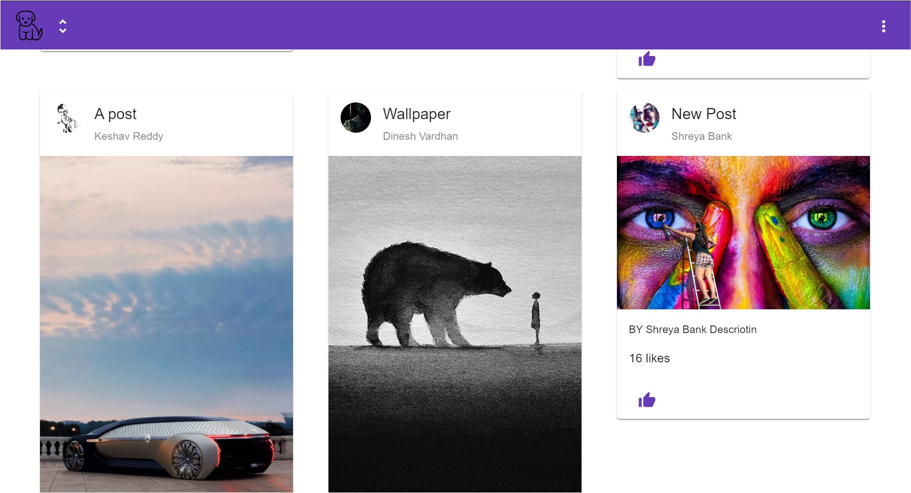
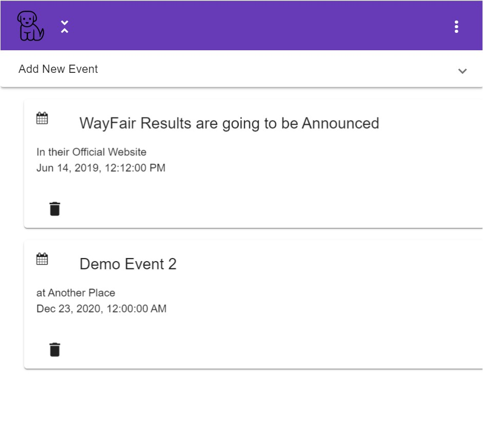
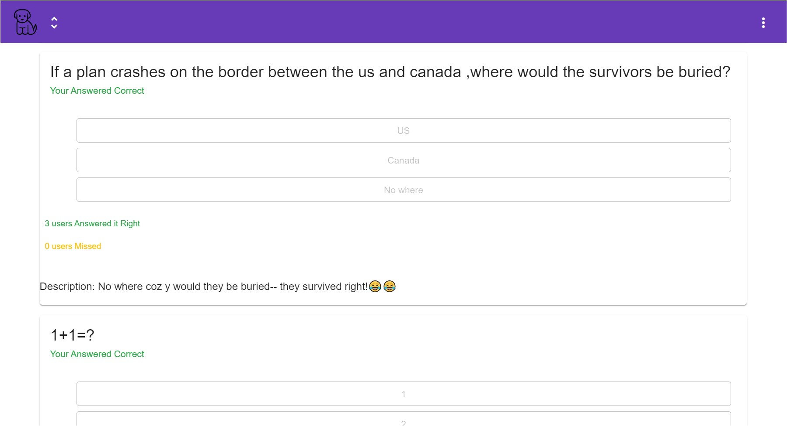
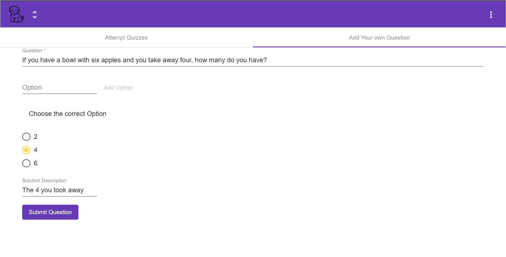
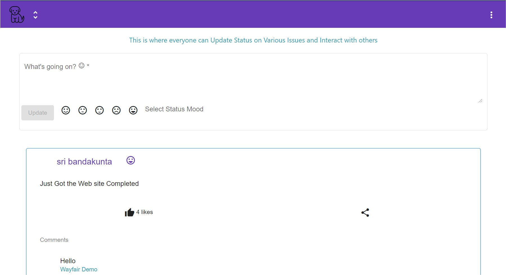
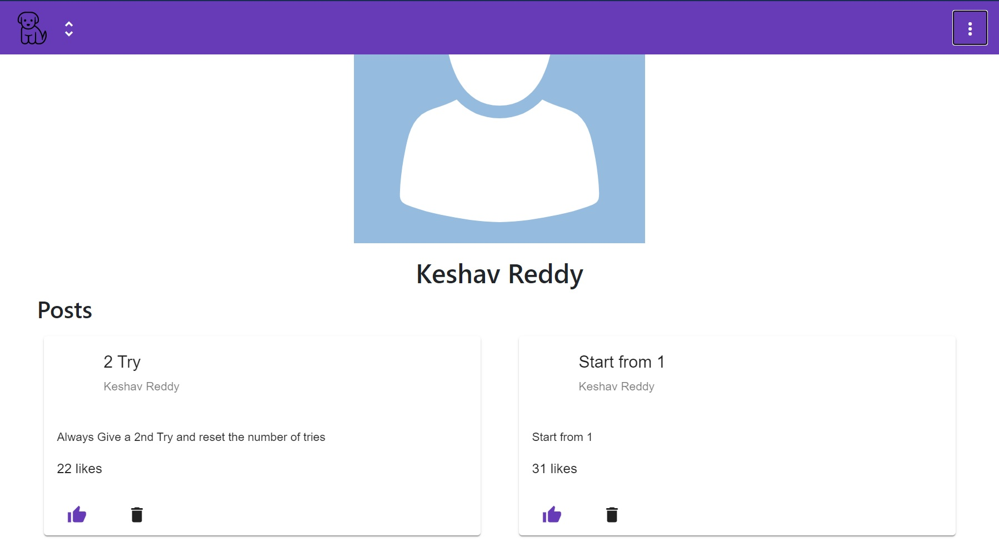

A fully functional web application built for the Wayfair competition.

It won 2nd prize 🏆 in the Scholar Jet "Seeing Home" Wayfair competition.

## App Overview

### Home Page

After logging in, you land on a page where you can choose between four zones, shown below.

### Post Zone

View and like posts, and upload your own images with descriptions.

### Events Zone

View and create events with a date and time.

## Quiz Zone

Attempt questions and see the solution with a detailed explanation of the answer.

Add your own questions:

### Status Zone

Post a status with an emotion, and like, comment on, or share any status.

### Profile

Every user has their own profile showing the posts they've uploaded.

