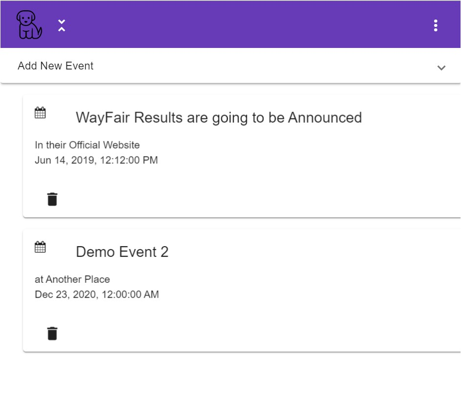

Simple and fully functional web application made as part of wayfair competition

Won 2nd prize🏆 on Scholar Jet wayfair Seeing Home Competition

## App Overview

### Home Page
After Login, you will be redirected to a page where you can choose between 4 of these sections as shown

### POST ZONE
See, like and upload images with description

### Events Zone
See and upload event with date and time

## Quiz Zone
Can attempt question and know the solution with description of answer

Adding your own question

### STATUS ZONE
Update any status with emotion and can like, comment, share any status

### Profile
Everyone will have their own profile to see posts uploaded by them

