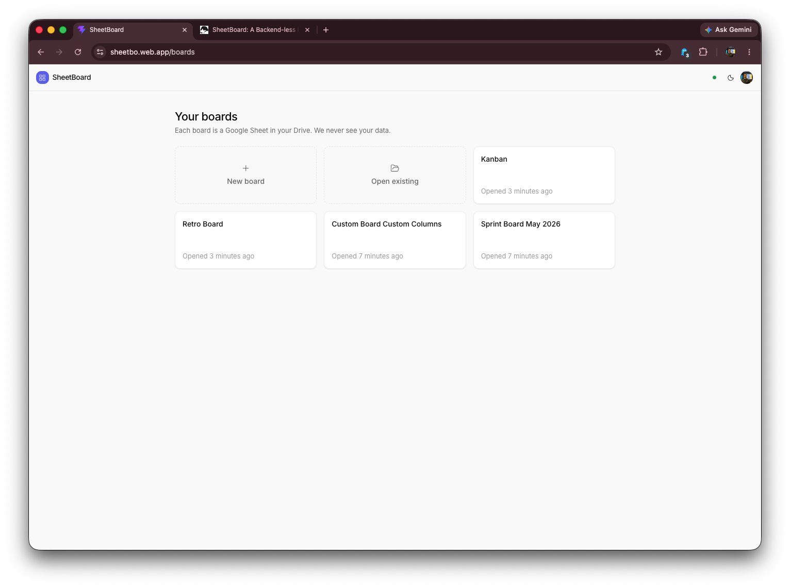
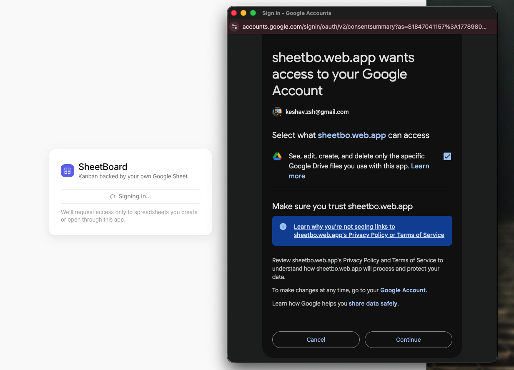
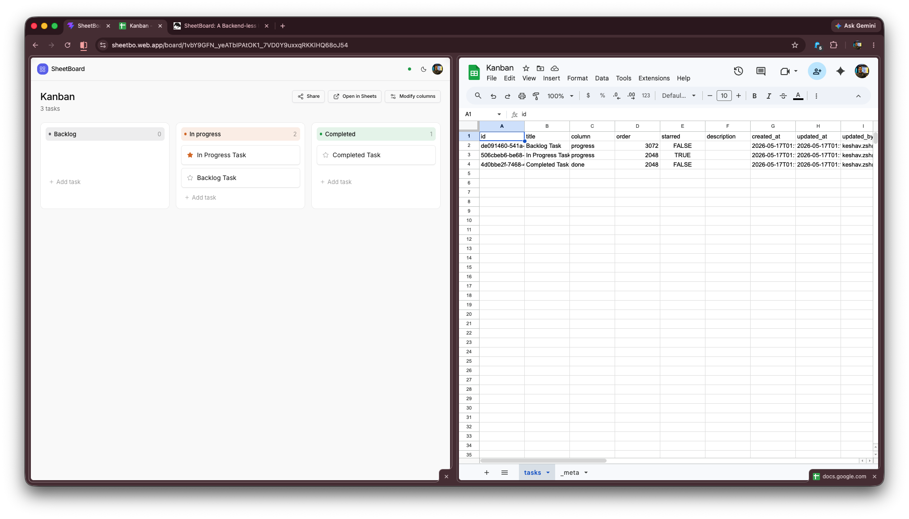
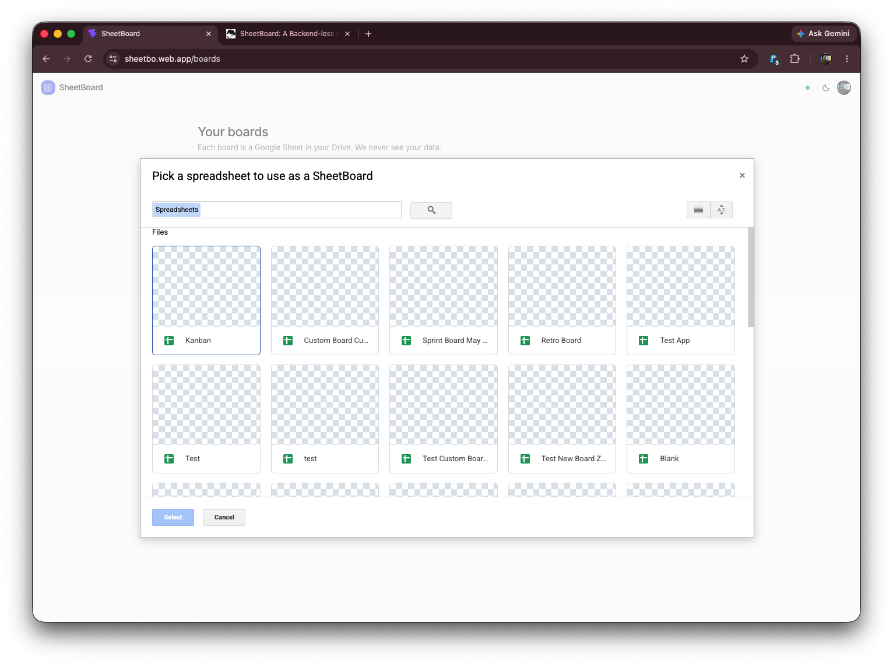

> Live demo: https://sheetbo.web.app — sign in with any Google account; a board is created in *your* Drive.

## ABSTRACT

SheetBoard is a Kanban board with a deliberately radical constraint: **there is no backend and no database.** Every board is an ordinary Google Sheet in the user's own Google Drive, and the application is a static single-page app that speaks directly to the Google Sheets API from the browser. The OAuth access token stays in the tab, the spreadsheet stays in the user's Drive, and there is no server in the middle that could store, leak, or hold that data hostage. This project explores how far a "frontend-only, your-data-is-yours" architecture can be pushed while still delivering the instant, drag-and-drop, real-time feel of a modern SaaS task board.

## The Idea

SheetBoard started as a re-engineering of my earlier [Kanban Task Manager (Angular 17)](/mylocaltask). That project nailed the drag-and-drop board experience but kept everything in browser local storage, so a board lived and died on a single device. SheetBoard keeps the same interaction model and swaps local storage for a Google Sheet — making the very same board portable, shareable, and durable without introducing a server.

Most task boards ask you to trust a company with your data forever. SheetBoard inverts that: the spreadsheet *is* the product's database, and it already lives somewhere the user controls. A board can be opened, edited, shared, or deleted directly in Google Sheets at any time — SheetBoard never brokers who can see it. The app requests only the minimal `drive.file` OAuth scope, which grants per-file access exclusively to spreadsheets the app created or that the user explicitly picked through the Google Picker, never the rest of the user's Drive.

## How It Works

### No backend, browser-native auth

Authentication uses the Google Identity Services (GSI) token model — no redirect URIs, no auth server, no session cookie. The browser obtains a short-lived access token and every Google Sheets request is made client-side. There is no API layer to deploy or scale because there is no API layer at all; the "backend" is Google's own Sheets and Drive APIs.

### The spreadsheet *is* the database

A SheetBoard board is a spreadsheet with two tabs. The **`tasks`** tab has one task per row with columns for `id`, `title`, `column`, `order`, `starred`, `description`, and audit timestamps. A second **`_meta`** tab holds key/value configuration — the schema version, board title, creation time, template, and a JSON blob describing the board's columns.

Crucially, **columns are per-board data, not a hardcoded enum.** The set of columns lives in a single `_meta` cell, so every board can define its own workflow; legacy boards without that cell fall back to a default Kanban layout for backward compatibility, and an in-app schema warning can repair an older spreadsheet in place.

### Optimistic updates with polling reconciliation

Every edit applies to the UI instantly and the sheet write happens in the background. The board query re-fetches on a five-second poll, which reconciles steady state and surfaces edits made by collaborators directly in Google Sheets. A subtle but important design decision: mutations deliberately do **not** force an immediate refetch on success — Google Sheets has read-after-write consistency lag, and an eager refetch would race that lag and visibly revert a card the user just moved. Trusting the optimistic state and letting the poll reconcile produces a UI that feels instant *and* stays correct.

### Self-rebalancing card order

Card position is stored as a sparse integer with large gaps between values, so reordering a card normally means writing a single new `order` value rather than rewriting an entire column. When two cards get squeezed too close for a clean midpoint, the drag path rebalances the whole column in one batched write instead of writing a colliding value — keeping ordering stable without a fragile floating-point scheme.

## Tech Stack

SheetBoard is built with **Vite, React 19, and TypeScript**, styled with **Tailwind CSS** and **shadcn/ui** primitives. Data fetching and caching use **TanStack Query**, client state uses **Zustand** (persisted per user), drag-and-drop uses **dnd-kit**, runtime validation uses **zod**, and toasts use **sonner**. The entire app ships as static files with an initial bundle of roughly 136 KB gzipped, with dialogs and heavy routes lazy-loaded to keep it there.

## Privacy & Security

The security story is the architecture: **tokens stay in the browser, spreadsheets stay in the user's Drive, and there is no server.** The browser-side Google credentials are public by design (as is correct for a browser OAuth client) and the API key is restricted by HTTP referrer and locked to the Google Picker API. Because the app only ever holds the `drive.file` scope, it is structurally incapable of touching files the user did not create or explicitly choose — the principle of least privilege enforced by Google itself rather than by a backend the user has to trust.

## Deployment

Being nothing but static files, SheetBoard can be hosted anywhere. It deploys to **Firebase Hosting** (free `*.web.app` domain, global CDN, SPA rewrite) with an SPA fallback so client-side routing works, and continuous deployment is wired through **GitHub Actions** — merges to the main branch build and ship automatically, and pull requests get preview deploys. Any static host (Cloudflare Pages, Netlify, GitHub Pages) works identically: build, add a SPA rewrite, and allowlist the deployed origin in Google Cloud.

## Conclusion

SheetBoard demonstrates that a genuinely useful, real-time, collaborative product can be built with **zero backend infrastructure** by treating a user-owned Google Sheet as the database. The result is a Kanban board with no servers to run, no database bills, no data-ownership questions, and no lock-in — the user can walk away with their data because their data was never anywhere else. It is a study in how thoughtful constraints (frontend-only, least-privilege scope, optimistic-with-poll sync, self-rebalancing order) can add up to an experience that feels like a polished SaaS app while remaining radically simple and private.
