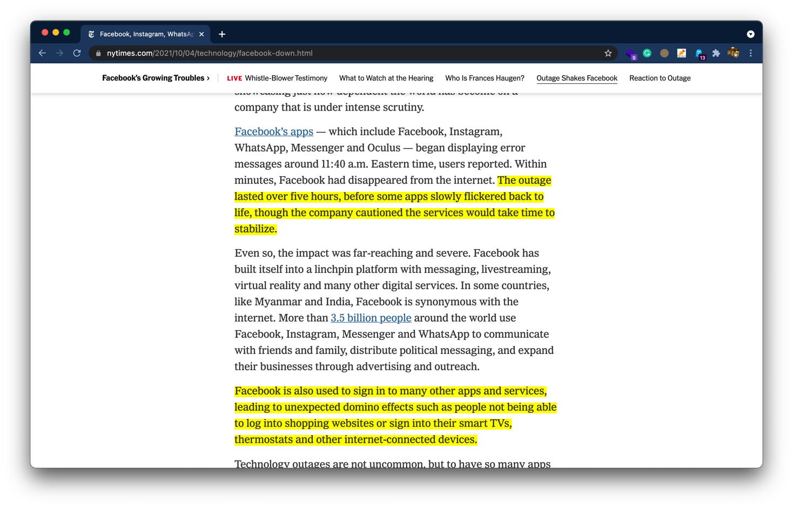
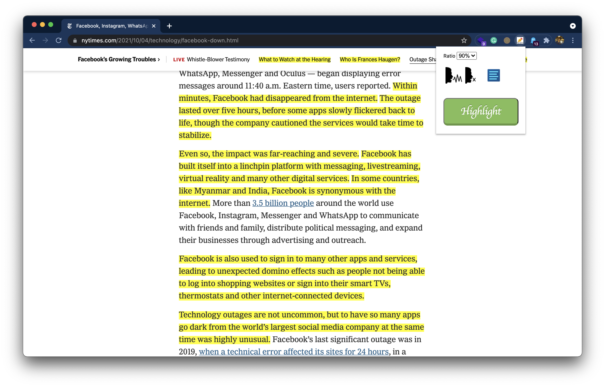
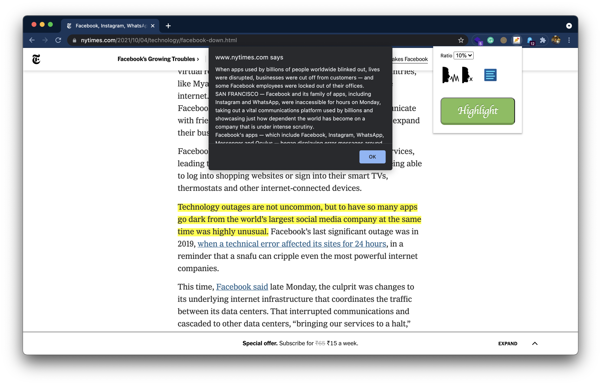

# Synopsis

# Intro

Chrome Extension that summarize any article, text, document, webpage or essay in a single click. and highlighting important lines automatically using NLP

### Reading Article and Highlight

> Highlighted 30% of article

> Highlighted 90% article

### Complete Summary

