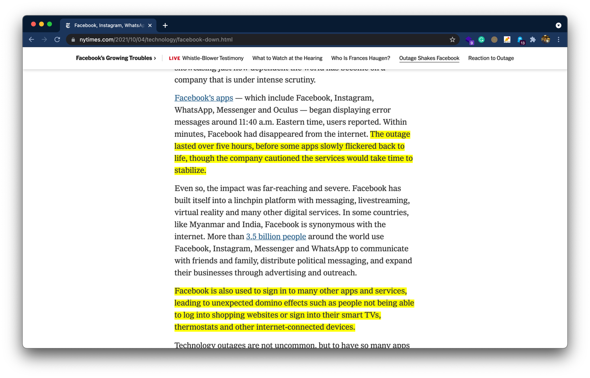
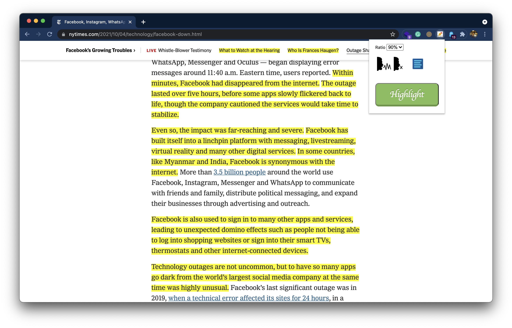
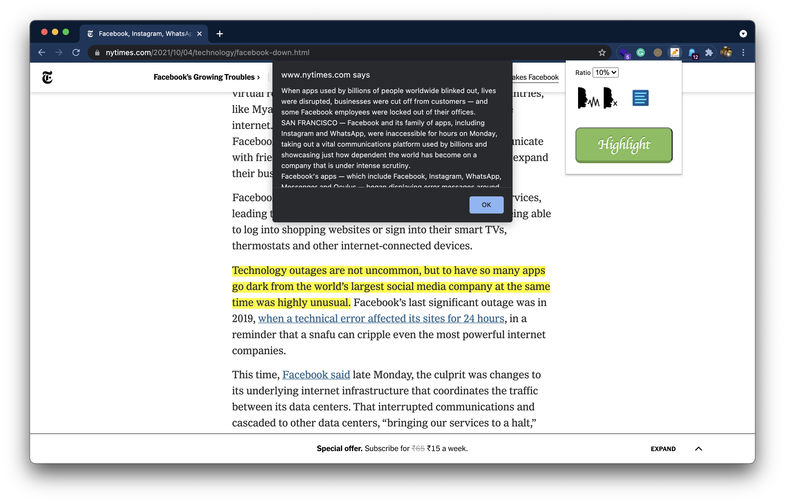

# Introduction

A Chrome extension that summarizes any article, document, webpage, or essay in a single click, and automatically highlights the most important lines using NLP.

### Reading an Article with Highlights

> Highlighted 30% of the article

> Highlighted 90% of the article

### Complete Summary

